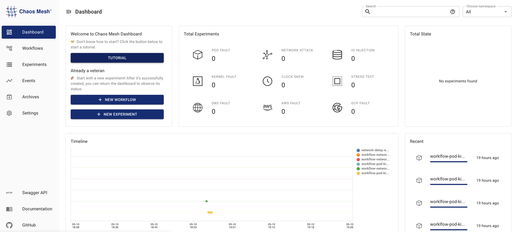

This document describes the basic features of Chaos Mesh, including [fault injection](#fault-injection), [Chaos workflows](#chaos-workflows), [visualized operations](#visualized-operations), and [security guarantees](#security-guarantees).

## Fault injection

Fault injection is the core of Chaos experiments. Chaos Mesh covers a full range of faults that might occur in a distributed system, and provides three comprehensive, fine-grained fault types: basic resource faults, platform faults, and application-layer faults.

- Basic resource faults:
  - [PodChaos](simulate-pod-chaos-on-kubernetes.md): simulates Pod failures, such as Pod node restart, Pod's persistent unavailability, and certain container failures in a specific Pod.
  - [NetworkChaos](simulate-network-chaos-on-kubernetes.md): simulates network failures, such as network latency, packet loss, packet reordering, and network partitions.
  - [DNSChaos](simulate-dns-chaos-on-kubernetes.md): simulates DNS failures, such as DNS domain name resolution failures and returning an incorrect IP address.
  - [HTTPChaos](simulate-http-chaos-on-kubernetes.md): simulates HTTP communication failures, such as HTTP communication latency.
  - [StressChaos](simulate-heavy-stress-on-kubernetes.md): simulates CPU or memory resource contention.
  - [IOChaos](simulate-io-chaos-on-kubernetes.md): simulates file I/O failures of a specific application, such as I/O delays and read/write failures.
  - [TimeChaos](simulate-time-chaos-on-kubernetes.md): simulates clock jumps.
  - [KernelChaos](simulate-kernel-chaos-on-kubernetes.md): simulates kernel failures, such as application memory allocation failures.
- Platform faults:
  - [AWSChaos](simulate-aws-chaos.md): simulates AWS platform failures, such as the AWS node restart.
  - [GCPChaos](simulate-gcp-chaos.md): simulates GCP platform failures, such as the GCP node restart.
- Application faults:
  - [JVMChaos](simulate-jvm-application-chaos.md): simulates JVM application failures, such as function call delays.

## Chaos workflows

A Chaos workflow includes a set of Chaos experiments and an application status check, allowing you to complete the entire Chaos Engineering process on the platform.

Chaos workflows enable you to run a series of Chaos experiments, gradually expand the blast radius (the scope of attacks), and increase the types of failures. After running a Chaos workflow, you can easily view the current state of the application with Chaos Mesh and determine whether to run follow-up experiments. Meanwhile, to reduce the cost of maintaining Chaos workflows, you can continuously update and accumulate Chaos experiment workflows and reuse existing experiments in other workflows.

Currently, Chaos workflows provide the following features:

- Orchestrate serial Chaos experiments
- Orchestrate parallel Chaos experiments
- Support checking the status and results of experiments
- Support pausing a Chaos experiment
- Support using YAML files to define and manage Chaos workflows
- Support using the web UI to define and manage Chaos workflows

For the configuration of a specific workflow, see [Create Chaos Mesh workflow](create-chaos-mesh-workflow.md).

## Visualized operations

Chaos Mesh provides the Chaos Dashboard component for visualized operations, which greatly simplifies Chaos experiments. You can manage and monitor a Chaos experiment directly through the visualization interface. For example, with a few clicks you can define the scope of a Chaos experiment, specify the type of fault injection, define scheduling rules, and get the results of the Chaos experiment.

## Security guarantees

Chaos Mesh manages permissions using the native [RBAC](https://kubernetes.io/docs/reference/access-authn-authz/rbac/) feature in Kubernetes.

You can freely create multiple roles according to your actual permission requirements, bind the roles to a service account, and then generate the corresponding token for the service account. When you log in to the Dashboard with this token, you can only perform Chaos experiments within the permissions granted to that service account.

In addition, you can enable Chaos experiments in specific namespaces by setting namespace annotations, which further safeguards the controllability of Chaos experiments.
