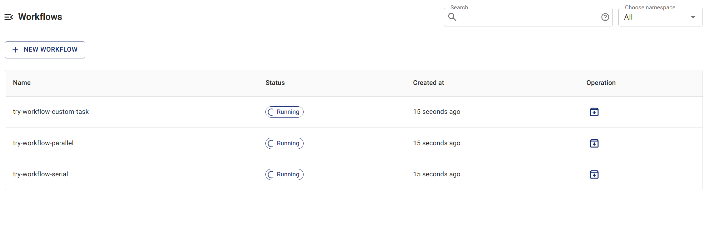
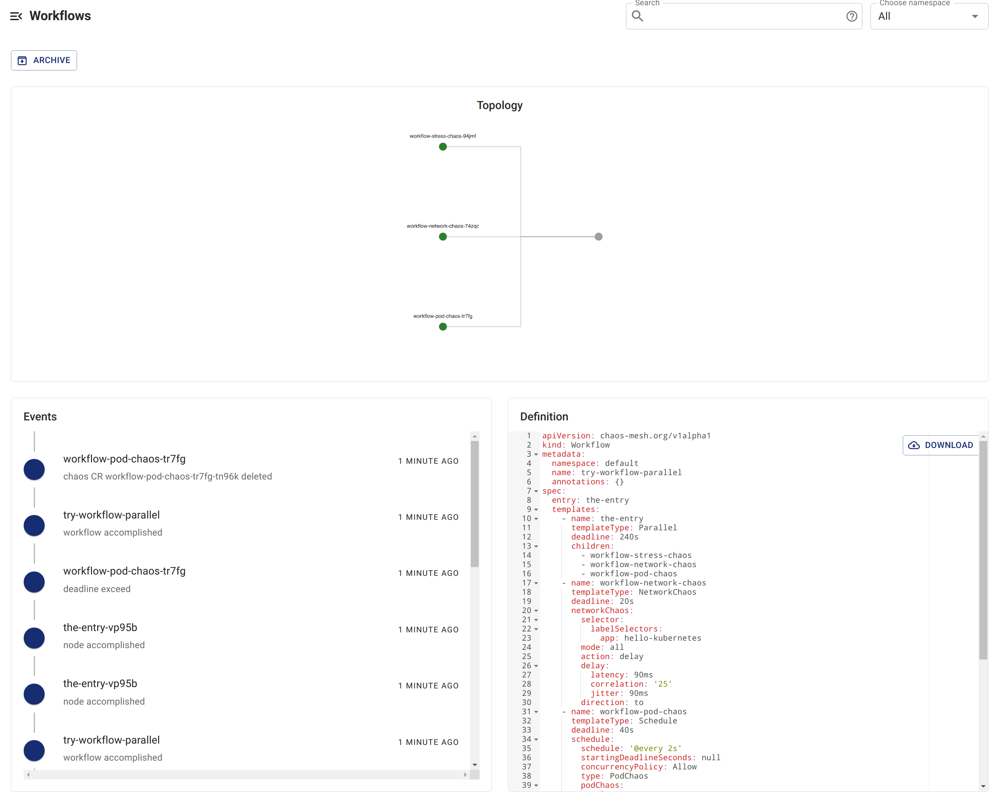

## Check workflow status using Chaos Dashboard

1. List all workflows in Chaos Dashboard.

   

2. Select the workflow you want to check and see the details of the workflow.

   

## Check workflow status using `kubectl` commands

1. Execute the following command to list the workflows currently created in the specified namespace:

   ```shell
   kubectl -n <namespace> get workflow
   ```

2. Choose the workflow you want to inspect, then specify its name in the following command to get all of its workflow nodes:

   ```shell
   kubectl -n <namespace> get workflownode --selector="chaos-mesh.org/workflow=<workflow-name>"
   ```

   The steps of the workflow are represented by the names of these workflow nodes.

3. Execute the following command to get the detailed status of the specified workflow node:

   ```shell
   kubectl -n <namespace> describe workflownode <workflow-node-name>
   ```

   The output includes whether the execution of the current node is completed, the execution status of its parallel or serial node, the corresponding Chaos experiment object of the current node, and so on.
