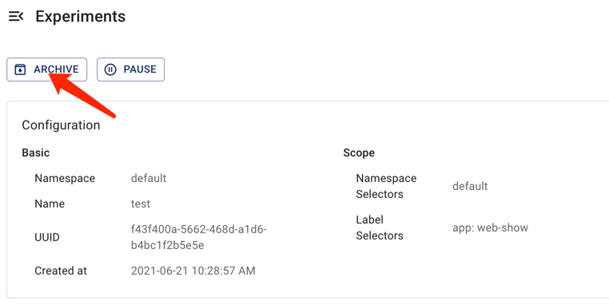

This document describes how to clean up chaos experiments in Chaos Mesh. When a chaos experiment is no longer needed, you can clean it up to stop the fault injection and restore the affected targets.

For the basic operations of creating, running, viewing, pausing, updating, and deleting chaos experiments, refer to [Run a Chaos Experiment](run-a-chaos-experiment.md).

## Clean up a chaos experiment

Deleting a chaos experiment restores the injected faults immediately. You can clean up a chaos experiment in either of the following ways.

### Clean up a chaos experiment using commands

Use the `kubectl delete` command to delete a chaos experiment. Once the chaos experiment is deleted, the injected faults on the target objects are restored immediately:

```sh
kubectl delete -f network-delay.yaml
# or delete the chaos object directly
kubectl delete networkchaos network-delay
```

### Clean up a chaos experiment using Chaos Dashboard

If you want to delete a chaos experiment on Chaos Dashboard and archive it to the experiment history, click the corresponding **Archive** button of the chaos experiment.



## Force-clean a chaos experiment whose deletion is blocked

Chaos Mesh uses a finalizer to track the faults injected by a chaos experiment. When deleting the chaos experiment, the controller first restores the injected faults on all target objects, and the finalizer is removed only when all the injected faults are recovered. After the finalizer is removed, the chaos experiment object is deleted.

If the controller fails to restore some injected faults (for example, the target objects no longer exist), the deletion is blocked and the chaos experiment object remains present (a `deletionTimestamp` is set on it). In this case, check the Chaos Mesh logs to find out why the faults cannot be restored, or directly create an [issue](https://github.com/chaos-mesh/chaos-mesh/issues) to report this problem to the Chaos Mesh team.

If you need to force-clean the blocked chaos experiment, use the following command:

```sh
kubectl annotate networkchaos network-delay chaos-mesh.chaos-mesh.org/cleanFinalizer=forced
```

:::warning

Force-clean removes the finalizer directly without waiting until all the injected faults are restored. This may leave lingering faults on the target objects. Use it only when the normal deletion is blocked.

:::

## Clean up all chaos experiments

Before cleaning up a namespace or uninstalling Chaos Mesh, make sure that all the chaos experiments are deleted. You can list all the chaos-related objects by executing the following command:

```sh
for i in $(kubectl api-resources | grep chaos-mesh | awk '{print $1}'); do kubectl get $i -A; done
```

:::note

The `Schedule` and the `Workflow` resources, as well as the chaos experiment objects they create, are separate Kubernetes objects. When you clean up the experiments created by a `Schedule` or a `Workflow`, make sure to delete these objects as well.

:::

For more details about removing Chaos Mesh from a Kubernetes cluster, refer to [Uninstall Chaos Mesh](uninstallation.md).
