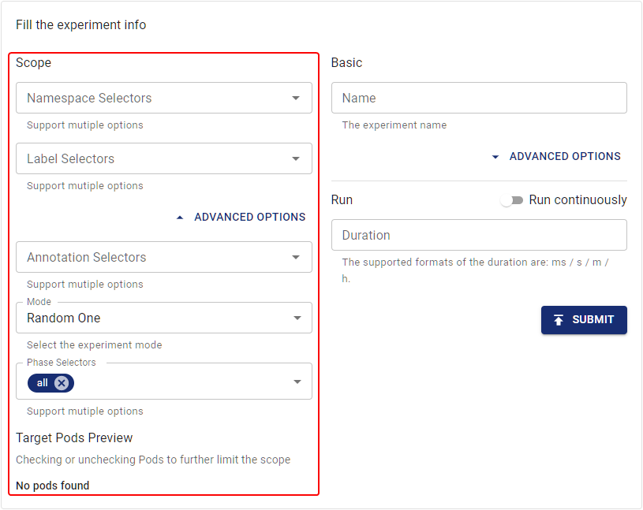

This document describes how to define the scope of a single Chaos experiment, which helps you accurately control the fault's explosion radius.

## An overview of experiment scopes

In Chaos Mesh, you can define the scope of a single Chaos experiment by specifying a selector.

Different types of selectors correspond to different filtering rules. You can specify one or more selectors in a Chaos experiment to define the scope of your experiment. If multiple selectors are specified at the same time, the current experiment target must meet the rules of all specified selectors at the same time.

When you create a Chaos experiment, Chaos Mesh supports the following ways to define the scope of an experiment. You can choose any one of the following ways as needed:

- Define the experiment scope in a YAML configuration file
- Define the experiment scope on the Chaos Dashboard

## Define the experiment scope in a YAML configuration file

This section introduces the meanings of different selector types and their the usages, and provides the configuration examples in the YAML file. When defining the experiment scope in the YAML file, you can specify one or more selectors according to your need of scope filtering.

### Namespace selectors

- Specifies the namespace of the experiment's target Pod.
- Data type: string array type.
- If this selector is empty or is not specified, Chaos Mesh will set it to the namespace of the current Chaos experiment.

When you create the experiment using the YAML file, see the following example for selector configuration:

```yaml
spec:
  selector:
    namespaces:
      - 'app-ns'
```

### Label selectors

- Specifies the [labels](https://kubernetes.io/docs/concepts/overview/working-with-objects/labels/) that the experiment's target Pod must have.
- Data type: key-value pairs.
- If multiple labels are specified, the experiment target must have all the labels specified by this selector.

When you create the experiment using the YAML file, see the following example for selector configuration:

```yaml
spec:
  selector:
    labelSelectors:
      'app.kubernetes.io/component': 'tikv'
```

### Expression selectors

- Specifies a set of [expressions](https://kubernetes.io/docs/concepts/overview/working-with-objects/labels/#resources-that-support-set-based-requirements) that define the label's rules to specifiy the experiment's target Pod.
- You can use this selector to set up the experiment's target Pod that does not meet some labels.

When you create the experiment using the YAML file, see the following example for selector configuration:

```yaml
spec:
  selector:
    expressionSelectors:
      - { key: tier, operator: In, values: [cache] }
      - { key: environment, operator: NotIn, values: [dev] }
```

### Annotation selectors

- Specifies the [annotations](https://kubernetes.io/docs/concepts/overview/working-with-objects/annotations/) that the experiment's target Pod must have.
- Data type: key-value pairs.
- If multiple annotations are specified, the experiment target must have all annotations specified by this selector.

When you create the experiment using the YAML file, see the following example for selector configuration:

```yaml
spec:
  selector:
    annotationSelectors:
      'example-annotation': 'group-a'
```

### Field selectors

- Specifies the [fields](https://kubernetes.io/docs/concepts/overview/working-with-objects/field-selectors/) of the experiment's target Pod.
- Data type: key-value pairs.
- If multiple fields are specified, the experiment target must have all fields set by this selector.

When you create the experiment using the YAML file, see the following example for selector configuration:

```yaml
spec:
  selector:
    fieldSelectors:
      'metadata.name': 'my-pod'
```

### PodPhase selectors

- Specifies the phase of the experiment's target Pod.
- Data type: string array type.
- Supported phases: `Pending`, `Running`, `Succeeded`, `Failed`, `Unknown`.
- This option is empty by default, which means that the target Pod's phase is not limited.

When you create the experiment using the YAML file, see the following example for selector configuration:

```yaml
spec:
  selector:
    podPhaseSelectors:
      - 'Running'
```

### Node selectors

- Specifies the [node label](https://kubernetes.io/docs/tasks/configure-pod-container/assign-pods-nodes/) to which the experiment's target Pod belongs.
- Data type: key-value pairs.
- If multiple node labels are specified, the node to which the experiment's target Pod belongs must have all labels specified by this selector.

When you create the experiment using the YAML file, see the following example for selector configuration:

```yaml
spec:
  selector:
    nodeSelectors:
      'node-label': 'label-one'
```

### Node list Selector

- Specifies the node to which the experiment's target Pod belongs.
- Data type: string array type.
- The target Pod can only belong to one node in the configured node list.

When you create the experiment using the YAML file, see the following example for selector configuration:

```yaml
spec:
  selector:
    nodes:
      - node1
      - node2
```

### Pod list Selector

- Specifies the namespaces and list of the experiment's target `Pods`.
- Type of data: key-value pairs. The "keys" are the namespaces of the target `Pod` and the "values" are the target `Pod` list.
- If you have specified this selector, Chaos Mesh will **ignore** other configured selectors.

When you create the experiment using the YAML file, see the following example for selector configuration:

```yaml
spec:
  selector:
    pods:
      tidb-cluster: # namespace of the target pods
        - basic-tidb-0
        - basic-pd-0
        - basic-tikv-0
        - basic-tikv-1
```

### Physical Machine List Selector

- Specifies the namespaces and list of the experiment's target `PhysicalMachines`.
- Type of data: key-value pairs. The "keys" are the namespaces of the target `PhysicalMachine` and the "values" are the target `PhysicalMachine` list.
- If you have specified this selector, Chaos Mesh will **ignore** other configured selectors.

:::note

`PhysicalMachine` is a CRD(CustomResourcesDefinition) that represents a physical machine. Chaos Mesh uses [chaosctl](chaosctl-tool.md#generate-tls-certs-for-choasd) to create `PhysicalMachine` typically。

:::

When you create the experiment using the YAML file, see the following example for selector configuration:

```yaml
spec:
  selector:
    physicalMachines:
      default: # namespace of the target PhysicalMachines
        - physcial-machine-a
        - physcial-machine-b
```

## Define the experiment scope on Chaos Dashboard

If you use Chaos Dashboard to create a Chaos experiment, you can configure the Chaos experiment scope when filling out the experiment information.

The following selectors are currently available on Chaos Dashboard. You can specify one or more selectors according to the filtering requirements of the experiment scope:

- Namespace selectors
- Label selectors
- Annotation selectors
- Phase selectors

While setting selectors, you can also view the actual scope of the experiment target in the Dashboard in real time and can directly modify the target Pod scope filtered by the selectors.



## Compatibility matrix

| Type | Support Kubernetes | Support Physical Machine |
| :-- | :-- | :-- | 
|Namespace Selectors|Y|Y|
|Label Selectors|Y|Y|
|Expression Selectors|Y|Y|
|Annotation Selectors|Y|Y|
|Field Selectors|Y|Y|
|PodPhase Selectors|Y|N|
|Node Selectors|Y|N|
|Node List Selectors|Y|N|
|Pod List Selectors|Y|N|
|PhysicalMachine List Selectors|N|Y|