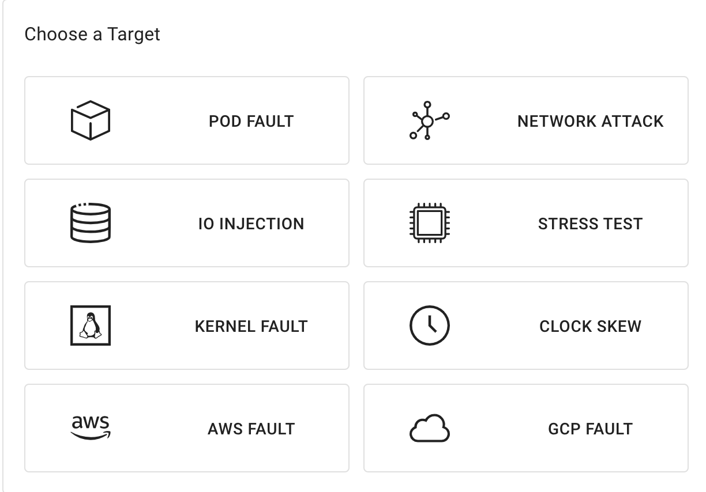

## Schedule overview

This document describes how to use Chaos Mesh to create a scheduled task, which can automatically create Chaos experiments at a fixed time (or at a fixed time interval).

In Kubernetes, Chaos Mesh uses `Schedule` to describe scheduled tasks.

:::note

The name of a `Schedule` object should not exceed 57 characters because the created Chaos experiment will add 6 additional random characters to the end of the name.The name of the `Schedule` object with `Workflow` should not exceed 51 characters because Workflow will add 6 additional random characters to the end of the name.

:::

## Create scheduling rules with `kubectl` using YAML files

For example, to apply a 100 millisecond delay for 12 seconds in the fifth minute of each hour, configure the YAML file as follows:

```yaml
apiVersion: chaos-mesh.org/v1alpha1
kind: Schedule
metadata:
  name: schedule-delay-example
spec:
  schedule: '5 * * * *'
  historyLimit: 2
  concurrencyPolicy: 'Allow'
  type: 'NetworkChaos'
  networkChaos:
    action: delay
    mode: one
    selector:
      namespaces:
        - default
      labelSelectors:
        'app': 'web-show'
    delay:
      latency: '10ms'
      correlation: '100'
      jitter: '0ms'
    duration: '12s'
```

Save this YAML file as `schedule-networkchaos.yaml`, and then run `kubectl apple-f ./schedule-networkchaos.yaml`.

Based on this configuration, Chaos Mesh will create the following `NetworkChaos` object in the fifth minute of each hour (such as 0:05, 1:05...):

```yaml
apiVersion: chaos-mesh.org/v1alpha1
kind: NetworkChaos
metadata:
  name: schedule-delay-example-xxxxx
spec:
  action: delay
  mode: one
  selector:
    namespaces:
      - default
    labelSelectors:
      'app': 'web-show'
  delay:
    latency: '10ms'
    correlation: '100'
    jitter: '0ms'
  duration: '12s'
```

The fields in `Schedule` are described below, mostly similar to fields in Kubernetes `CronJob`. You can refer to [documentation of Kubernetes CronJob](https://kubernetes.io/zh/docs/concepts/workloads/controllers/cron-jobs/) for more information.

:::note

The timezone in the `schedule` field subjects to the timezone of `chaos-controller manager-`.

:::

### `schedule` field

The `schedule` field is used to specify the time when an experiment occurs.

```
# ┌───────────── minute (0 - 59)
# │ ┌───────────── hour (0 - 23)
# │ │ ┌───────────── day of month (1 - 31)
# │ │ │ ┌───────────── month (1 - 12)
# │ │ │ │ ┌───────────── day of week (0 - 6) (from Sunday to Monday; on some systems, 7 is also Sunday)
# │ │ │ │ │
# │ │ │ │ │
# │ │ │ │ │
# * * * * *
```

| Input                 | Description                                    | Equivalence           |
| --------------------- | ---------------------------------------------- | --------------------- |
| @year (or @annually)  | run at midnight on January 1 of each year      | 0 0 1 1 \*          |
| @monthly              | run at midnight on the first day of each month | 0 0 1 \* \*       |
| @weekly               | run at midnight on Sunday of each week         | 0 0 \* \* 0       |
| @daily (or @midnight) | run at midnight each day                       | 0 0 \* \* \*    |
| @hourly               | run at the beginning of each hour              | 0 \* \* \* \* |

If you need to generate time expressions, you can also use web tools such as [crontab.guru](https://crontab.guru).

### `historyLimit` field

After an experiment ends, the corresponding history will not be deleted so you can retrieve and observe the results easily in case of any errors. The number set in `historyLimit` is the number of reserved tasks. This number includes tasks in progress. Chaos Mesh does not delete running tasks.

When there are more than `historyLimit` tasks, Chaos Mesh will delete the earliest created tasks sequentially. If those tasks continue to run, they will be skipped and not deleted.

### `ConciliationPolicy` field

The values available for this field are `"Forbid"`, `"Allow"`, and `""`.

This field is used to specify whether to allow this `Schedule` object to create multiple concurrent experiments. For example, with the `schedule: * * * * *` configuration, one experiment will be created every minute. If the `duration` of the experiment is configured to be 70 seconds, multiple experiments will be created simtaneously.

By default, the `concurrencyPolicy` field is set to `Forbid`, which means multiple experiments are not allowed to be created simultaneously. If you set the value of the `concurrencyPolicy` field to `Allow`, multiple experiments are allowed to be created simultaneously.

The following configuration still takes the delay experiment as an example:

```yaml
spec:
  schedule: '* * * * *'
  type: 'NetworkChaos'
  networkChaos:
    action: delay
    mode: one
    selector:
      namespaces:
        - default
      labelSelectors:
        'app': 'web-show'
    delay:
      latency: '10ms'
    duration: '70s'
```

Based on this configuration, if you set `concurrencyPolicy: "Allow"`, there will be a delay of 20 milliseconds in 10 seconds every minute. And for the other 50 seconds, there will be a delay of 10 milliseconds. If you set `concurrencyPolicy: "Forbid"`, there will always be a delay of 10 milliseconds.

:::note

Not all experiment types support multiple experiments on the same Pod. For details, refer to the documents of the specific experiment types.

:::

### `startingDeadlineSeconds` field

The default value of `startingDeadlineSeconds` is 0.

When `startingDeadlineSeconds` is set to 0, Chaos Mesh will check if any experiments are missed from the last time of the scheduling to now (this might happen when you close Chaos Mesh, suspend Schedule for a long time, or set `concertencyPolicy` to `Forbid`).

When `startingDeadlineSeconds` exceeds 0, Chaos Mesh will check if any experiments are missed for the past `startingDeadlineSeconds` seconds since the current time. If the value of `startingDeadlineSeconds` is too small, some experiments might be missed. For example:

```yaml
spec:
  schedule: '* * * * *'
  type: 'NetworkChaos'
  networkChaos:
    action: delay
    mode: one
    selector:
      namespaces:
        - default
      labelSelectors:
        'app': 'web-show'
    startingDeadlineSeconds: 5
    delay:
      latency: '10ms'
    duration: '70s'
```

In the above example, due to `concurrencyPolicy` is set to `Forbid`, creating new tasks is forbidden at the beginning of the minute. And in the tenth second of this minute, the last created Chaos experiment has finished running. But due to the limits of `startingDeadlineSeconds` and the set of `concurrencyPolicy`, the missing events will not be retrieved and no Chaos experiments will be created. New Chaos experiment will only be created at the beginning of the next minute.

If `startingDeadlineSeconds` is not set (or is set to 0), there will always be a delay of 10 milliseconds. This is because after the running task is done, Chaos Mesh finds a previous missing task (due to `concurrencyPolicy` is set to `Forbid`), and immediately creates a new task.

To learn more examples and similar explanations of this field, see [Kubernetes CronJob documents](https://kubernetes.io/zh/docs/concepts/workloads/controllers/cron-jobs/#cron-job-limitations).

### Define experiments

To define the specific content of the experiment, you need to specify two fields in `Schedule`: `type` and `*Chaos`. `type` field is used to specify the type of an experiment, and `*Chaos` field is used to describe the content of the experiment. Normally, the content in the `type` field uses upper camel case, for example: `NetworkChaos`, `PodChaos`, `IOChaos`. While the key of `*Chaos`  uses lower camel case like  `networkChaos`, `podChaos`, and `ioChaos`. The key of `*Chaos` is the `spec` of the corresponding type of experiment. For details, refer to the documents of the specific experiment types.

## Create Scheduling rules using Chaos Dashboard

1. Open Chaos Dashboard, and click **NEW EXPERIMENT** on the page to create a new experiment.

   

2. Select and fill in the specific details of the experiment.

   

3. Fill out information including the planning cycle and concurrency strategy.

   

4. Submit the experiment information.

### Pause the scheduled task

Unlike `CronJob`, pausing `Schedule` not only prevents it from creating a new experiment, but also pauses an already created experiment.

If you do not want to create a Chaos experiment as a scheduled task for now, you need to add the `experiment.chaos-mesh.org/pause=true` annotation to the `Schedule` object. You can add the annotation using the `kubectl` command:

```bash
kubectl annotate -n $NAMESPACE schedule $NAME experiment.chaos-mesh.org/pause=true
```

In the command, `$NAMESPACE` is a namespace, and `$NAME` is the name of `Schedule`. The successful result is returned as follows:

```bash
schedule/$NAME annotated
```

If you want to unpause the task, you can use the following command to remove the annotation:

```bash
kubectl annotate -n $NAMESPACE schedule $NAME experiment.chaos-mesh.org/pause-
```

In the command, `$NAMESPACE` is the namespace, and `$NAME` is the name of `Schedule`.The successful result is returned as follows:

```bash
schedule/$NAME annotated
```
