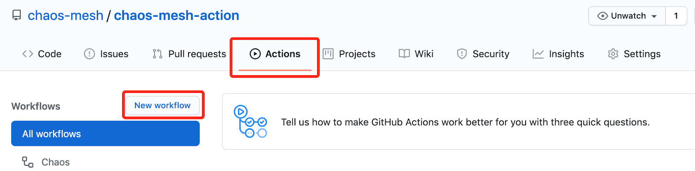

This document describes how to integrate Chaos Mesh to custom continuous integration (CI) using chaos-mesh-action. It will help you identify issues that have been introduced into system development prior to product release.

The chaos-mesh-action is a GitHub action that have published on [GitHub Marketplace](https://github.com/marketplace/actions/chaos-mesh). Its source code is on [GitHub](https://github.com/chaos-mesh/chaos-mesh-action) as well.

## Design of chaos-mesh-action

[GitHub Actions](https://docs.github.com/en/actions) are one of features to custom continuous integration (CI) and continuous deployment (CD) supported by GitHub. You can easily automate and customize software development workflows right in your repository with GitHub Actions.

Combined with GitHub Actions, Chaos Mesh can be smoothly blended into your day-to-day development and tests, ensuring that all codes submitted on GitHub do not have bugs (to pass tests at least) and do not cause logic errors.  The image below shows chaos-mesh-action integrated to the CI workflow:


## Use chaos-mesh-action in GitHub workflow

The chaos-mesh-action works for GitHub workflow.  GitHub workflow is a configurable automated process which can be set up in your repository to build, test, pack, publish or deploy any GitHub project. Follow the below process to integrate Chaos Mesh to your CI:

- Step 1: Design workflow
- Step 2: Create workflow
- Step 3: Run workflow

### Step 1: Design workflow

Before designing workflow, you should think about the following questions:

- What features do you want to test in this workflow?
- What type of fault will be injected?
- How to verify the correctness of the system?

For example, we can design an simple workflow for tests. The stepts below can be included:

1. Create two pods in the Kubernetes cluster.
2. Ping from one pod to another pod.
3. Inject network latency faults using Chaos Mesh to test whether the ping command is affected.

### Step 2: Create workflow

After the workflow is designed, follow the steps below to create a workflow.

1. Navigate to the GitHub repository for software testing.
2. Creating workflow by clicking `Actions` and then click `New workflow`.



Workflow is essentially a sequentially automated job configuration.  Note that the following job is configured in a single file.  In order to provide a clear explanation, we split the script into different working groups, as shown below in:

- Set workflow name and trigger rules.

  Name the workflow to "Chaos".  When you commit code or create a pull request to a master branch, this workflow will be triggered.

  ```yaml
  name: Chaos

  on:
    push:
      branches:
        - master
    pull_request:
      branches:
        - master
  ```

- Install CI related environment

  This configuration specifies Ubuntu operating system and creates a a kind cluster using helm/kind-action.  After that, it exports information about the cluster. Finally, it checks out the GitHub repository the workflow is about to access.

  ```yaml
  jobs:
    build:
      runs-on: ubuntu-latest
      steps:
        - name: Creating kind cluster
          uses: helm/kind-action@v1.0.0-rc.1

        - name: Print cluster information
          run: |
            kubectl config view
            kubectl cluster-info
            kubectl get nodes
            kubectl get pods -n kube-system
            helm version
            kubectl version

        - uses: actions/checkout@v2
  ```

- Deploy an application

  In the following example, this job deploys an application that will create two Kubernetes pods.

  ```yaml
  - name: Deploy an application
       run: |
         kubectl apply -f https://raw.githubusercontent.com/chaos-mesh/apps/master/ping/busybox-statefulset.yaml
  ```

- Inject faults using Chaos Mesh

  ```yaml
  - name: Run chaos mesh action
      uses: chaos-mesh/chaos-mesh-action@v0.5
      env:
        CHAOS_MESH_VERSION: v1.0.0
        CFG_BASE64: YXBpVmVyc2lvbjogY2hhb3MtbWVzaC5vcmcvdjFhbHBoYTEKa2luZDogTmV0d29ya0NoYW9zCm1ldGFkYXRhOgogIG5hbWU6IG5ldHdvcmstZGVsYXkKICBuYW1lc3BhY2U6IGJ1c3lib3gKc3BlYzoKICBhY3Rpb246IGRlbGF5ICMgdGhlIHNwZWNpZmljIGNoYW9zIGFjdGlvbiB0byBpbmplY3QKICBtb2RlOiBhbGwKICBzZWxlY3RvcjoKICAgIHBvZHM6CiAgICAgIGJ1c3lib3g6CiAgICAgICAgLSBidXN5Ym94LTAKICBkZWxheToKICAgIGxhdGVuY3k6ICIxMG1zIgogIGR1cmF0aW9uOiAiNXMiCiAgc2NoZWR1bGVyOgogICAgY3JvbjogIkBldmVyeSAxMHMiCiAgZGlyZWN0aW9uOiB0bwogIHRhcmdldDoKICAgIHNlbGVjdG9yOgogICAgICBwb2RzOgogICAgICAgIGJ1c3lib3g6CiAgICAgICAgICAtIGJ1c3lib3gtMQogICAgbW9kZTogYWxsCg==
  ```

  With chaos-mesh-action, Chaos Mesh will be installed and inject faults automatically. The only things you need to do is to prepare the configuration of the chaos experiment and get its value encoded in Base64. If you want to inject network latency to the pod, you can use the following configuration example:

  ```yaml
  apiVersion: chaos-mesh.org/v1alpha1
  kind: NetworkChaos
  metadata:
    name: network-delay
    namespace: busybox
  spec:
    action: delay # the specific chaos action to inject
    mode: all
    selector:
      pods:
        busybox:
          - busybox-0
    delay:
      latency: '10ms'
    duration: '5s'
    scheduler:
      cron: '@every 10s'
    direction: to
    target:
      selector:
        pods:
          busybox:
            - busybox-1
      mode: all
  ```

  Get the Base64 encoded value of the chaos experiment configuration file above using the command line below:

  ```bash
  $ base64 chaos.yaml
  ```

- Verify the correctness of the system

  Ping workflow from one pod to another pod in this job and observe network latency.

  ```yaml
  - name: Verify
       run: |
         echo "do some verification"
         kubectl exec busybox-0 -it -n busybox -- ping -c 30 busybox-1.busybox.busybox.svc
  ```

### Step 3: Run workflow

  Once a workflow is created, it can be triggered by creating a pull request to a master branch. Once the workflow completed its running process, the output of the job verification is similar to the one below:

  ```log
  do some verification
  Unable to use a TTY - input is not a terminal or the right kind of file
  PING busybox-1.busybox.busybox.svc (10.244.0.6): 56 data bytes
  64 bytes from 10.244.0.6: seq=0 ttl=63 time=0.069 ms
  64 bytes from 10.244.0.6: seq=1 ttl=63 time=10.136 ms
  64 bytes from 10.244.0.6: seq=2 ttl=63 time=10.192 ms
  64 bytes from 10.244.0.6: seq=3 ttl=63 time=10.129 ms
  64 bytes from 10.244.0.6: seq=4 ttl=63 time=10.120 ms
  64 bytes from 10.244.0.6: seq=5 ttl=63 time=0.070 ms
  64 bytes from 10.244.0.6: seq=6 ttl=63 time=0.073 ms
  64 bytes from 10.244.0.6: seq=7 ttl=63 time=0.111 ms
  64 bytes from 10.244.0.6: seq=8 ttl=63 time=0.070 ms
  64 bytes from 10.244.0.6: seq=9 ttl=63 time=0.077 ms
  ……
  ```

  The output shows that there are a series of 10 milliseconds of delay, and each delay lasts for 5 seconds (refers to 5 times). This is in line with the configuration of chaos experiments that injected using chaos-mesh-action.

## What's next

Currently, chaos-mesh-action has been applied to [TiDB Operator](https://github.com/pingcap/tidb-operator). You can verify the restart of operator instances by injecting pod faults in the workflow. This is to ensure that the TiDB Operator can work properly when a pod of TiDB operator is randomly deleted by injected faults. For details, see [TiDB Operator](https://github.com/pingcap/tidb-operator/actions?query=workflow%3Achaos).

In the future, chaos-mesh-action will be applied to more tests for TiDB to ensure the stability of TiDB and its components. Welcome to use chaos-mesh-action to create your own workflow.

If you find some errors in this document, or think some information is missing here, welcome to create an [issue](https://github.com/pingcap/chaos-mesh/issues) or a [pull request (PR)](https://github.com/chaos-mesh/chaos-mesh/pulls) in the Chaos Mesh repository, or join our slack channel [#project-chaos-mesh](https://slack.cncf.io/)  in the [CNCF](https://www.cncf.io/) workspace.
