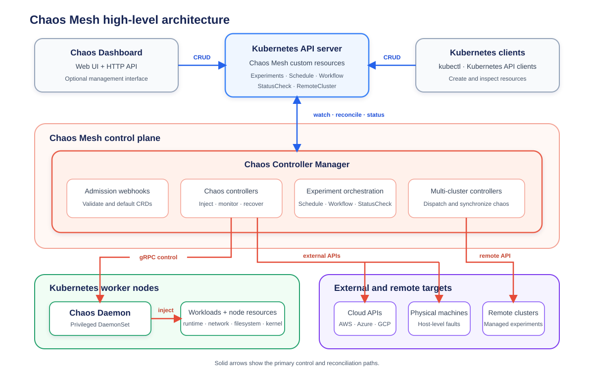

This document describes the concepts, use cases, core strengths, and the architecture of Chaos Mesh.

## Chaos Mesh Overview

Chaos Mesh is an open-source, cloud-native Chaos Engineering platform. It offers various fault simulation types and provides a powerful ability to orchestrate fault scenarios.

Using Chaos Mesh, you can conveniently simulate the various abnormalities that might occur in the development, testing, and production environments, and find potential problems in the system. To lower the barrier to entry for Chaos Engineering, Chaos Mesh provides an intuitive visualization interface. You can easily design your Chaos scenarios on the Web UI and monitor the status of your Chaos experiments.

## Core strengths

As the industry's leading Chaos testing platform, Chaos Mesh has the following core strengths:

- Stable core capabilities: Chaos Mesh originated from the core testing platform of [TiDB](https://github.com/pingcap/tidb), and inherited a lot of TiDB's existing test experience from its initial release.
- Battle-tested: Chaos Mesh is used in numerous companies and organizations, such as Tencent and Meituan, and in the testing systems of many well-known distributed systems, such as Apache APISIX and RabbitMQ.
- Easy to use: Chaos Mesh makes full use of automation through graphical operations and Kubernetes-native usage.
- Cloud native: Chaos Mesh natively supports the Kubernetes environment with its powerful automation capabilities.
- Various fault simulation scenarios: Chaos Mesh covers most of the basic fault simulation scenarios in distributed testing systems.
- Flexible experiment orchestration: You can design your own Chaos experiment scenarios on the platform, including the orchestration of multiple Chaos experiments and application status checks.
- High security: Chaos Mesh is designed with multiple layers of security controls.
- An active community: Chaos Mesh is an incubating project of the CNCF, with a growing number of [contributors](https://github.com/chaos-mesh/chaos-mesh/graphs/contributors) and [adopters](https://github.com/chaos-mesh/chaos-mesh/blob/master/ADOPTERS.md) around the world.
- Easily scalable: It's easy to add new fault test types and functions to Chaos Mesh.

## Architecture overview

Chaos Mesh is built on Kubernetes CRDs (Custom Resource Definitions). To manage different Chaos experiments, Chaos Mesh defines multiple CRD types based on their fault types and implements a separate controller for each type. Chaos Mesh mainly consists of three components:

- **Chaos Dashboard**: The visualization component of Chaos Mesh. It provides a set of user-friendly web interfaces through which users can manage and observe Chaos experiments, and it also provides an RBAC permission management mechanism.
- **Chaos Controller Manager**: The core logical component of Chaos Mesh. It is primarily responsible for scheduling and managing Chaos experiments, and contains several CRD controllers, such as the Workflow controller, the Schedule controller, and controllers for various fault types.
- **Chaos Daemon**: The main execution component. Chaos Daemon runs as a [DaemonSet](https://kubernetes.io/docs/concepts/workloads/controllers/daemonset/) and has the Privileged permission by default (which can be disabled). This component mainly interferes with specific network devices, file systems, and kernels by hacking into the target Pod's Namespace.

As shown in the above image, the overall architecture of Chaos Mesh can be divided into three parts from top to bottom:

- User input and observation

  User input originates from either the Chaos Dashboard (Web UI and HTTP API) or Kubernetes clients such as `kubectl`, and reaches the Kubernetes API Server as operations on Chaos Mesh custom resources (such as Experiments, Schedule, Workflow, StatusCheck, or RemoteCluster). Users do not directly interact with the Chaos Controller Manager; all user operations are eventually reflected as changes to a Chaos resource (such as a change to a NetworkChaos resource).

- Monitoring and scheduling in the control plane

  The Chaos Controller Manager watches Chaos resources from the Kubernetes API Server. It validates and applies defaults to them through admission webhooks, uses the chaos controllers to inject, monitor, and recover experiments, orchestrates experiments through Schedule, Workflow, and StatusCheck, and dispatches chaos to managed remote clusters through the multi-cluster controllers.

- Fault injection and execution

  The Chaos Controller Manager controls the Chaos Daemon (a privileged DaemonSet) over gRPC to inject faults into workloads and node resources, such as the runtime, network, filesystem, and kernel. It also injects faults into external and remote targets, including cloud APIs (AWS, Azure, and GCP), physical machines, and remote clusters.
