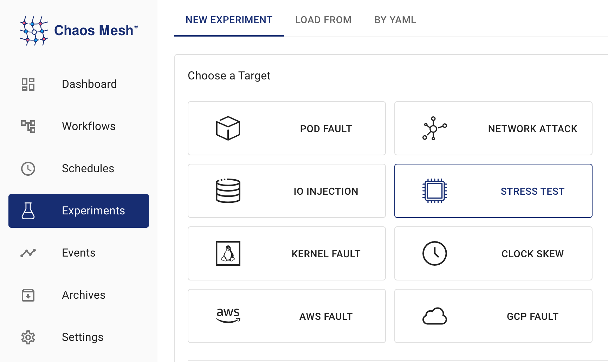

## StressChaos Introduction

Chaos Mesh provides StressChaos experiments to simulate stress scenarios inside containers. This document describes how to create StressChaos experiments and how to prepare the corresponding configuration file.

You can create experiments using either Chaos Dashboard or the YAML configuration files.

## Create experiments using Chaos Dashboard

1. Open Chaos Dashboard, and click **NEW EXPERIMENT** on the page to create a new experiment:

   

2. In the **Choose a Target** area, choose **STRESS TEST** and fill out the experiment information. For specific configuration fields, refer to the description in [Configuration Description](#fields description).

   

3. Fill out the experiment information, and specify the experiment scope and the scheduled experiment duration:

   

4. Submit the experiment information.

## Create experiments using the YAML file

1. Write the experiment configuration to the YAML configuration file. In the following example, the `memory-stress.yaml` file is used.

   ```yaml
   apiVersion: chaos-mesh.org/v1alpha1
   kind: StressChaos
   metadata:
     name: memory-stress-example
     namespace: chaos-testing
   spec:
     mode: one
     selector:
       labelSelectors:
         'app': 'app1'
     stressors:
       memory:
         workers: 4
         size: '256MB'
   ```

   This experiment configuration will create a process in the selected container, continuously allocate and read and write in memory, occupying up to 256MB of memory.

2. After the configuration file is prepared, use `kubectl` to create an experiment:

   ```bash
   kubectl apply -f memory-stress.yaml
   ```

### Field description

The fields in the YAML configuration file are described in the following table:

| Parameter | Type | Description | Default value | Required | Example |
| --- | --- | --- | --- | --- | --- |
| duration | string | Specifies the duration of the experiment. | None | Yes | `30s` |
| stressors | [Stressors](#stressors) | Specifies the stress of CPU or memory | None | No |  |
| stressngStressors | string | Specifies the stres-ng parameter to reach richer stress injection | None | No | `--clone 2` |
| mode | string | Specifies the mode of the experiment. The mode options include `one` (selecting a random Pod), `all` (selecting all eligible Pods), `fixed` (selecting a specified number of eligible Pods), `fixed-percent` (selecting a specified percentage of Pods from the eligible Pods), and `random-max-percent` (selecting the maximum percentage of Pods from the eligible Pods). | None | Yes | `one` |
| value | string | Provides a parameter for the `mode` configuration, depending on `mode`.For example, when `mode` is set to `fixed-percent`, `value` specifies the percentage of Pods. | None | No | 1 |
| containerNames | []string | Specifies the name of the container into which the fault is injected. | None | No | `["nginx"]` |
| selector | struct | Specifies the target Pod. For details, refer to [Define the Scope of Chaos Experiments](./define-chaos-experiment-scope.md). | None | Yes |  |

#### Stressors

| Parameter | Type                              | Description                 | Default value | Required | Example |
| --------- | --------------------------------- | --------------------------- | ------------- | -------- | ------- |
| memory    | [MemoryStressor](#memorystressor) | Specifies the memory stress | None          | No       |         |
| cpu       | [CPUStressor](#cpustressor)       | Specifies the CPU stress    | None          | No       |         |

##### MemoryStressor

| Parameter | Type   | Description                                              | Default value | Required | Example |
| --------- | ------ | -------------------------------------------------------- | ------------- | -------- | ------- |
| workers   | int    | Specifies the number of threads that apply memory stress |               | No      | `1`     |
| size      | string | Specifies the size of memory to be occupied or a percentage of the total memory size, and the final sum of allocated memory size is `workers * size`     |               | No       | `256MB`/`25%` |
| time      | string | Specifies the time to reach the memory `size`, and the growth model is a linear model     |               | No       | `10min` |

(**tips**: Chaos Mesh uses [memStress](https://github.com/chaos-mesh/memStress) to simulate memory stressChaos Mesh uses memStress to simulate memory stress, in which way we can avoid high CPU load.)
##### CPUStressor

| Parameter | Type | Description | Default value | Required | Example |
| --- | --- | --- | --- | --- | --- |
| workers | int | Specifies the number of threads that apply CPU stress |  | Yes | `1` |
| load | int | Specifies the percentage of CPU occupied 0 means sleep and no load; 100 means full load, and the final sum of CPU load is `workers * load` |  | No | `50` |
