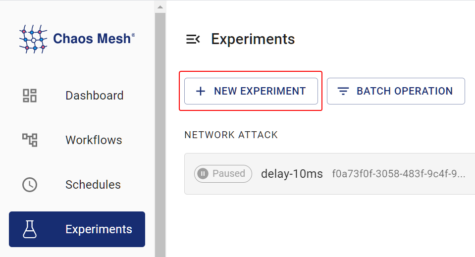
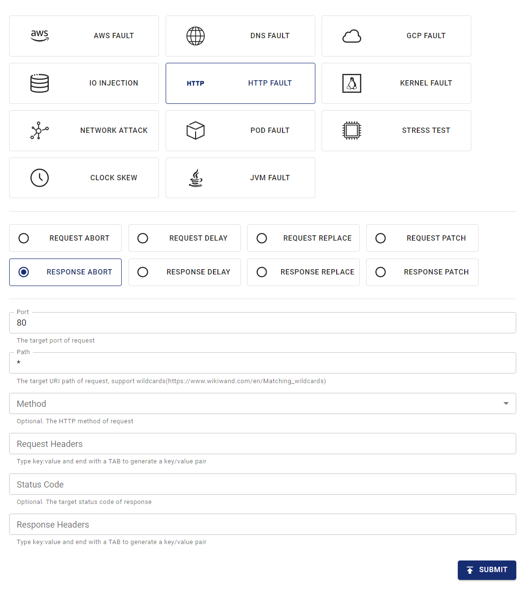

This document describes how to simulate HTTP faults by creating HTTPChaos experiments in Chaos Mesh.

## HTTPChaos introduction

HTTPChaos is a fault type provided by Chaos Mesh. By creating an HTTPChaos experiment, you can simulate faults during HTTP request and response processing. Currently, HTTPChaos supports the following fault types:

- `abort`: interrupts the connection
- `delay`: injects latency into the request or response
- `replace`: replaces part of the content in an HTTP request or response message
- `patch`: adds additional content to an HTTP request or response message

HTTPChaos supports combinations of different fault types. If you configure multiple HTTP fault types when creating an HTTPChaos experiment, the faults are injected in the following order: `abort` -> `delay` -> `replace` -> `patch`. When the `abort` fault causes a short circuit, the connection is interrupted directly.

For the detailed description of HTTPChaos configuration, see [Field description](#field-description) below.

## Notes

Before injecting the faults supported by HTTPChaos, note the following:

- There is no Control Manager of Chaos Mesh running on the target Pod.
- By default, the fault rules affect both the client and the server in the Pod. If you want to affect only one side, refer to the [specify side](#specify-side) section.
- HTTPS access should be disabled, because injecting HTTPS connections is not currently supported.
- For HTTPChaos injection to take effect, the client should avoid reusing TCP sockets. HTTPChaos does not affect HTTP requests sent over a TCP connection that was established before fault injection.
- Use non-idempotent requests (such as most POST requests) with caution in production environments. If such requests are used, the target service may not return to normal by simply repeating the requests after fault injection.

## Create experiments using Chaos Dashboard

1. Open Chaos Dashboard and click **NEW EXPERIMENT** to create a new experiment:

   

2. In the **Choose a Target** area, choose **HTTP FAULT** and select a specific behavior, such as `RESPONSE ABORT`. Then fill out the specific configurations.

   

3. Submit the experiment.

   In this example, you have configured the `RESPONSE ABORT` fault to be injected into all requests on port 80.

## Create experiments using YAML files

Chaos Mesh also supports using YAML configuration files to create HTTPChaos experiments. In a YAML file, you can simulate either one HTTP fault type or a combination of different HTTP fault types.

### Example of `abort`

1. Write the experiment configuration to the `http-abort-failure.yaml` file, as in the following example:

   ```yaml
   apiVersion: chaos-mesh.org/v1alpha1
   kind: HTTPChaos
   metadata:
     name: test-http-chaos
   spec:
     mode: all
     selector:
       labelSelectors:
         app: nginx
     target: Request
     port: 80
     method: GET
     path: /api
     abort: true
     duration: 5m
   ```

   Based on this configuration example, Chaos Mesh injects the `abort` fault into the specified Pod for 5 minutes. During fault injection, the GET requests sent through port 80 to the `/api` path of the target Pod are interrupted.

2. After the configuration file is prepared, use `kubectl` to create the experiment:

   ```bash
   kubectl apply -f ./http-abort-failure.yaml
   ```

### Example of fault combinations

1. Write the experiment configuration to the `http-failure.yaml` file, as in the following example:

   ```yaml
   apiVersion: chaos-mesh.org/v1alpha1
   kind: HTTPChaos
   metadata:
     name: test-http-chaos
   spec:
     mode: all
     selector:
       labelSelectors:
         app: nginx
     target: Request
     port: 80
     method: GET
     path: /api/*
     delay: 10s
     replace:
       path: /api/v2/
       method: DELETE
     patch:
       headers:
         - ['Token', '<one token>']
         - ['Token', '<another token>']
       body:
         type: JSON
         value: '{"foo": "bar"}'
     duration: 5m
   ```

   Based on this configuration example, Chaos Mesh injects the `delay`, `replace`, and `patch` faults in sequence.

2. After the configuration file is prepared, use `kubectl` to create the experiment:

   ```bash
   kubectl apply -f ./http-failure.yaml
   ```

## Field description

### Description for common fields

Common fields are meaningful when the `target` of fault injection is `Request` or `Response`.

| Parameter | Type | Description | Default value | Required | Example |
| --- | --- | --- | --- | --- | --- |
| `mode` | string | Specifies the mode of the experiment. The mode options include `one` (selecting a random pod), `all` (selecting all eligible pods), `fixed` (selecting a specified number of eligible pods), `fixed-percent` (selecting a specified percentage of Pods from the eligible pods), and `random-max-percent` (selecting the maximum percentage of Pods from the eligible pods). |  | yes | `one` |
| `value` | string | Provides parameters for the `mode` configuration depending on the value of `mode`. |  | no | 1 |
| `target` | string | Specifies whether the target of fault injection is `Request` or `Response`. The [`target`-related fields](#description-for-target-related-fields) should be configured at the same time. |  | yes | Request |
| `port` | int32 | The TCP port that the target service listens on. |  | yes | 80 |
| `path` | string | The URI path of the target request. Supports wildcard matching. | Takes effect on all paths by default. | no | /api/\* |
| `method` | string | The HTTP method of the target request. | Takes effect for all methods by default. | no | GET |
| `request_headers` | map[string]string | Matches the request headers of the target request. | Takes effect for all requests by default. | no | Content-Type: application/json |
| `abort` | bool | Indicates whether to inject the fault that interrupts the connection. | false | no | true |
| `delay` | string | Specifies the time for a delay fault. | 0 | no | 10s |
| `replace.headers` | map[string]string | Specifies the key-value pairs used to replace the request headers or response headers. |  | no | Content-Type: application/xml |
| `replace.body` | []byte | Specifies the content used to replace the request body or response body (Base64 encoded). |  | no | eyJmb28iOiAiYmFyIn0K |
| `patch.headers` | [][]string | Specifies the key-value pairs appended to the request headers or response headers by the patch fault. |  | no | - [Set-Cookie, one cookie] |
| `patch.body.type` | string | Specifies the type of the patch fault applied to the request body or response body. Currently, only [`JSON`](https://tools.ietf.org/html/rfc7396) is supported. |  | no | JSON |
| `patch.body.value` | string | Specifies the content of the patch fault applied to the request body or response body. |  | no | `{"foo": "bar"}` |
| `duration` | string | Specifies the duration of the experiment. |  | yes | 30s |
| `scheduler` | string | Specifies the scheduling rules for the time of the experiment. |  | no | 5 \* \* \* \* |
| `tls.secretName` | string | Specifies the name of the required Secret resource. |  | no | "http-tls-scr" |
| `tls.secretNamespace` | string | Specifies the namespace of the required Secret resource. In most cases, it should be the same namespace as the `chaos-controller-manager` deployment. |  | no | "chaos-mesh" |
| `tls.certName` | string | Specifies the name of the certificate file in the Secret, for example `tls.crt`. |  | no | "tls.crt" |
| `tls.keyName` | string | Specifies the name of the key file in the Secret, for example `tls.key`. |  | no | "tls.key" |
| `tls.caName` | string | Specifies the name of the CA file in the Secret, for example `ca.crt`. |  | no | "ca.crt" |

:::note

- When creating experiments with YAML files, `replace.body` must be the base64 encoding of the replacement content.

- When creating experiments with the Kubernetes API, there is no need to encode the replacement content. Just convert it to `[]byte` and put it into the `httpchaos.Spec.Replace.Body` field. The following is an example:

```golang
httpchaos.Spec.Replace.Body = []byte(`{"foo": "bar"}`)
```

:::

### Description for `target`-related fields

#### `Request`-related fields

The `Request`-related fields are meaningful when `target` is set to `Request`.

| Parameter | Type | Description | Default value | Required | Example |
| --- | --- | --- | --- | --- | --- |
| `replace.path` | string | Specifies the URI path used to replace content. |  | no | /api/v2/ |
| `replace.method` | string | Specifies the HTTP method used to replace the request method. |  | no | DELETE |
| `replace.queries` | map[string]string | Specifies the key-value pairs used to replace the URI query. |  | no | foo: bar |
| `patch.queries` | [][]string | Specifies the key-value pairs appended to the URI query by the patch fault. |  | no | - [foo, bar] |

#### `Response`-related fields

The `Response`-related fields are meaningful when `target` is set to `Response`.

| Parameter | Type | Description | Default value | Required | Example |
| --- | --- | --- | --- | --- | --- |
| `code` | int32 | Matches the response status code of the target. | Takes effect for all status codes by default. | no | 200 |
| `response_headers` | map[string]string | Matches the response headers of the target. | Takes effect for all responses by default. | no | Content-Type: application/json |
| `replace.code` | int32 | Specifies the status code used to replace the response status code. |  | no | 404 |

## Specify side

By default, the fault rules affect both the client and the server in the Pod, but you can affect only one side by matching the request headers.

This section provides some examples of specifying the affected side. You can adjust the header selector in the rules depending on your particular cases.

### Client side

To inject faults into the client in the Pod without affecting the server, you can match the request or response by the `Host` header in the request.

For example, if you want to interrupt all requests to `http://example.com/`, you can apply the following YAML config:

```yaml
apiVersion: chaos-mesh.org/v1alpha1
kind: HTTPChaos
metadata:
  name: test-http-client
spec:
  mode: all
  selector:
    labelSelectors:
      app: some-http-client
  target: Request
  port: 80
  path: '*'
  request_headers:
    Host: 'example.com'
  abort: true
```

### Server side

To inject faults into the server in the Pod without affecting the client, you can also match the request or response by the `Host` header in the request.

For example, if you want to interrupt all requests to your server behind the service `nginx.nginx.svc`, you can apply the following YAML config:

```yaml
apiVersion: chaos-mesh.org/v1alpha1
kind: HTTPChaos
metadata:
  name: test-http-server
spec:
  mode: all
  selector:
    labelSelectors:
      app: nginx
  target: Request
  port: 80
  path: '*'
  request_headers:
    Host: 'nginx.nginx.svc'
  abort: true
```

In other cases, especially when injecting faults into inbound requests from outside, you may match the request or response by the `X-Forwarded-Host` header in the request.

For example, if you want to interrupt all requests to your server behind the public gateway `nginx.host.org`, you can apply the following YAML config:

```yaml
apiVersion: chaos-mesh.org/v1alpha1
kind: HTTPChaos
metadata:
  name: test-http-server
spec:
  mode: all
  selector:
    labelSelectors:
      app: nginx
  target: Request
  port: 80
  path: '*'
  request_headers:
    X-Forwarded-Host: 'nginx.host.org'
  abort: true
```

## TLS

To inject faults into TLS connections, enable TLS mode. In TLS mode, the Chaos Mesh proxy acts as both a server and a client, so it needs a trusted CA and the corresponding certificate and key. You need to create the TLS certificate, key, and CA on your own and store them in a Secret, then reference the Secret through the `tls` fields.

To create a new TLS server and inject faults into its connections, do the following:

1. Create your own root CA private key and root CA certificate:

   ```
   openssl req -newkey rsa:4096 -x509 -sha512 -days 365 -nodes -out ca.crt -keyout ca.key
   ```

2. Create the server's Certificate Signing Request:

   ```
   openssl genrsa -out server.key 2048
   openssl req -new -key server.key -out server.csr
   ```

3. Write the extension file `server.ext` for the server:

   ```
   authorityKeyIdentifier=keyid,issuer
   basicConstraints=CA:FALSE
   keyUsage = digitalSignature, nonRepudiation, keyEncipherment, dataEncipherment
   subjectAltName = @alt_names

   [alt_names]
   IP.1 = X.X.X.X
   ```

4. Generate the server certificate:

   ```
   openssl x509 -req -in server.csr -CA ca.crt -CAkey ca.key -CAcreateserial -out server.crt -days 365 -sha256 -extfile server.ext
   ```

5. Add the CA `ca.crt` to the client.

6. Store `server.key`, `server.crt`, and `ca.crt` in a Secret, and reference the Secret through the `tls` fields.

To inject faults into a client connection, the Chaos Mesh proxy acts as the remote server. In this case, change the `server.ext` file above to match the target domain.

For example:

```
subjectAltName = @alt_names

[alt_names]
DNS.1 = *.domain.com
IP.1 = xxx.xxx.xxx.xxx
```

## Local debugging

If you are not sure of the effects of certain fault injections, you can also test the corresponding features locally using [rs-tproxy](https://github.com/chaos-mesh/rs-tproxy). Chaos Mesh uses rs-tproxy to implement HTTPChaos.
