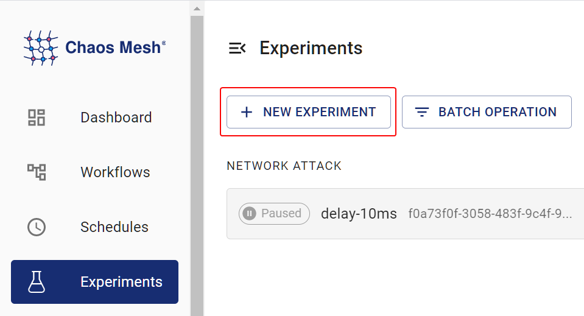

This document describes how to create PhysicalMachineChaos (physical machine chaos) experiments in Chaos Mesh to simulate the faults of network, disk, pressure, JVM, time, and others in physical or virtual machines.

## Introduction to PhysicalMachineChaos

You can use PhysicalMachineChaos to simulate the faults of network, disk, pressure, JVM, time, and others in physical or virtual machines.

## Deploy Chaosd server

Before creating PhysicalMachineChaos experiments using Chaos Mesh, you need to deploy Chaosd in service mode to all physical or virtual machines that are going to be injected with faults. After deploying Chaosd, run Chaosd server as follows:

1. Deploy Chaosd, generate a TLS certificate, and create `PhysicalMachine`:

- For the deployment method of Chaosd, refer to [Download and deploy Chaosd](chaosd-overview.md#download-and-deploy).
- After deploying Chaosd, **before** starting Chaosd server, you need to generate a TLS certificate and create a `PhysicalMachine` in Kubernetes clusters. For more information on how to generate TLS certificates, refer to [Generate TLS certificates for Chaosd](chaosctl-tool.md#generate-tls-certificates-for-chaosd).

  :::note

  When using Chaos Mesh v2.1.0, you need to deploy Chaosd [v1.1.0](https://github.com/chaos-mesh/chaosd/releases/tag/v1.1.0).

  :::

2. Start Chaosd Server:

- After generating the TLS certificate through Chaosctl, run the following command to start Chaosd in service mode:

  ```bash
  chaosd server --https-port 31768 --CA=/etc/chaosd/pki/ca.crt --cert=/etc/chaosd/pki/chaosd.crt --key=/etc/choasd/pki/chaosd.key
  ```

  :::note

  The TLS certificates are saved to the default output directory of Chaosctl. If you manually specified another directory when generating certificates, replace the directory in the command line with the corresponding one.

  :::

- If the TLS certificate is not generated through Chaosctl, you can run the following command to start Chaosd in service mode. However, for the security of your clusters, this is **not** recommended.

  ```bash
  chaosd server --port 31767
  ```

## Create experiments using Chaos Dashboard

1. Open Chaos Dashboard, and click **NEW EXPERIMENT** on the page to create a new experiment:

   

2. Click **PHYSIC** in **Experiment Type** and choose a specific type of the experiment, such as **NETWORK ATTACK**. Then, choose a specific behavior and fill out the corresponding configurations:

   

3. Fill out the experiment information to specify the range and the planned duration of the experiment:

   

4. Submit the experiment.

## Create experiments using an YAML file

1. Write the experimental configurations to the "physicalmachine.yaml" file. For example:

   ```yaml
   apiVersion: chaos-mesh.org/v1alpha1
   kind: PhysicalMachineChaos
   metadata:
     name: physical-network-delay
     namespace: chaos-testing
   spec:
     action: network-delay
     mode: one
     selector:
       namespaces:
         - default
       labelSelectors:
         'arch': 'amd64'
     network-delay:
       device: ens33
       ip-address: 140.82.112.3
       latency: 1000ms
     duration: '10m'
   ```

   The experimental configurations above send HTTP requests to Chaosd service in the specified physical machines or virtual machines to trigger network latency experiments.

2. Create the experiment using `kubectl`. The command is as follows:

   ```bash
   kubectl apply -f physicalmachine.yaml
   ```

### Configuration description

| Configuration item | Type | Description | Default value | Required | Example |
| :-- | :-- | :-- | :-- | :-- | :-- |
| `action` | string | Defines the actions of physical machines faults, optional values are as follows: `stress-cpu`, `stress-mem`, `disk-read-payload`, `disk-write-payload`, `disk-fill`, `network-corrupt`, `network-duplicate`, `network-loss`, `network-delay`, `network-partition`, `network-dns`, `process`, `jvm-exception`, `jvm-gc`, `jvm-latency`, `jvm-return`, `jvm-stress`, `jvm-rule-data`, `clock` | None | Yes | `stress-cpu` |
| `address` | string array | Selects the `address` of Chaosd service to inject faults, only one of `address` or `selector` could be specified | [] | Yes | ["192.168.0.10:31767"] |
| `selector` | struct | Specifies the target PhysicalMachine. For details, refer to [Define the experiment scope](define-chaos-experiment-scope.md), only one of `address` or `selector` could be specified | None | No |  |
| `mode` | string | Specifies the mode of the experiment. The mode options include `one` (selecting a random PhysicalMachine), `all` (selecting all eligible PhysicalMachines), `fixed` (selecting a specified number of eligible PhysicalMachines), `fixed-percent` (selecting a specified percentage of PhysicalMachines from the eligible PhysicalMachines), and `random-max-percent` (selecting the maximum percentage of PhysicalMachines from the eligible PhysicalMachines). | None | Yes | `one` |
| `value` | string | Provides a parameter for the `mode` configuration, depending on `mode`. For example, when `mode` is set to `fixed-percent`, `value` specifies the percentage of PhysicalMachines. | None | No | `1` |
| `duration` | string | Specifies the duration of experiments | None | Yes | `30s` |

Each fault action has its own specific configurations. The following section introduces various fault types and their corresponding configuration methods.

#### CPU stress

To simulate a CPU stress scenario, you need to set the action to "stress-cpu". For the corresponding configurations, refer to Parameters of simulating CPU stress.

#### Memory stress

To simulate a memory stress scenario, you need to set the action to "stress-mem". For the corresponding configurations, refer to Parameters of simulating memory stress.

#### Disk read load

To simulate a disk read load scenario, you need to set the action to "disk-read-payload". For the corresponding configurations, refer to Parameters of simulating disk read load.

#### Disk write load

To simulate a disk write load scenario, you need to set the action to "disk-write-payload". For the corresponding configurations, refer to Parameters of simulating disk write load.

#### Disk fill

To simulate a disk fill scenario, you need to set the action to "disk-fill". For the corresponding configurations, refer to Parameters of simulating disk fill.

#### Network corruption

To simulate a network corruption scenario, you need to set the action to "network-corrupt". For the corresponding configurations, refer to Parameters of simulating network corruption.

#### Network latency

To simulate a network latency scenario, you need to set the action to "network-delay". For the corresponding configurations, refer to Parameters of simulating network latency.

#### Network duplication

To simulate a network duplication scenario, you need to set the action to "network-duplicate". For the corresponding configurations, refer to Parameters of simulating network duplication.

#### Network loss

To simulate a network loss scenario, you need to set the action to "network-loss". For the corresponding configurations, refer to Parameters of simulating network loss.

#### Network partition

To simulate a network partition scenario, you need to set the action to "network-partition". For the corresponding configurations, refer to Parameters of simulating network partition.

#### DNS fault

To simulate a DNS fault scenario, you need to set the action to "network-dns". For the corresponding configurations, refer to Parameters of simulating DNS fault.

#### Process fault

To simulate a process fault scenario, you need to set the action to "process". For the corresponding configurations, refer to Parameters of simulating process fault.

#### Throw custom exceptions for JVM applications

To simulate a scenario that JVM applications throw custom exceptions, you need to set the action to "jvm-exception". For the corresponding configurations, refer to Parameters for throwing custom exceptions.

#### Increase method latency for JVM applications

To simulate a scenario that JVM applications increase method latency, you need to set the action to "jvm-latency". For the corresponding configurations, refer to Parameters for increasing method latency.

#### Modify return values of methods for JVM applications

To simulate a scenario that JVM applications modify return values of methods, you need to set the action to "jvm-return". For the corresponding configurations, refer to Parameters for modifying return values of a method.

#### Trigger garbage collection for JVM applications

To simulate a scenario that JVM applications trigger garbage collection, you need to set the action to "jvm-gc". For the corresponding configurations, refer to Parameters for triggering garbage collection.

#### Trigger faults using Byteman configuration files for JVM applications

To simulate a scenario that JVM applications trigger faults using Byteman configuration files, you need to set the action to "jvm-rule-data". For the corresponding configurations, refer to Parameters for triggering faults by setting Byteman configuration files.

#### Time offset

To simulate a time offset scenario, you need to set the action to "clock". For the corresponding configurations, refer to Parameters of simulating time offset.
