Chaos Mesh v2.1.0 introduces the following significant changes, which expand the user scenarios of Chaos Mesh and improve overall usability:

- Support creating and running Chaos experiments in a physical machine, an important step for Chaos Mesh to become a Chaos Engineering platform.
- Optimize Workflow to display the Workflow-related events and configurations and to create HTTP tasks in Workflow, which greatly expands the user scenarios of workflow.
- Support creating HTTPChaos on Chaos Dashboard, which improves the usability of HTTPChaos.
- Supports simulating the faults of JVM application through [Byteman](https://byteman.jboss.org), which improves the usability and scalability of JVMChaos.
- Integrates GCP certification into Chaos Dashboard.

This tutorial introduces how to use the key features in Chaos Mesh v2.1.0.

## Prepare the environment

### Deploy Kubernetes and Chaos Mesh

Before you begin, make sure you have installed [Git](https://git-scm.com) and [Docker](https://www.docker.com) on your computer.

In this section, you are going to deploy Kubernetes and Chaos Mesh using the installation script `install.sh`, which performs the following operations:

- Deploy a Kubernetes cluster.
- Install Chaos Mesh in that Kubernetes cluster.

:::note

The deployment methods of Kubernetes and Chaos Mesh provided in this document are only for testing and quick start. If you want to deploy them in a production environment, refer to [Install Chaos Mesh using Helm](./production-installation-using-helm.md).

:::

1. Clone Chaos Mesh project

   You can clone [Chaos Mesh project](https://github.com/chaos-mesh/chaos-mesh) on Github by running the following command:

   ```
   git clone https://github.com/chaos-mesh/chaos-mesh.git && \
   cd chaos-mesh && git checkout v2.1.0
   ```

2. Deploy Kubernetes and Chaos Mesh using `install.sh`

   Run the following command to deploy a Kubernetes cluster:

   ```
   ./install.sh --local kind
   ```

   `install.sh` is a one-click installation script provided by Chaos Mesh. The script checks your environment automatically, installs [kind](https://kind.sigs.k8s.io), starts a local Kubernetes cluster, and then installs Chaos Mesh.

### Forward the port for Dashboard service

To visit Chaos Dashboard in the browser, you need to run the following command to forward the port for the Chaos Dashboard service:

```
kubectl port-forward -n chaos-testing svc/chaos-dashboard 2333:2333 --address 0.0.0.0
```

After running the command, you can access Chaos Dashboard by visiting <127.0.0.1:2333> in your browser. The Dashboard interface is as follows:


### Deploy Chaosd

Chaosd, provided by Chaos Mesh, is a tool to run Chaos experiments on a physical machine.

1. Download Chaosd:

   ```
   curl -fsSL -o chaosd-v1.1.0-linux-amd64.tar.gz https://mirrors.chaos-mesh.org/chaosd-v1.1.0-linux-amd64.tar.gz
   ```

2. Unzip the Chaosd file and navigate to the local directory:

   ```
   tar zxvf chaosd-v1.1.0-linux-amd64.tar.gz
   cd chaosd-v1.1.0-linux-amd64
   ```

3. Enable Chaosd in the service mode:

   ```
   nohup chaosd server --port 31767 2>&1 chaosd.log &
   ```

After that, you can send the request for Chaos experiments to Chaosd through the port "31767" of your local machine.

### Deploy the test applications

To run the test smoothly, you need to set up a test environment beforehand. Suppose that you have a MySQL database on a physical machine, and an application "mysql-query" in Kubernetes provides data query services for MySQL.

In this tutorial, you are going to use Chaos Mesh to insert faults into a physical machine and an application in Kubernetes, and then see the impact of the faults on your service.

The architecture of the test application is as follows:

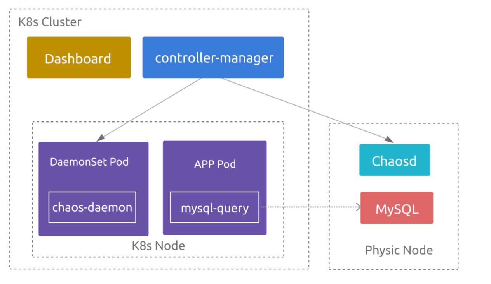

#### Deploy MySQL

1. Deploy MySQL v8.0 using Docker:

   ```
   docker run --rm --name mysql-3306 -p 3306:3306 -e MYSQL_ROOT_PASSWORD=123456 mysql/mysql-server:8.0.27 --port=3306 --bind-address=0.0.0.0
   ```

2. Use Docker to enter the container and connect to MySQL, because it is not yet possible to access the MySQL service from outside the container:

   ```
   docker exec -it mysql-3306 mysql -uroot -p123456
   ```

3. Run the following SQL statements to create a user that can access the database externally, and grant all privileges to the user:

   ```
   CREATE USER 'chaos'@'%' IDENTIFIED BY 'chaos-mesh';
   GRANT ALL PRIVILEGES ON * . * TO 'chaos'@'%';
   ```

4. Prepare the dataset for testing. You can run [`example.SQL`](https://github.com/WangXiangUSTC/byteman-example/blob/chaos_demo/mysqldemo/example.SQL) in MySQL to generate the test data.

#### Deploy mysql-query service

[mysql-query](https://github.com/WangXiangUSTC/byteman-example/tree/chaos_demo/mysqldemo) is a demo application written in Java, whose image is uploaded to Docker Hub. To deploy the service in the Kubernetes cluster, take the following steps:

1. Download the [`deployment.yaml`](https://github.com/WangXiangUSTC/byteman-example/blob/chaos_demo/mysqldemo/deployment.yaml) file and modify the configuration.

   :::note

   You need to replace the IP address in the environment variable `MYSQL_DSN` with the address of the server where MySQL is installed.

   :::

2. Use the `deployment.yaml` to create the mysql-query service:

   ```
   kubectl create namespace mysql-query
   kubectl apply -f ./deployment.yaml
   ```

3. Check whether the Pod in the `mysql-query` namespace runs successfully:

   ```
   kubectl get pods -n mysql-query
   ```

   The expected result is as follows:

   ```
   NAME                           READY   STATUS    RESTARTS   AGE
   mysql-query-6dd8bd5474-5zbkw   1/1     Running   0          60s
   mysql-query-6dd8bd5474-k8bgs   1/1     Running   0          60s
   ```

   In the result, you can find that there are two Pods that share the query request, and the mysql-query service has configured `NodePort`. Therefore, the Pods can directly access the service on the nodes of the Kubernetes cluster through the NodePort (`30001` in here).

4. Run the following command to access kind-control-plane and send HTTP requests:

   ```
   docker exec -it kind-control-plane curl -X GET "http://127.0.0.1:30001/query?sql=SELECT%20*%20FROM%20chaos.website"
   ```

   mysql-query gets the SQL statement in the request and runs it in MySQL. The expected result is as follows:

   ```
   id, name, url
   1, Chaos Mesh, https://chaos-mesh.org
   2, GitHub, https://github.com
   2, Google, https://google.com
   Elapsed time: 35(ms)
   ```

If the result shows the query results and the query time, the application can provide its service normally.

## Create Chaos experiments

After deploying Chaos Mesh, you can design Chaos experiments for your application and create the experiments using Chaos Mesh v2.1.0.

### Experiment 1: Is the service highly available?

If you send HTTP requests to mysql-query service through NodePort multiple times and check the logs of the two mysql-query Pods, you can see that both Pods print the query requests in their logs. In such cases, these two Pods share the responsibility for serving your SQL queries.

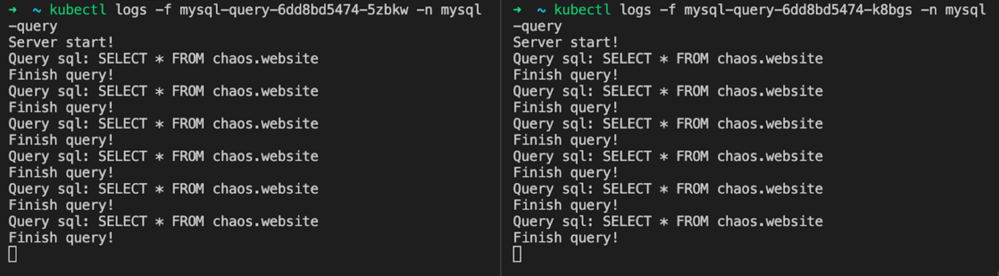

If one of the Pods fails and cannot be connected, a highly available system can automatically forward the requests to another Pod. You can create a Chaos experiment to verify the service's high availability. The steps are as follows:

1. Click **New experiment** in Chaos Dashboard:

   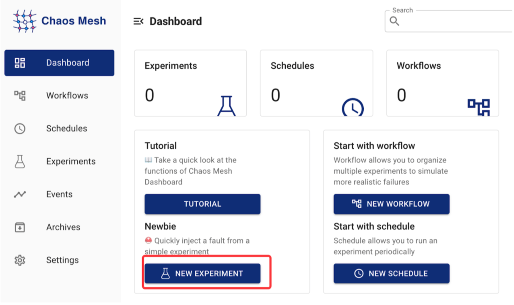

2. Select **Kubernetes** as the experiment environment and **HTTP Fault** as the experiment type:

   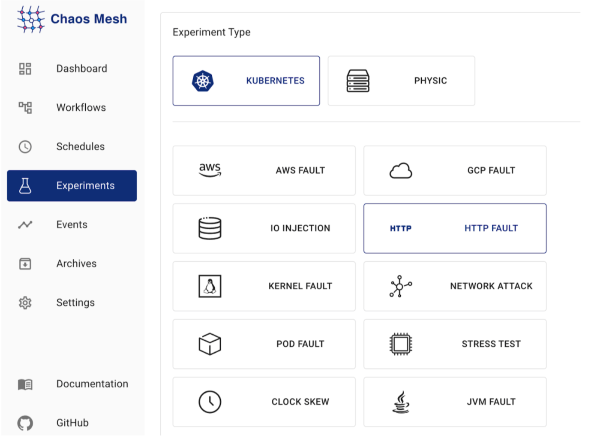

3. Select **Request abort** as the fault behavior, and fill out the fault configuration:

   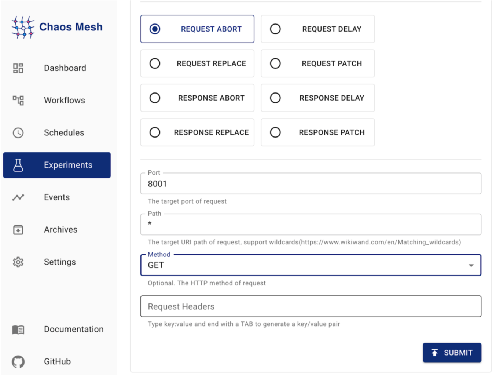

4. Fill out the experiment information:

   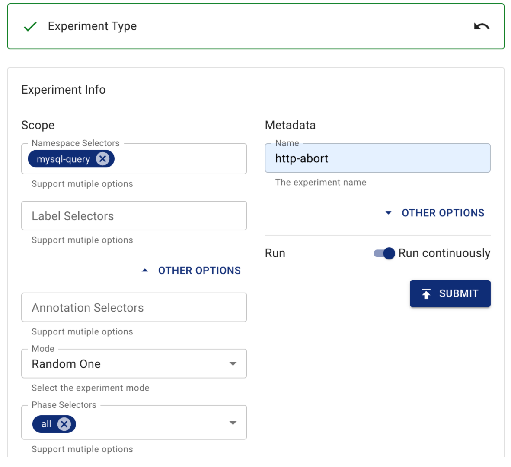

5. Submit the experiment.

This experiment chooses a random Pod of the mysql-query service and injects the HTTP fault into the Pod. The chosen Pod will terminate its connection.

After running the experiment, you can verify the experiment results by running the following command _multiple times_:

```
docker exec -it kind-control-plane curl -X GET "http://127.0.0.1:30001/query?sql=SELECT%20*%20FROM%20chaos.website"
```

You can see that the command sometimes returns a normal response, but sometimes it also reports an error as follows:

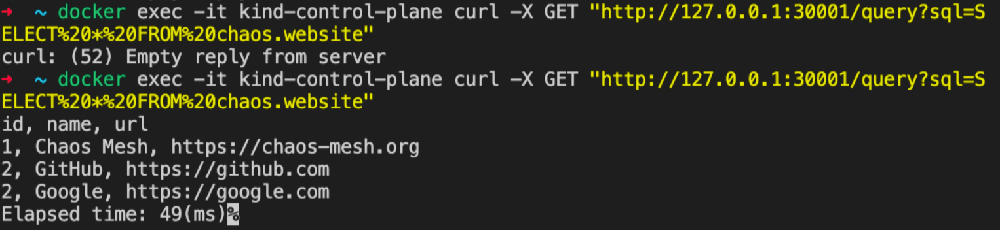

The experiment shows that this service is not highly available. You have successfully found a fault in the service architecture through a HTTP fault injection.

After the experiment, you might need to consider how to optimize the service architecture, such as using Ingress and NGINX.

### Experiment 2: What if the query returns an exception?

Even though all of your SQL queries executed in normal situations return normal data, it does not mean your code has no bugs. If the query returns an exception, you might wonder whether your application can handle the exception and return the error message. In such cases, you can verify that situation by running a Chaos experiment.

Before creating the experiment, you need to understand the code logic of your application. The [`querySQL`](https://github.com/WangXiangUSTC/byteman-example/blob/318a35fbff3e1648464b69bf892fcc0ec1860a28/mysqldemo/src/main/java/com/mysqldemo/App.java#L126) function executes SQL statements and can throw a `java.sql.SQLException` exception. You can inject faults into this function.

1. Click **New experiment** in Chaos Dashboard. Select **Kubernetes** as the experiment environment and **JVM Fault** as the experiment type:

   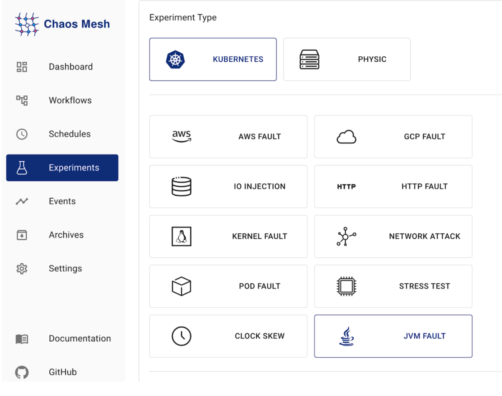

2. Select **Exception** as the fault behavior, and fill out the fault configuration:

   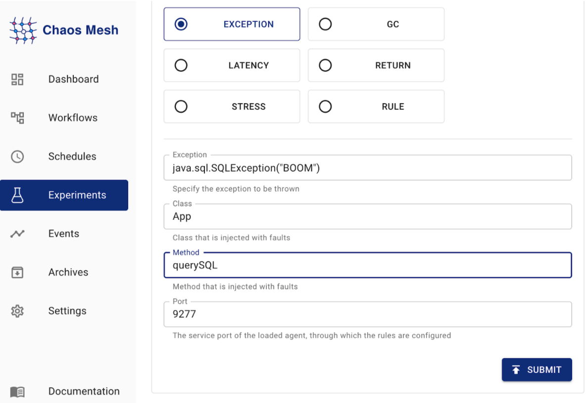

3. Fill out the experiment information:

   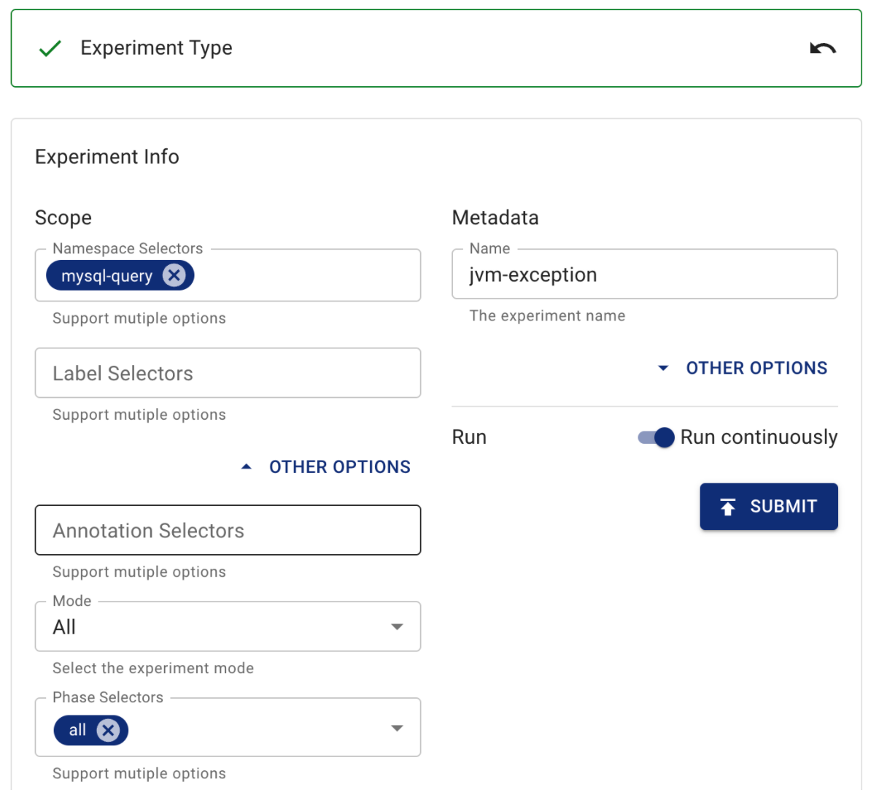

4. Submit the experiment.

This experiment chooses all Pods of the mysql-query service and injects the JVM fault into the Pods. When your application executes the `querySQL` function, it throws an exception.

After running the experiment, you can verify the experiment results by running the following command:

```
docker exec -it kind-control-plane curl -X GET "http://127.0.0.1:30001/query?sql=SELECT%20*%20FROM%20chaos.test"
curl: (18) transfer closed with outstanding read data remaining
```

As you can see in the result, the application reports an error, but the result is not the exception information of the application. The logs of the two mysql-query Pods do not contain any notable information.

To find out the root cause, you need to read the code and find out which part of the code is executed after `java.sql.SQLException` is thrown. Through investigation, you can find an exception caused by a null pointer.

You have successfully found a fault in the code through a JVM fault injection.

### Experiment 3: How does heavy workload affect MySQL queries?

After the two preceding experiments, you already know how vulnerable your application can be. This is what Chaos Engineering is all about: it helps you understand how the system handles failure, identify potential issues, fix them in advance, and thereby build confidence in your system.

After you fix the two issues exposed above, you might want to run an experiment on the storage of your application – MySQL. When the server that MySQL runs on also runs heavy workloads for other applications, how does those workloads affect MySQL queries? You can check it by the following experiment.

1. Click **New experiment** in Chaos Dashboard. Because MySQL is deployed on a physical machine, select **Physic** as the experiment environment and **Stress test** as the experiment type:

   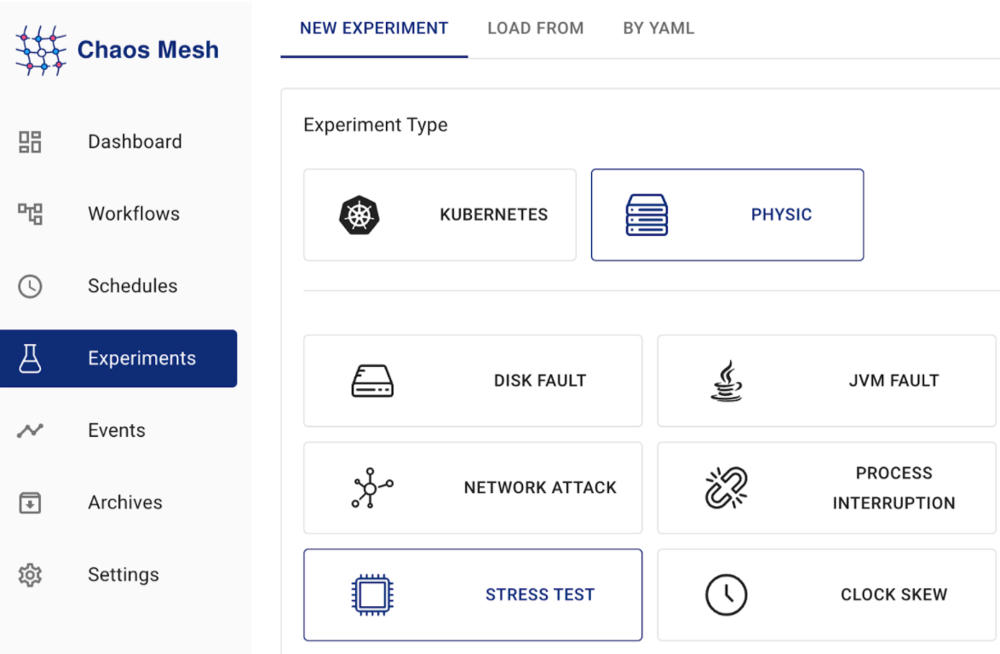

2. Select **CPU** as the fault behavior, and fill out the fault configuration:

   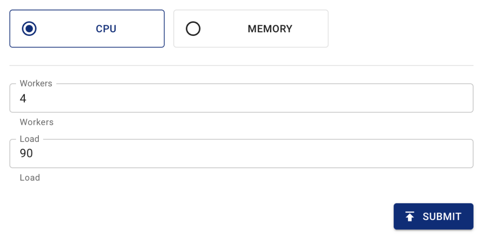

3. Fill out the experiment information. In the **Address** text box, write the Chaosd service address:

   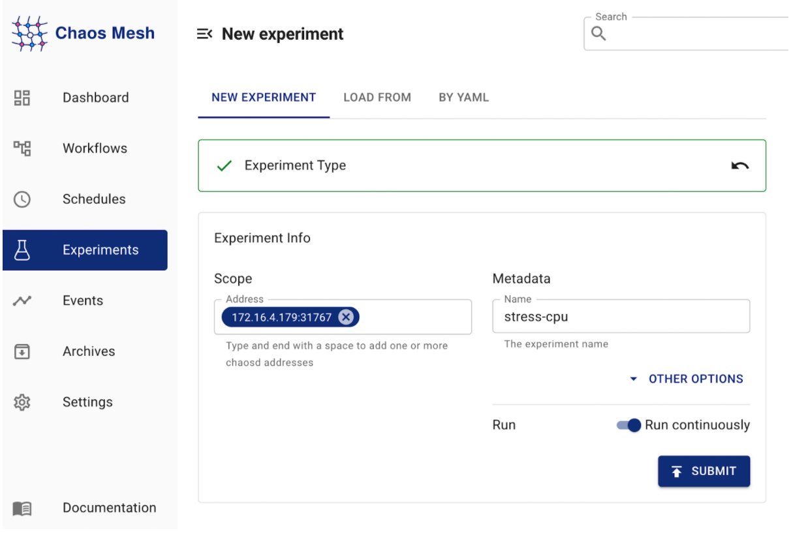

4. Submit the experiment.

This experiment injects CPU stress fault into the physical machine using Chaosd.

To check the experiment result, run the following command to send a HTTP request:

```
docker exec -it kind-control-plane curl -X GET "http://127.0.0.1:30001/query?sql=SELECT%20*%20FROM%20chaos.website"
```

The expected result is as follows:

```
id, name, url
1, Chaos Mesh, https://chaos-mesh.org
2, GitHub, https://github.com
2, Google, https://google.com
Elapsed time: 39(ms)
```

You can see that the query successfully returns a result. The elapsed time does not increase significantly.

For now, you do not have to worry about the performance of MySQL, and you can even deploy other applications on this physical machine. However, when the data volume is large and the database must serve thousands of queries per second, MySQL might not be able to provide your application with acceptable performance. At this time, you might consider try TiDB.

## What's next

By going through this tutorial, you have now tried out three experiments of Chaos Mesh v2.1.0 (HTTP, JVM, physical machine environment) and felt the charm of Chaos Mesh and Chaos Engineering.

If you have any questions when you use Chaos Mesh, feel free to [tell us](https://github.com/chaos-mesh/chaos-mesh/issues).
