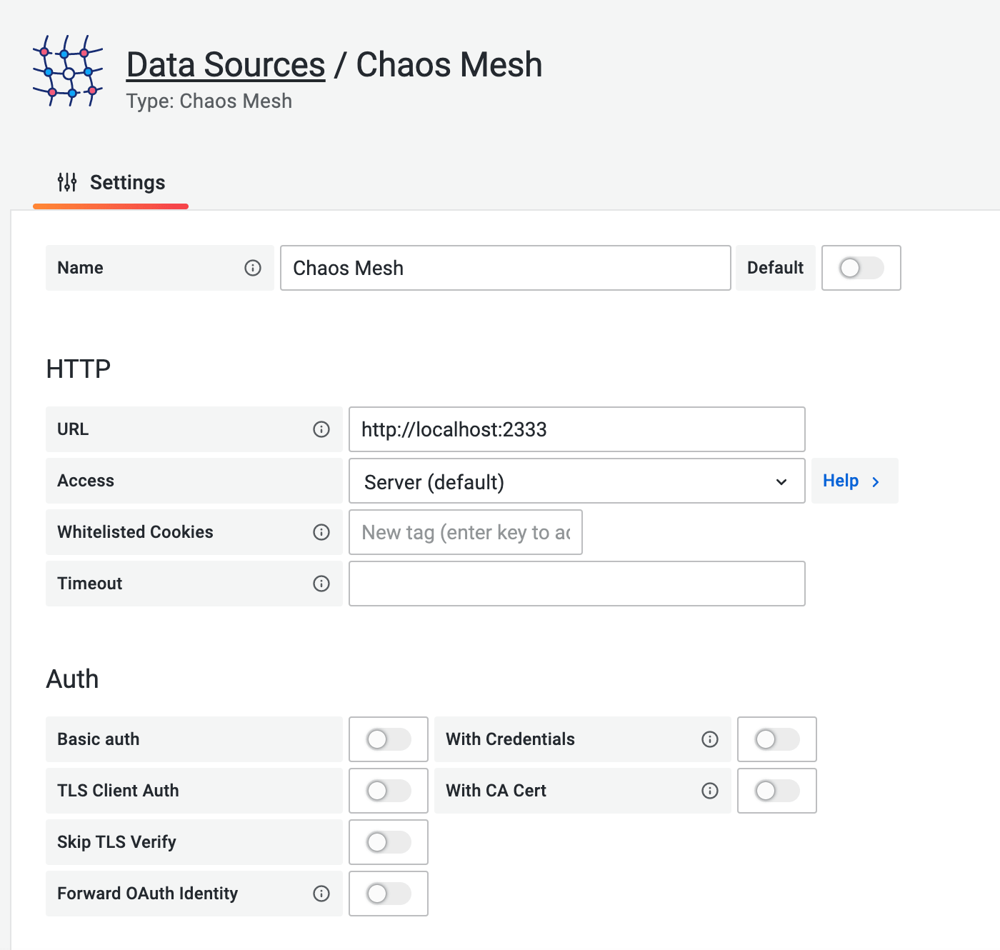

This document describes how to install the Data Source plugin locally in Grafana and make observations using Grafana Data Source.

:::note

- Grafana should be `7.0.0` or later.
- Because Grafana is not yet accepting the plugin submission for Chaos Mesh Data Source, it can't be installed via `grafana-cli` at this time.

:::

## Install Data Source Plugin

You can install the Data Source plugin locally in Grafana by following these steps:

1. Download the plugin zip package with the following command or go to <https://github.com/chaos-mesh/datasource/releases> to download:

   ```shell
   curl -LO https://github.com/chaos-mesh/datasource/releases/download/v2.1.0/chaosmeshorg-datasource-2.1.0.zip
   ```

   After downloading, extract the plugin to the Grafana plugin directory:

   ```shell
   unzip chaosmeshorg-datasource-2.1.0.zip -d YOUR_PLUGIN_DIR
   ```

   :::tip

   Refer to <https://grafana.com/docs/grafana/latest/plugins/installation/#install-a-packaged-plugin> to find the plugin dir.

   :::

2. Then update and save Grafana's configuration file `grafana.ini` and add the plugins to `allow_loading_unsigned_plugins` to ensure that Grafana can load unsigned plugins:

   ```ini
   [plugins]
     allow_loading_unsigned_plugins = chaosmeshorg-datasource
   ```

   :::tip

   Refer to <https://grafana.com/docs/grafana/latest/administration/configuration/#config-file-locations> to find the configuration file.

   :::

3. Finally, restart Grafana to load the Data Source plugin.

## Setup Data Source Plugin

1. After you have successfully installed the Data Source plugin locally in Grafana, go to **Configuration -> Data sources** and add Chaos Mesh, then go to the following configuration page:

   

   In this page, only the `URL` field needs to be filled in, the other fields can be ignored.

   Assuming you have Chaos Mesh installed locally, Dashboard will export the API on port `2333` by default. So if you haven't changed anything, you can just put `http://localhost:2333` in the `URL`.

2. Then use the `port-forward` command to make the API externally accessible:

   ```shell
   kubectl port-forward -n chaos-testing svc/chaos-dashboard 2333:2333
   ```

3. Click **Save & Test** to test the connection. If it shows a successful notification, the setup is complete.

## Query

The Data Source plugin looks at the Chaos Mesh through the lens of events, and the following options are responsible for filtering the different events:

- `Object ID`: Filter by object uuid
- `Namespace`: Filter by different namespace
- `Name`: Filter by object name
- `Kind`: Filter by kind (PodChaos, Schedule...)
- `Limit`: Limit the number of events

They will be passed as parameters to the `/api/events` API.

## Annotations

You can integrate Chaos Mesh events into the panel by setting up Annotations, as created in the following example:

! [Annotations](img/grafana/annotations.png)

For information on how to fill in the fields in annotations, please refer to [Query](#query).

## Variables

You can query Chaos Mesh for events dynamically by setting different variables.


The following are the types of variables provided by the plugin:

- `Namespace`: After selection, all available namespaces will be displayed directly at the bottom of the page under `Preview of values`.
- `Kind`: Same as **Namespace**. Get all kinds.
- `Experiment`: Same as **Namespace**. Get the names of all experiments.
- `Schedule`: Same as **Namespace**. Get the names of all schedules.

## Questions & Feedbacks

If you encounter problems during installation or setup, feel free to ask the community questions at [CNCF Slack](https://cloud-native.slack.com/archives/C0193VAV272), or create an [issue](https://github.com/chaos-mesh/datasource/issues) to give feedback to the Chaos Mesh team.

## Explore More

If you'd like to learn more, feel free to check out the source code for the plugin at [chaos-mesh/datasource](https://github.com/chaos-mesh/datasource).
