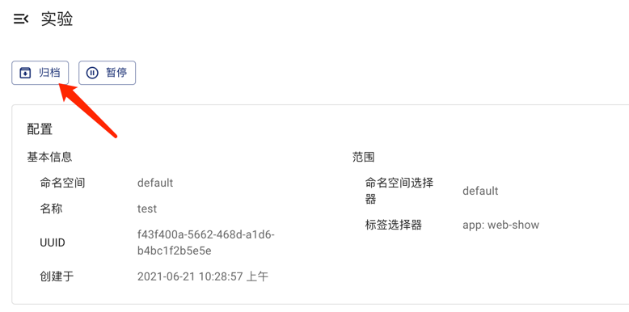

本文档介绍如何使用 Chaos Mesh 清理混沌实验。当混沌实验不再需要时，你可以清理它，以停止故障注入并恢复受影响的测试目标。

关于创建、运行、查看、暂停、更新以及删除混沌实验的基础操作，请参考[运行混沌实验](run-a-chaos-experiment.md)。

## 清理混沌实验

删除混沌实验后，注入的故障会被立刻恢复。你可以采用以下两种方式之一清理混沌实验。

### 使用命令清理混沌实验

使用 `kubectl delete` 命令删除混沌实验。混沌实验被删除后，目标对象上注入的故障会被立刻恢复：

```sh
kubectl delete -f network-delay.yaml
# 或直接删除 chaos 对象
kubectl delete networkchaos network-delay
```

### 使用 Chaos Dashboard 清理混沌实验

如果你想在 Chaos Dashboard 上删除混沌实验并归档到实验历史中，可以点击 Chaos 实验对应的 **Archive** 按钮。



## 强制清理删除被阻塞的混沌实验

Chaos Mesh 使用 finalizer 追踪混沌实验注入的故障。删除混沌实验时，controller 会先恢复所有目标对象上注入的故障，只有所有注入的故障都被恢复后，finalizer 才会被移除。finalizer 被移除后，混沌实验对象才会被删除。

如果 controller 无法恢复某些注入的故障（例如，目标对象已经不存在），删除操作会被阻塞，此时混沌实验对象仍然存在（对象上会带有 `deletionTimestamp`）。在这种情况下，你可以查看 Chaos Mesh 的日志找出故障无法被恢复的原因，或者直接创建一个 [issue](https://github.com/chaos-mesh/chaos-mesh/issues) 向 Chaos Mesh 团队反馈此问题。

如果需要强制清理被阻塞的混沌实验，可以使用以下命令：

```sh
kubectl annotate networkchaos network-delay chaos-mesh.chaos-mesh.org/cleanFinalizer=forced
```

:::warning

强制清理会直接移除 finalizer，不会等待所有注入的故障被恢复。这可能导致目标对象上残留未恢复的故障。请仅在正常删除被阻塞时使用此方式。

:::

## 清理所有混沌实验

在清理命名空间或卸载 Chaos Mesh 之前，请确保所有混沌实验都已删除。你可以通过执行以下命令列出所有与 Chaos 相关的对象：

```sh
for i in $(kubectl api-resources | grep chaos-mesh | awk '{print $1}'); do kubectl get $i -A; done
```

:::note

`Schedule` 和 `Workflow` 资源，以及它们创建的混沌实验对象，都是独立的 Kubernetes 对象。清理由 `Schedule` 或 `Workflow` 创建的实验时，请确保一并删除这些对象。

:::

关于从 Kubernetes 集群中移除 Chaos Mesh 的更多细节，请参考[卸载 Chaos Mesh](uninstallation.md)。
