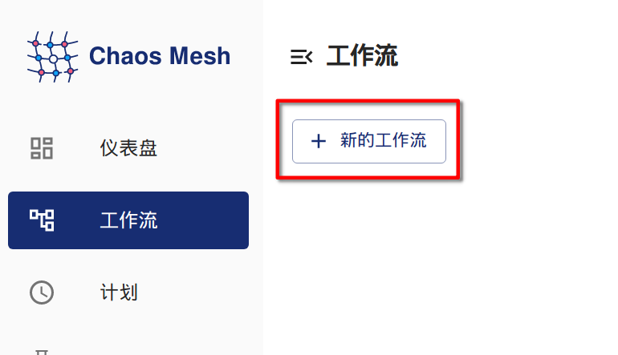
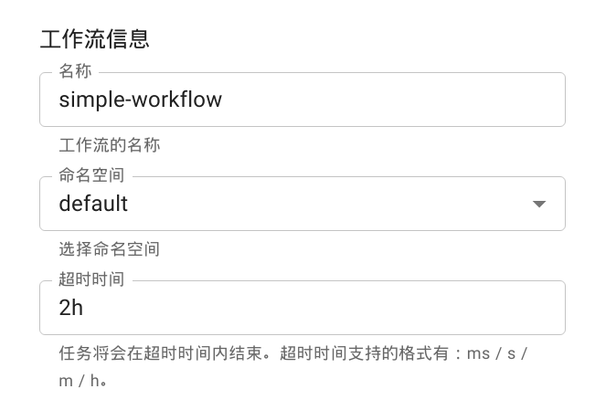
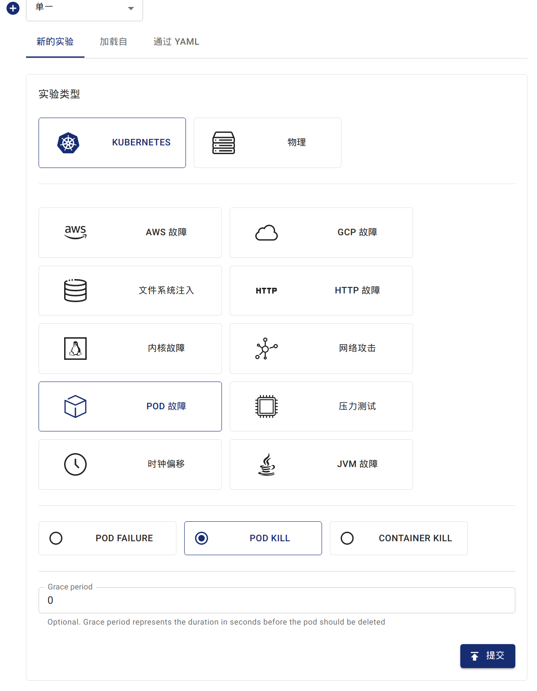
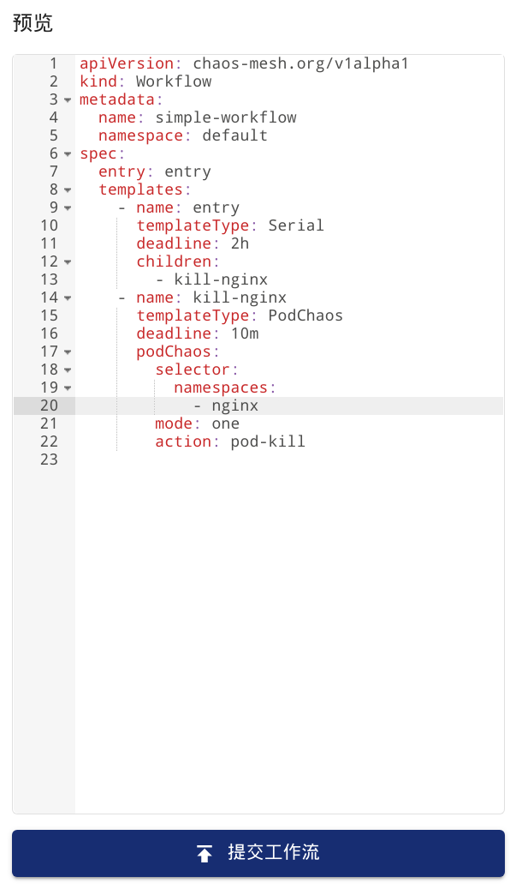

## Chaos Mesh Workflow 简介

在 Chaos Mesh 中模拟真实的系统故障时，通常伴随着持续验证。你可能希望在 Chaos Mesh 平台上构建一系列故障，而不是执行单个独立的混沌故障注入操作。

为满足该需求，Chaos Mesh 提供了 Chaos Mesh Workflow，一个内置的工作流引擎。使用该引擎，你可以串行或并行地执行多种不同的 Chaos 实验， 用于模拟生产级别的错误。

目前， Chaos Mesh Workflow 支持以下功能：

- 串行编排
- 并行编排
- 自定义任务
- 条件分支

使用场景举例：

- 使用并行编排同时注入多个 NetworkChaos 模拟复杂的网络环境
- 在串行编排中进行健康检查，使用条件分支决定是否执行剩下的步骤

Chaos Mesh Workflow 在设计时一定程度上参考了 Argo Workflow。如果您熟悉 Argo Workflow 您也能很快地上手 Chaos Mesh Workflow。

Github 仓库中含有其他 Workflow 的[示例](https://github.com/chaos-mesh/chaos-mesh/tree/master/examples/workflow).

## 通过 Chaos Dashboard 创建 Workflow

### 第 1 步：打开 Chaos Dashboard

点击**新的工作流**。



### 第 2 步：设置工作流基本信息



### 第 3 步：配置工作流节点

1. 根据需求选择**选择任务类型**

   在本示例中选择的任务类型为”单一“。

   :::note 注意

   Chaos Dashboard 会自动创建一个命名为 "entry" 的串行节点，作其用为该工作流的入口。

   :::

   

2. 填写实验信息

   配置方法与创建普通的混沌实验相同。比如，你可以设置一个 POD KILL 类型的 PodChaos 故障，并将其命名为 “kill-nginx”。

   

### 第 4 步：提交工作流

你可以先在**预览**查看工作流定义。确认无误后，点击**提交工作流**按钮创建工作流。



## 使用 YAML 文件与 `kubectl` 创建 Workflow

Workflow 类似于各种类型的 Chaos 对象，同样作为 CRD 存在于 kubernetes 集群中。你可以使用 `kubectl create -f <workflow.yaml>` 创建 Chaos Mesh Workflow。以下为创建的具体示例。使用本地 YAML 文件创建 Workflow：

```shell
kubectl create -f <workflow.yaml>
```

使用网络上的 YAML 文件创建 Workflow：

```shell
kubectl create -f https://raw.githubusercontent.com/chaos-mesh/chaos-mesh/master/examples/workflow/serial.yaml
```

一个简单的 Workflow YAML 文件定义如下所示，这个 Workflow 将会同时注入 `StressChaos`、`NetworkChaos` 与 `PodChaos`：

```yaml
apiVersion: chaos-mesh.org/v1alpha1
kind: Workflow
metadata:
  name: try-workflow-parallel
spec:
  entry: the-entry
  templates:
    - name: the-entry
      templateType: Parallel
      deadline: 240s
      children:
        - workflow-stress-chaos
        - workflow-network-chaos
        - workflow-pod-chaos-schedule
    - name: workflow-network-chaos
      templateType: NetworkChaos
      deadline: 20s
      networkChaos:
        direction: to
        action: delay
        mode: all
        selector:
          labelSelectors:
            'app': 'hello-kubernetes'
        delay:
          latency: '90ms'
          correlation: '25'
          jitter: '90ms'
    - name: workflow-pod-chaos-schedule
      templateType: Schedule
      deadline: 40s
      schedule:
        schedule: '@every 2s'
        type: 'PodChaos'
        podChaos:
          action: pod-kill
          mode: one
          selector:
            labelSelectors:
              'app': 'hello-kubernetes'
    - name: workflow-stress-chaos
      templateType: StressChaos
      deadline: 20s
      stressChaos:
        mode: one
        selector:
          labelSelectors:
            'app': 'hello-kubernetes'
        stressors:
          cpu:
            workers: 1
            load: 20
            options: ['--cpu 1', '--timeout 600']
```

其中 `templates` 定义了实验中的各个步骤，`entry` 定义了 Workflow 执行时的入口。

`templates` 中的每个元素都代表了一个 Workflow 的步骤，例如:

```yaml
name: the-entry
templateType: Parallel
deadline: 240s
children:
  - workflow-stress-chaos
  - workflow-network-chaos
  - workflow-pod-chaos
```

`templateType: Parallel` 代表节点的类型为并行；`deadline: 240s` 代表这个节点下的所有并行实验预期在 240 秒内执行完成，否则将超时；`children` 代表将要并行执行的其他 template 名称。

再例如：

```yaml
name: workflow-pod-chaos
templateType: PodChaos
deadline: 40s
podChaos:
  action: pod-kill
  mode: one
  selector:
    labelSelectors:
      'app': 'hello-kubernetes'
```

`templateType: PodChaos` 代表节点的类型为 PodChaos 实验；`deadline: 40s` 代表当前 Chaos 实验将持续 40 秒；`podChaos` 字段是 PodChaos 实验的定义。

通过 YAML 文件与 `kubectl` 创建 Workflow 较为灵活，你可以对串行活并行编排进行嵌套，声明复杂的编排，甚至可以与条件分支组合达到循环的效果。

## 字段说明

### Workflow 字段说明

| 参数 | 类型 | 说明 | 默认值 | 是否必填 | 示例 |
| --- | --- | --- | --- | --- | --- |
| entry | string | 声明 Workflow 的入口，值为 templates 中某一 template 的名称。 | 无 | 是 |  |
| templates | []Template | 声明 Workflow 中可执行的各个步骤的行为，详见 [Template 字段说明](#template-字段说明) | 无 | 是 |  |

### Template 字段说明

| 参数 | 类型 | 说明 | 默认值 | 是否必填 | 示例 |
| --- | --- | --- | --- | --- | --- |
| name | string | template 的名称，需要符合 DNS-1123 命名规范。 | 无 | 是 | any-name |
| type | string | template 的类型。可选值有: Task、Serial、Parallel、Suspend、Schedule、AWSChaos、DNSChaos、GCPChaos、HTTPChaos、IOChaos、JVMChaos、KernelChaos、NetworkChaos、PodChaos、StressChaos、TimeChaos、StatusCheck | 无 | 是 | PodChaos |
| deadline | string | template 持续的时间。 | 无 | 否 | '5m30s' |
| children | []string | 声明该 template 下的子任务，当 type 为 Serial 或 Parallel 时需要配置该字段。 | 无 | 否 | ["any-chaos-1", "another-serial-2", "any-shcedule"] |
| task | Task | 配置自定义任务，当 type 为 Task 时需要配置该字段。详见 [Task 字段说明](#task-字段说明) | 无 | 否 |  |
| conditionalBranches | []ConditionalBranch | 配置自定任务后的条件分支，当 type 为 Task 时可选配置该字段。详见 [ConditionalBranch 字段说明](#conditionalBranch-字段说明) | 无 | 否 |  |
| awsChaos | object | 配置 AWSChaos，当 type 为 AWSChaos 时需要配置该字段。详见 [模拟 AWS 故障](simulate-aws-chaos.md) | 无 | 否 |  |
| dnsChaos | object | 配置 DNSChaos，当 type 为 DNSChaos 时需要配置该字段。详见 [模拟 DNS 故障](simulate-dns-chaos-on-kubernetes.md) | 无 | 否 |  |
| gcpChaos | object | 配置 GCPChaos，当 type 为 GCPChaos，当 时需要配置该字段。详见 [模拟 GCP 故障](simulate-gcp-chaos.md) | 无 | 否 |  |
| httpChaos | object | 配置 HTTPChaos，当 type 为 HTTPChaos 时需要配置该字段。详见 [模拟 HTTP 故障](simulate-http-chaos-on-kubernetes.md) | 无 | 否 |  |
| ioChaos | object | 配置 IOChaos，当 type 为 IOChaos 时需要配置该字段。详见 [模拟文件 I/O 故障](simulate-io-chaos-on-kubernetes.md) | 无 | 否 |  |
| jvmChaos | object | 配置 JVMChaos，当 type 为 JVMChaos 时需要配置该字段。详见 [模拟 JVM 应用故障](simulate-jvm-application-chaos.md) | 无 | 否 |  |
| kernelChaos | object | 配置 KernelChaos，当 type 为 KernelChaos 时需要配置该字段。详见 [模拟内核故障](simulate-kernel-chaos-on-kubernetes.md) | 无 | 否 |  |
| networkChaos | object | 配置 NetworkChaos，当 type 为 NetworkChaos 时需要配置该字段。详见 [模拟 AWS 故障](simulate-aws-chaos.md) | 无 | 否 |  |
| podChaos | object | 配置 PodChaosd ，当 type 为 PodChaosd 时需要配置该字段。详见 [模拟网络故障](simulate-network-chaos-on-kubernetes.md) | 无 | 否 |  |
| stressChao | object | 配置 StressChaos，当 type 为 StressChaos 时需要配置该字段。详见 [模拟压力场景](simulate-heavy-stress-on-kubernetes.md) | 无 | 否 |  |
| timeChaos | object | 配置 TimeChaos，当 type 为 TimeChaos 时需要配置该字段。详见 [模拟时间故障](simulate-time-chaos-on-kubernetes.md) | 无 | 否 |  |
| schedule | object | 配置 Schedule ，当 type 为 Schedule 时需要配置该字段。详见 [定义调度规则](define-scheduling-rules.md) | 无 | 否 |  |
| statusCheck | object | 配置 StatusCheck，当 type 为 StatusCheck 时需要配置该字段。详见 [在工作流中进行状态检查](status-check-in-workflow.md) | 无 | 否 |  |
| abortWithStatusCheck | bool | 配置当 StatusCheck 失败时是否终止 Workflow，当 type 为 StatusCheck 时可选配置该字段。 | false | 否 | `true` |

:::note 注意

当在 Workflow 中建立有持续时间的 Chaos 时，需要将持续时间填写到外层的 `deadline` 字段中，而不是使用 Chaos 中的 `duration` 字段。

:::

### Task 字段说明

| 参数 | 类型 | 说明 | 默认值 | 是否必填 | 示例 |
| --- | --- | --- | --- | --- | --- |
| container | object | 定义自定义任务容器，可参考 [Container 字段说明](#container-字段说明) | 无 | 否 |  |
| volumes | array | 若需要在自定义任务容器中挂载卷，则需要在该字段声明卷。关于完整定义可参考 [corev1.Volume](https://kubernetes.io/docs/reference/generated/kubernetes-api/v1.23/#volume-v1-core) | 无 | 否 |  |

### ConditionalBranch 字段说明

| 参数 | 类型 | 说明 | 默认值 | 是否必填 | 示例 |
| --- | --- | --- | --- | --- | --- |
| target | string | 当前条件分支想要执行的 template 名称 | 无 | 是 | another-chaos |
| expression | string | 类型为布尔的表达式，在自定义任务完成后，当表达式值为真时，当前条件分支将会被执行。未设置该值时，条件分支将会在自定义任务完成后直接执行。 | 无 | 否 | exitCode == 0 |

目前在 `expression` 中提供了两个上下文变量：

- `exitCode` 表示自定义任务的退出码。
- `stdout` 表示自定义任务的标准输出。

> 更多的上下文变量将在后续补充。

可参考[该文档](https://github.com/antonmedv/expr/blob/master/docs/Language-Definition.md)编写 `expression` 表达式。

### Container 字段说明

这里只列举了常用字段，关于完整定义可参考 [corev1.Container](https://kubernetes.io/docs/reference/generated/kubernetes-api/v1.23/#container-v1-core)

| 参数    | 类型     | 说明           | 默认值 | 是否必填 | 示例                                              |
| ------- | -------- | -------------- | ------ | -------- | ------------------------------------------------- |
| name    | string   | 容器名称       | 无     | 是       | task                                              |
| image   | string   | 镜像名称       | 无     | 是       | busybox:latest                                    |
| command | []string | 容器执行的命令 | 无     | 否       | `["wget", "-q", "http://httpbin.org/status/201"]` |
