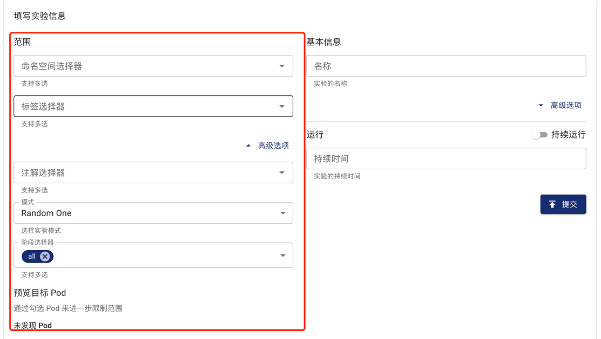

本篇文档描述如何为单个混沌实验定义实验范围，帮助你准确地控制故障爆炸半径。

## 简介

在 Chaos Mesh 中，你可以通过指定选择器 (Selectors) 的方式定义单个混沌实验的作用范围。

不同类型的 Selector 对应着不同的过滤规则。你可以在一个混沌实验中指定一个或多个 Selector 来定义你的实验范围。如果同时指定多个 Selector，代表当前实验目标需要同时满足所有指定的 Selectors 的规则。

在创建混沌实验时，Chaos Mesh 支持以下两种定义混沌实验范围的方式。你可以按需选择以下任一方式：

- 在 YAML 配置文件中定义实验范围
- 在 Dashboard 上定义实验范围

## 在 YAML 配置文件中定义实验范围

本小节提供了不同类型的 Selectors 的含义、用法、在 YAML 文件中的配置示例。在 YAML 配置文件中定义实验范围时，你可以按照实验范围的过滤需求指定一个或多个 Selectors。

### Namespace Selectors

- 指定实验目标 Pod 所属的命名空间。
- 数据类型：字符串数组类型。
- 如果此 Selector 为空或者不指定此 Selector，Chaos Mesh 会将其设置为当前混沌实验所属的命名空间。

当使用 YAML 文件创建实验时，示例配置如下：

```yaml
spec:
  selector:
    namespaces:
      - 'app-ns'
```

### Label Selector

- 指定实验目标 Pod 需要带有的 [Labels](https://kubernetes.io/docs/concepts/overview/working-with-objects/labels/)。
- 数据类型：键值对类型。
- 如果指定了多个 Labels，代表实验目标需要带有此 Selector 指定的所有 Labels。

当使用 YAML 文件创建实验时，示例配置如下：

```yaml
spec:
  selector:
    labelSelectors:
      'app.kubernetes.io/component': 'tikv'
```

### Expression Selector

- 指定一组定义 Label 规则的[表达式](https://kubernetes.io/docs/concepts/overview/working-with-objects/labels/#resources-that-support-set-based-requirements)用来限定实验目标 Pod。
- 你可以通过此 Selector 设置不满足某些 Labels 的实验目标 Pod。

当使用 YAML 文件创建实验时，示例配置如下：

```yaml
spec:
  selector:
    expressionSelectors:
      - { key: tier, operator: In, values: [cache] }
      - { key: environment, operator: NotIn, values: [dev] }
```

### Annotation Selector

- 指定实验目标 Pod 需要带有的 [Annotations](https://kubernetes.io/docs/concepts/overview/working-with-objects/annotations/)。
- 数据类型：键值对类型。
- 如果指定了多个 Annotations，代表实验目标需要带有此 Selector 指定的所有 Annotations。

当使用 YAML 文件创建实验时，示例配置如下：

```yaml
spec:
  selector:
    annotationSelectors:
      'example-annotation': 'group-a'
```

### Field Selector

- 指定实验目标 Pod 的 [Fields](https://kubernetes.io/docs/concepts/overview/working-with-objects/field-selectors/)。
- 数据类型：键值对类型。
- 如果指定了多个 Fields 字段，代表实验目标需要带有此 Selector 设置的所有 Fields。

当使用 YAML 文件创建实验时，示例配置如下：

```yaml
spec:
  selector:
    fieldSelectors:
      'metadata.name': 'my-pod'
```

### PodPhase Selector

- 指定实验目标 Pod 的 Phase。
- 数据类型：字符串数组类型。
- 支持的 Phase 有：Pending、Running、Succeeded、Failed、Unknown。
- 此选项默认为空，意味不限制目标 Pod 的 Phase。

当使用 YAML 文件创建实验时，示例配置如下：

```yaml
spec:
  selector:
    podPhaseSelectors:
      - 'Running'
```

### Node Selector

- 指定实验目标 Pod 所属的 [Node 的 Labels](https://kubernetes.io/docs/tasks/configure-pod-container/assign-pods-nodes/)。
- 数据类型：键值对类型。
- 如果指定了多个 Node Labels，代表实验目标 Pod 所属的 Node 需要带有此 Selector 指定的所有 Labels。

当用户通过 YAML 文件创建实验，配置如下：

```yaml
spec:
  selector:
    nodeSelectors:
      'node-label': 'label-one'
```

### Node List

- 指定实验目标 Pod 所属的 Node。
- 数据类型： 字符串数组。
- 目标 Pod 只需属于配置的 Node 列表中的其中一个 Node 即可。

当使用 YAML 文件创建实验时，示例配置如下：

```yaml
spec:
  selector:
    nodes:
      - node1
      - node2
```

### Pod List

- 指定实验目标 Pod 命名空间和 Pod 列表。
- 数据类型：键值对类型。"键"为目标 Pod 所属的 Namespace, "值"为目标 Pod 列表。
- 只要指定了此 Selector，Chaos Mesh 就会**忽略其他配置的 Selectors**。

当使用 YAML 文件创建实验时，示例配置如下：

```yaml
spec:
  selector:
    pods:
      tidb-cluster: # namespace of the target pods
        - basic-tidb-0
        - basic-pd-0
        - basic-tikv-0
        - basic-tikv-1
```

### Physical Machine List

- 指定实验目标 PhysicalMachine 命名空间和 PhysicalMachine 列表。
- 数据类型：键值对类型。"键"为目标 PhysicalMachine 所属的 Namespace, "值"为目标 PhysicalMachine 列表。
- 只要指定了此 Selector，Chaos Mesh 就会**忽略其他配置的 Selectors**。

:::note 注意

`PhysicalMachine` 是一种代表物理机的 CRD，通常情况下会使用 [chaosctl](chaosctl-tool.md#为-chaosd-生成-tls-证书) 来创建 `PhysicalMachine`。

:::

当使用 YAML 文件创建实验时，示例配置如下：

```yaml
spec:
  selector:
    physicalMachines:
      default: # namespace of the target PhysicalMachines
        - physcial-machine-a
        - physcial-machine-b
```

## 在 Dashboard 上定义实验范围

如果使用 Chaos Dashboard 创建混沌实验，你可以在填写实验信息时配置混沌实验范围。

目前 Chaos Dashboard 上提供了以下 Selectors。可以按照实验范围的过滤需求指定一个或多个 Selectors：

- 命名空间选择器 (`Namespace Selectors`)
- 标签选择器 (`Label Selectors`)
- 注解选择器 (`Annotation Selectors`)
- 阶段选择器 (`Phase Selectors`)。

在设置 Selectors 的同时，你也可以在 Dashboard 中实时预览实验目标的实际范围，并且可以直接修改 Selectors 过滤出的目标 Pod 范围。



## 兼容性矩阵

| 类型 | 是否支持Kubernetes | 是否支持物理机 |
| :-- | :-- | :-- | 
|Namespace Selectors|Y|Y|
|Label Selectors|Y|Y|
|Expression Selectors|Y|Y|
|Annotation Selectors|Y|Y|
|Field Selectors|Y|Y|
|PodPhase Selectors|Y|N|
|Node Selectors|Y|N|
|Node List|Y|N|
|Pod List|Y|N|
|PhysicalMachine List|N|Y|