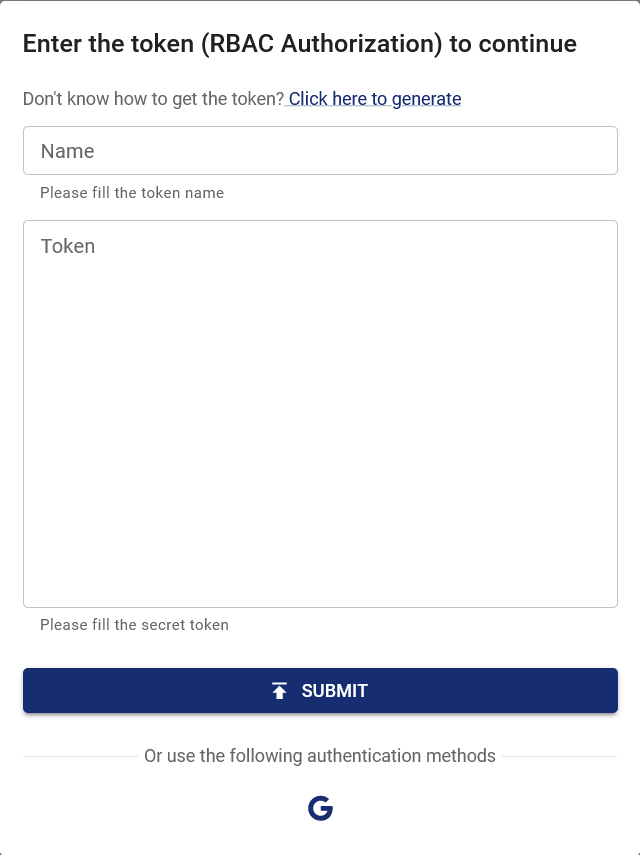

如果 Chaos Mesh 部署在 Google Cloud Platform 上，你可以通过 Google OAuth 登录 Chaos Dashboard。本文档介绍如何配置和启用这项功能。

## 创建 OAuth Client

根据 [Setting up OAuth 2.0](https://support.google.com/cloud/answer/6158849?hl=en) 创建 GCP OAuth 客户端，并获取 Client ID 与 Client Secret。

1. 进入 [Google Cloud Platform 控制台](https://console.cloud.google.com/)。
2. 选择一个项目。
3. 如果没有自动打开 APIs & services 页面，请在控制台的左侧菜单中手动选择 APIs & services。
4. 点击位于左侧的 Credentials。
5. 点击 Create Credentials，并选择 OAuth client ID。
6. 应用类型选择 Web Application，填写应用名称以及 Chaos Dashboard 的重定向 URI。Chaos Dashboard 的重定向 URI 为 `ROOT_URL/api/auth/gcp/callback`，其中 `ROOT_URL` 是 Chaos Dashboard 的根地址，例如 `http://localhost:2333`，可以通过 `helm` 的 `dashboard.rootUrl` 配置项进行配置。
7. 点击创建。

创建完成后，即可获得该客户端的 Client ID 与 Client Secret，请保存这两项内容，供后续步骤使用。

## 填写配置并启动 Chaos Mesh

:::info

更新：从 `v2.7.0` 开始，你可以通过提供一个 **Secret** 来存储 Client ID 与 Client Secret。**我们推荐使用这种方法**。

这一改动是为了避免将 Client ID 与 Client Secret 暴露给公众。在之前的版本中，Client ID 与 Client Secret 直接写在 values 中，这通常是不安全的。

了解更多信息请参考 https://github.com/chaos-mesh/chaos-mesh/issues/4206。

:::

要启用这项功能，需要修改 Chaos Mesh 的 Helm charts，设置以下配置项：

```yaml
dashboard:
  rootUrl: http://localhost:2333
  gcpSecurityMode:
    enabled: true
    # Old configuration items for compatibility.
    clientId: ''
    clientSecret: ''
    # References existing Kubernetes secret containing `GCP_CLIENT_ID` and `GCP_CLIENT_SECRET`.
    existingSecret: ''
```

如果已经安装并运行了 Chaos Mesh，可以通过 `helm upgrade` 命令来更新配置；如果还未安装 Chaos Mesh，则可以通过 `helm install` 进行安装。

## 使用 Google 登录

打开 Chaos Dashboard，点击登录窗口下方的 Google 图标。



登录 Google 账号并授权 OAuth Client 后，页面会自动跳转至 Chaos Dashboard，并显示已登录状态。此时，你的权限与该 Google 账户在此集群中的权限一致。如需添加其他权限，可以通过 RBAC（基于角色的访问控制）进行配置，例如：

```yaml
kind: ClusterRole
apiVersion: rbac.authorization.k8s.io/v1
metadata:
  name: chaos-mesh-cluster-manager
rules:
  - apiGroups:
      - chaos-mesh.org
    resources: ['*']
    verbs: ['get', 'list', 'watch', 'create', 'delete', 'patch', 'update']
---
kind: ClusterRoleBinding
apiVersion: rbac.authorization.k8s.io/v1
metadata:
  name: cluster-manager-binding
  namespace: chaos-mesh
subjects:
  - kind: User
    name: example@gmail.com
roleRef:
  kind: ClusterRole
  name: chaos-mesh-cluster-manager
  apiGroup: rbac.authorization.k8s.io
```

通过该配置，用户 `example@gmail.com` 可以查看和创建任何混沌实验。
