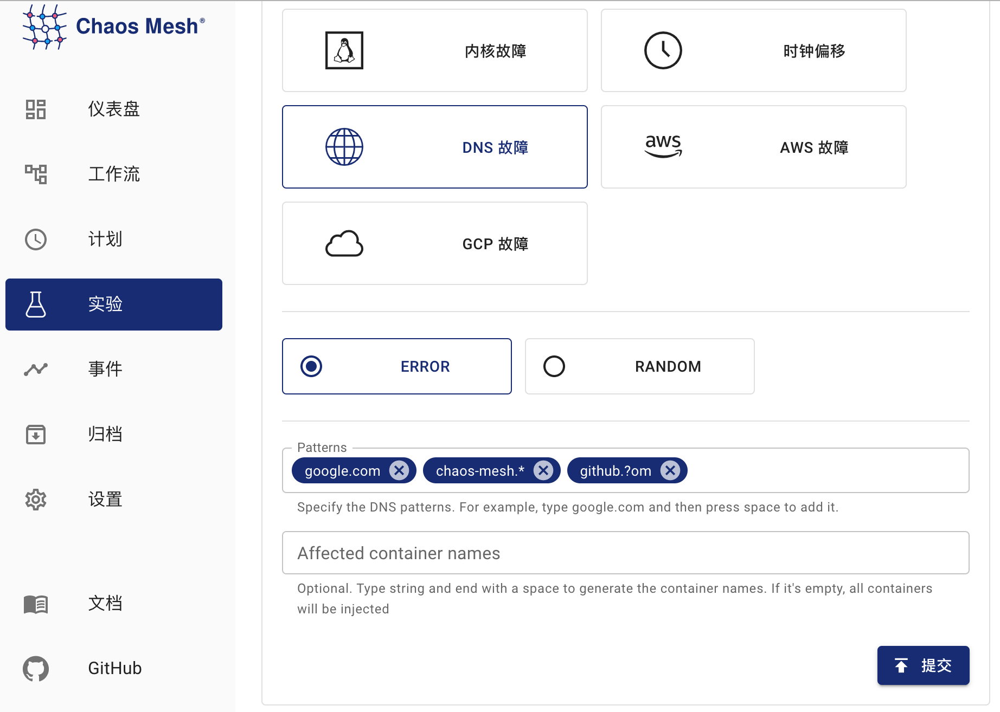
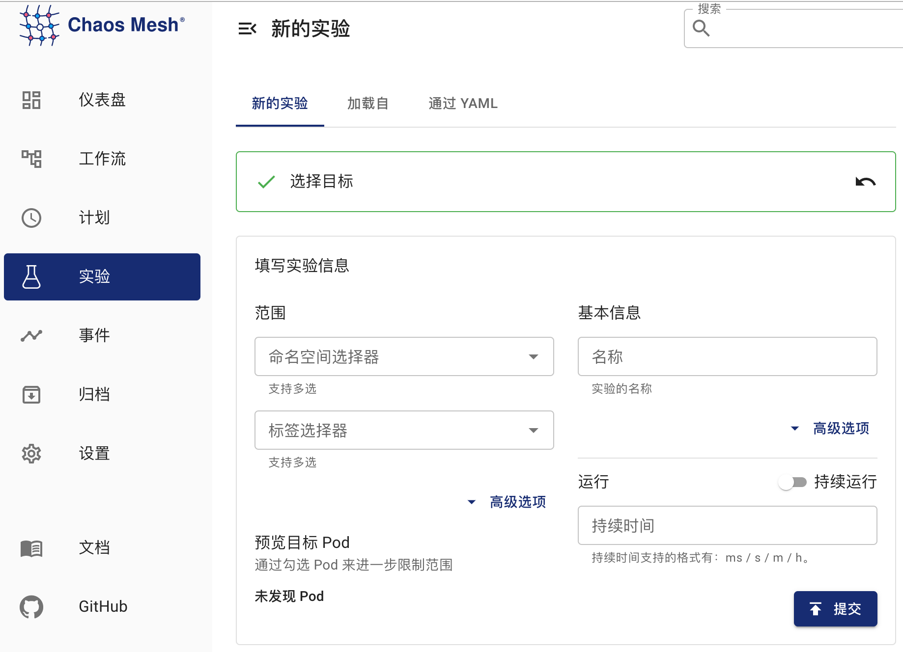

import PickHelmVersion from '@site/src/components/PickHelmVersion'

本文档主要介绍如何在 Chaos Mesh 中创建 DNSChaos 混沌实验，以模拟 DNS 故障。

:::info

要模拟 DNS 故障，你需要部署一个名为 Chaos DNS Server 的特殊 DNS 服务。

自 `v2.6` 起，Chaos Mesh 默认部署 Chaos DNS Server。如果不需要模拟 DNS 故障，你可以在安装 Chaos Mesh 时设置 `dnsServer.create` 为 `false`：

<PickHelmVersion>{`helm install chaos-mesh chaos-mesh/chaos-mesh --namespace=chaos-mesh --version latest --set dnsServer.create=false`}</PickHelmVersion>

:::

## DNSChaos 介绍

DNSChaos 可以用于模拟错误的 DNS 响应，例如在收到 DNS 请求时返回错误，或者返回随机的 IP 地址。

## 检查是否已部署 Chaos DNS Server

执行以下命令，检查是否已部署 Chaos DNS Server：

```bash
kubectl get pods -n chaos-mesh -l app.kubernetes.io/component=chaos-dns-server
```

确认 Pod 的状态为 `Running` 即可。

## 注意事项

1. 目前 DNSChaos 只支持 DNS 记录类型 `A` 和 `AAAA`。

2. Chaos DNS Server 运行带有 [k8s_dns_chaos](https://github.com/chaos-mesh/k8s_dns_chaos) 插件的 CoreDNS。如果 Kubernetes 集群本身的 CoreDNS 服务包含一些特殊配置，你可以通过编辑 `dns-server-config` ConfigMap，使 Chaos DNS Server 的配置与 Kubernetes CoreDNS 服务的配置一致，编辑命令如下：

   ```bash
   kubectl edit configmap dns-server-config -n chaos-mesh
   ```

## 使用 Dashboard 方式创建实验

1. 单击实验页面中的**新的实验**按钮创建实验：

   

2. 在“选择目标”处选择 “DNS 故障”，然后选择具体行为，例如 `ERROR`，最后填写匹配规则：

   

   图中配置的匹配规则可以对域名 `google.com`、`chaos-mesh.org` 和 `github.com` 生效，即对这三个域名发送 DNS 请求将返回错误。具体的匹配规则填写方式，参考[配置说明](#配置说明)中 `patterns` 字段的介绍。

3. 填写实验信息，指定实验范围以及实验计划运行时间：

   

4. 提交实验。

## 使用 YAML 方式创建实验

1. 将实验配置写入到文件 `dnschaos.yaml` 中，内容如下所示：

   ```yaml
   apiVersion: chaos-mesh.org/v1alpha1
   kind: DNSChaos
   metadata:
     name: dns-chaos-example
     namespace: chaos-mesh
   spec:
     action: random
     mode: all
     patterns:
       - google.com
       - chaos-mesh.*
       - github.?om
     selector:
       namespaces:
         - busybox
   ```

   该实验配置可以对域名 `google.com`、`chaos-mesh.org` 和 `github.com` 生效，对这三个域名发送 DNS 请求将返回随机 IP 地址。具体的匹配规则填写方式，参考[配置说明](#配置说明)中 `patterns` 字段的介绍。

2. 使用 `kubectl` 创建实验，命令如下：

   ```bash
   kubectl apply -f dnschaos.yaml
   ```

### 配置说明

| 参数 | 类型 | 说明 | 默认值 | 是否必填 | 示例 |
| :-- | :-- | :-- | :-- | :-- | :-- |
| `action` | string | 定义 DNS 故障的行为，可选值为 `random` 或 `error`。当值为 `random` 时，DNS 服务返回随机的 IP 地址；当值为 `error` 时，DNS 服务返回错误 | 无 | 是 | `random` 或 `error` |
| `patterns` | string 数组 | 选择匹配故障行为的域名模版，支持占位符 `?` 以及通配符 `*` | [] | 否 | `google.com`，`chaos-mesh.org`，`github.com` |
| `mode` | string | 指定实验的运行方式，可选择的方式包括：`one`（表示随机选出一个符合条件的 Pod）、`all`（表示选出所有符合条件的 Pod）、`fixed`（表示选出指定数量且符合条件的 Pod）、`fixed-percent`（表示选出占符合条件的 Pod 中指定百分比的 Pod）、`random-max-percent`（表示选出占符合条件的 Pod 中不超过指定百分比的 Pod） | 无 | 是 | `one` |
| `value` | string | 取决于 `mode` 的配置，为 `mode` 提供对应的参数。例如，当你将 `mode` 配置为 `fixed-percent` 时，`value` 用于指定 Pod 的百分比 | 无 | 否 | `1` |
| `selector` | struct | 指定注入故障的目标 Pod，详情请参考[定义实验范围](./define-chaos-experiment-scope.md) | 无 | 是 |  |

:::note

- `patterns` 配置中的通配符必须位于字符串的尾部，例如 `chaos-mes*.org` 是不合法的配置。

- 当 `patterns` 没有配置时，默认对所有域名注入故障。

:::
