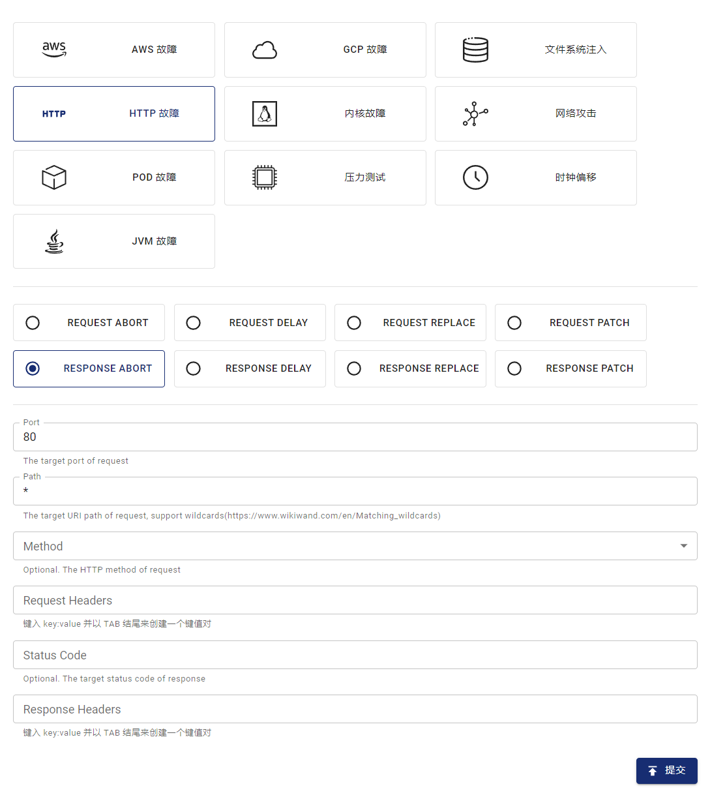

本文档介绍如何在 Chaos Mesh 中通过创建 HTTPChaos 实验模拟 HTTP 故障。

## HTTPChaos 简介

HTTPChaos 是 Chaos Mesh 中的一种故障类型。通过创建 HTTPChaos 实验，你可以模拟 **HTTP 服务端**在请求或响应过程中发生故障的场景。目前，HTTPChaos 支持模拟以下故障类型：

- `abort`：中断服务端的连接
- `delay`：为目标过程注入延迟
- `replace`：替换请求报文或者响应报文的部分内容
- `patch`：给请求报文或响应报文添加额外内容

HTTPChaos 支持多种类型故障的组合。在创建 HTTPChaos 实验时，如果同时配置了多种 HTTP 故障类型，实验运行时注入故障的优先级（顺序）固定为 `abort` -> `delay` -> `replace` -> `patch`。其中 `abort` 故障会导致短路，直接中断此次连接。

关于 HTTPChaos 详细的配置介绍，请参见[字段说明](#字段说明)部分。

## 注意事项

在注入 HTTPChaos 相关故障之前，请注意以下事项：

- 确保目标 Pod 上没有运行 Chaos Mesh 的 Control Manager。
- 确保目标服务禁用了 HTTPS 访问，因为 HTTPChaos 暂不支持注入 HTTPS 连接。
- 为使 HTTPChaos 注入生效，尽量避免复用客户端的 TCP socket。因为在注入故障前建立的 TCP socket 上进行 HTTP 请求不受 HTTPChaos 影响。
- 在生产环境下谨慎使用非幂等语义请求（例如大多数 POST 请求）。若使用了这类请求，注入故障后可能无法通过重复请求使目标服务恢复正常状态。

## 使用 Dashboard 创建实验

1. 打开 Chaos Dashboard 面板，单击实验页面中的**新的实验**按钮创建实验：

   

2. 在**选择目标**区域选择**HTTP 故障**，然后选择具体行为（如 `RESPONSE ABORT`），并填写具体配置：

   

3. 提交实验。

   以上图为例，点击**提交**即完成了对 80 端口所有请求的响应中断配置。

## 使用 YAML 文件创建实验

Chaos Mesh 也支持使用 YAML 配置文件创建 HTTPChaos 实验。在 YAML 配置文件中，你可以模拟一种 HTTP 故障类型，也可以模拟多种 HTTP 故障的组合。

### `abort` 示例

1. 将实验配置写入到 `http-abort-failure.yaml` 文件中，内容示例如下：

   ```yaml
   apiVersion: chaos-mesh.org/v1alpha1
   kind: HTTPChaos
   metadata:
     name: test-http-chaos
   spec:
     mode: all
     selector:
       labelSelectors:
         app: nginx
     target: Request
     port: 80
     method: GET
     path: /api
     abort: true
     duration: 5m
   ```

   依据此配置示例，Chaos Mesh 将向指定的 Pod 中注入 `abort` 故障 5 分钟，故障注入期间该 Pod 的 80 端口 `/api` 路径的 GET 请求会被中断。

2. 使用 `kubectl` 创建实验，命令如下：

   ```bash
   kubectl apply -f ./http-abort-failure.yaml
   ```

### 其它故障组合示例

1. 将实验配置写入到 `http-failure.yaml` 文件中，内容示例如下：

   ```yaml
   apiVersion: chaos-mesh.org/v1alpha1
   kind: HTTPChaos
   metadata:
     name: test-http-chaos
   spec:
     mode: all
     selector:
       labelSelectors:
         app: nginx
     target: Request
     port: 80
     method: GET
     path: /api/*
     delay: 10s
     replace:
       path: /api/v2/
       method: DELETE
     patch:
       headers:
         - ['Token', '<one token>']
         - ['Token', '<another token>']
       body:
         type: JSON
         value: '{"foo": "bar"}'
     duration: 5m
   ```

   依据此配置示例，Chaos Mesh 将向指定的 Pod 中分别注入 `delay` 故障、`replace` 故障、`patch` 故障。

2. 使用 `kubectl` 创建实验，命令如下：

   ```bash
   kubectl apply -f ./http-failure.yaml
   ```

## 字段说明

### 通用字段说明

通用字段指故障注入的目标过程为 Request 或 Response 时均有意义的字段。

| 参数 | 类型 | 说明 | 默认值 | 是否必填 | 示例 |
| --- | --- | --- | --- | --- | --- |
| `mode` | string | 指定实验的运行方式，可选择的方式包括：`one`（表示随机选出一个符合条件的 Pod）、`all`（表示选出所有符合条件的 Pod）、`fixed`（表示选出指定数量且符合条件的 Pod）、`fixed-percent`（表示选出占符合条件的 Pod 中指定百分比的 Pod）、`random-max-percent`（表示选出占符合条件的 Pod 中不超过指定百分比的 Pod） | 无 | 是 | `one` |
| `value` | string | 取决于 `mode` 的取值，为 `mode` 提供参数 | 无 | 否 | 1 |
| `target` | string | 指定故障注入的目标过程为 `Request` 或 `Response`，需要同时配置[与 `target` 相关的字段](#与-target-相关的字段说明) |  | 是 | Request |
| `port` | int32 | 目标服务监听的 TCP 端口 |  | 是 | 80 |
| `path` | string | 目标请求的 URI 路径，支持[通配符](https://www.wikiwand.com/en/Matching_wildcards) | 默认对所有路径生效 | 是 | /api/\* |
| `method` | string | 目标请求的 HTTP method | 默认对所有方法生效 | 否 | GET |
| `request_headers` | map[string]string | 目标请求的请求头匹配 | 默认对所有请求生效 | 否 | Content-Type: application/json |
| `abort` | bool | 是否注入连接中断故障 | false | 否 | true |
| `delay` | string | 指定延迟故障的时间 | 0 | 否 | 10s |
| `replace.headers` | map[string]string | 指定请求头或响应头替换故障中用于替换的键值对 |  | 否 | Content-Type: application/xml |
| `replace.body` | []byte | 指定请求体或响应体替换故障的内容（base64 编码） |  | 否 | eyJmb28iOiAiYmFyIn0K |
| `patch.headers` | [][]string | 指定请求头或响应头附加故障中附加的键值对 |  | 否 | - [Set-Cookie, one cookie] |
| `patch.body.type` | string | 指定请求体或响应体附加故障的类型，目前只支持 [`JSON`](https://tools.ietf.org/html/rfc7396) |  | 否 | JSON |
| `patch.body.value` | string | 指定请求体或响应体附加故障的故障内容 |  | 否 | {"foo": "bar"} |
| `duration` | string | 指定具体实验的持续时间 |  | 是 | 30s |
| `scheduler` | string | 指定具体实验的运行时间调度规则 |  | 否 | 5 \* \* \* \* |

### 与 `target` 相关的字段说明

### `Request` 专用字段说明

`Request` 专用字段是指故障注入的目标过程为 `Request` （即 `target` 设置为 `Request`） 时有意义的字段。

| 参数              | 类型              | 说明                                  | 默认值 | 是否必填 | 示例         |
| ----------------- | ----------------- | ------------------------------------- | ------ | -------- | ------------ |
| `replace.path`    | string            | 指定 URI 路径替换内容                 |        | 否       | /api/v2/     |
| `replace.method`  | string            | 指定请求 HTTP 方法的替换内容          |        | 否       | DELETE       |
| `replace.queries` | map[string]string | 指定 URI query 的替换键值对           |        | 否       | foo: bar     |
| `patch.queries`   | [][]string        | 指定 URI query 附加故障中附加的键值对 |        | 否       | - [foo, bar] |

### `Response` 专用字段说明

`Response` 专用字段是指故障注入的目标过程为 `Response` （即 `target` 设置为 `Response`） 时有意义的字段。

| 参数 | 类型 | 说明 | 默认值 | 是否必填 | 示例 |
| --- | --- | --- | --- | --- | --- |
| `code` | int32 | 目标响应的状态码 | 默认对所有状态码生效 | 否 | 200 |
| `response_headers` | map[string]string | 目标响应的响应头匹配 | 默认对所有响应生效 | 否 | Content-Type: application/json |
| `replace.code` | int32 | 指定响应状态码的替换内容 |  | 否 | 404 |

## 本地调试

如果你不确定某种故障的效果，也可以使用 [rs-tproxy](https://github.com/chaos-mesh/rs-tproxy) 在本地测试相应功能。Chaos Mesh 同样使用 rs-tproxy 实现 HTTPChaos。
