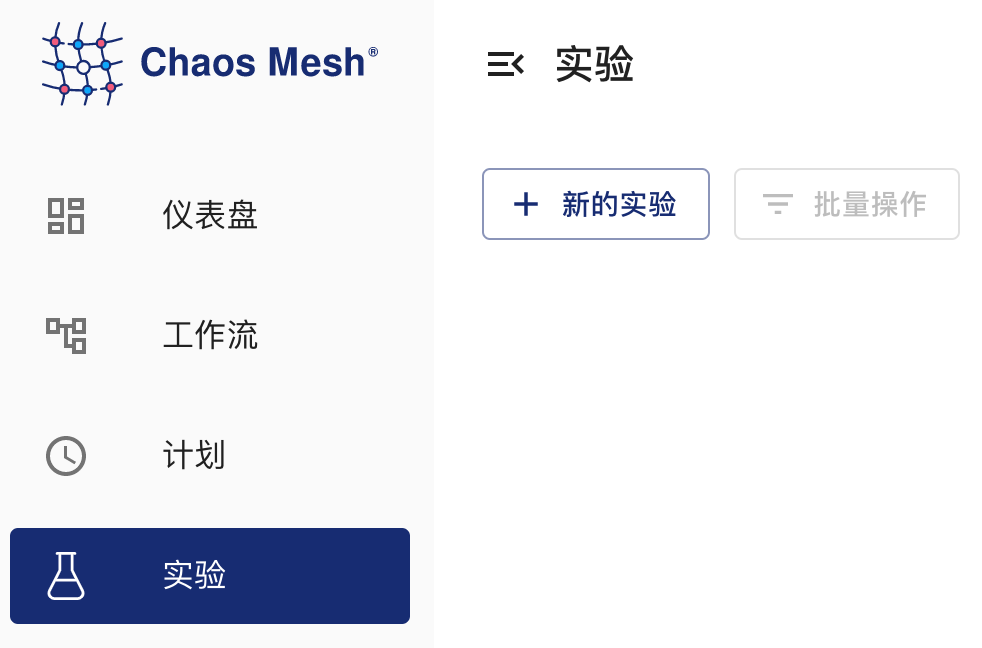
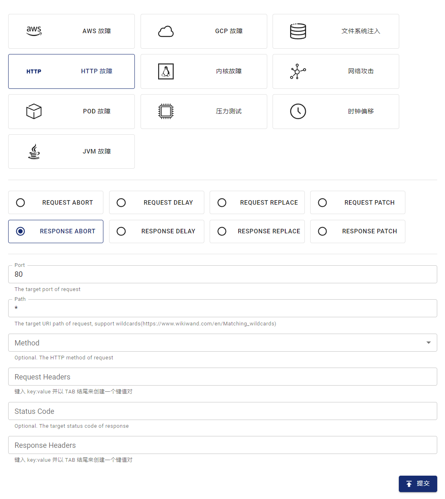

本文档介绍如何在 Chaos Mesh 中通过创建 HTTPChaos 实验模拟 HTTP 故障。

## HTTPChaos 简介

HTTPChaos 是 Chaos Mesh 中的一种故障类型。通过创建 HTTPChaos 实验，你可以模拟 HTTP 请求或响应处理过程中发生故障的场景。目前，HTTPChaos 支持模拟以下故障类型：

- `abort`：中断连接
- `delay`：为请求或响应注入延迟
- `replace`：替换 HTTP 请求报文或响应报文中的部分内容
- `patch`：为 HTTP 请求报文或响应报文添加额外内容

HTTPChaos 支持多种故障类型的组合。如果在创建 HTTPChaos 实验时同时配置了多种 HTTP 故障类型，故障将按以下顺序注入：`abort` -> `delay` -> `replace` -> `patch`。其中 `abort` 故障会导致短路，直接中断连接。

关于 HTTPChaos 详细的配置介绍，请参见[字段说明](#字段说明)部分。

## 注意事项

在注入 HTTPChaos 相关故障之前，请注意以下事项：

- 确保目标 Pod 上没有运行 Chaos Mesh 的 control manager。
- 故障规则默认会同时作用于 Pod 内的客户端和服务端。如果只想让故障作用于其中一端，请参见[指定生效端](#指定生效端)部分。
- 确保目标服务禁用了 HTTPS 访问，因为 HTTPChaos 暂不支持注入 HTTPS 连接。
- 为使 HTTPChaos 注入生效，尽量避免复用客户端的 TCP socket。因为在注入故障前建立的 TCP socket 上进行的 HTTP 请求不受 HTTPChaos 影响。
- 在生产环境下谨慎使用非幂等语义请求（例如大多数 POST 请求）。若使用了这类请求，注入故障后可能无法通过重复请求使目标服务恢复正常状态。

## 使用 Dashboard 创建实验

1. 打开 Chaos Dashboard 面板，单击实验页面中的**新的实验**按钮创建实验：

   

2. 在**选择目标**区域选择**HTTP 故障**，然后选择具体行为（如 `RESPONSE ABORT`），并填写具体配置：

   

3. 提交实验。

   以上图为例，点击**提交**即完成了对 80 端口所有请求的 `RESPONSE ABORT` 故障注入配置。

## 使用 YAML 文件创建实验

Chaos Mesh 也支持使用 YAML 配置文件创建 HTTPChaos 实验。在 YAML 配置文件中，你可以模拟一种 HTTP 故障类型，也可以模拟多种 HTTP 故障的组合。

### `abort` 示例

1. 将实验配置写入到 `http-abort-failure.yaml` 文件中，内容示例如下：

   ```yaml
   apiVersion: chaos-mesh.org/v1alpha1
   kind: HTTPChaos
   metadata:
     name: test-http-chaos
   spec:
     mode: all
     selector:
       labelSelectors:
         app: nginx
     target: Request
     port: 80
     method: GET
     path: /api
     abort: true
     duration: 5m
   ```

   依据此配置示例，Chaos Mesh 将向指定的 Pod 中注入 `abort` 故障 5 分钟。故障注入期间，发送到该 Pod 80 端口 `/api` 路径的 GET 请求会被中断。

2. 使用 `kubectl` 创建实验，命令如下：

   ```bash
   kubectl apply -f ./http-abort-failure.yaml
   ```

### 其它故障组合示例

1. 将实验配置写入到 `http-failure.yaml` 文件中，内容示例如下：

   ```yaml
   apiVersion: chaos-mesh.org/v1alpha1
   kind: HTTPChaos
   metadata:
     name: test-http-chaos
   spec:
     mode: all
     selector:
       labelSelectors:
         app: nginx
     target: Request
     port: 80
     method: GET
     path: /api/*
     delay: 10s
     replace:
       path: /api/v2/
       method: DELETE
     patch:
       headers:
         - ['Token', '<one token>']
         - ['Token', '<another token>']
       body:
         type: JSON
         value: '{"foo": "bar"}'
     duration: 5m
   ```

   依据此配置示例，Chaos Mesh 将向指定的 Pod 中依次注入 `delay` 故障、`replace` 故障、`patch` 故障。

2. 使用 `kubectl` 创建实验，命令如下：

   ```bash
   kubectl apply -f ./http-failure.yaml
   ```

## 字段说明

### 通用字段说明

通用字段指故障注入的目标为 `Request` 或 `Response` 时均有意义的字段。

| 参数 | 类型 | 说明 | 默认值 | 是否必填 | 示例 |
| --- | --- | --- | --- | --- | --- |
| `mode` | string | 指定实验的运行方式，可选择的方式包括：`one`（表示随机选出一个符合条件的 Pod）、`all`（表示选出所有符合条件的 Pod）、`fixed`（表示选出指定数量且符合条件的 Pod）、`fixed-percent`（表示选出占符合条件的 Pod 中指定百分比的 Pod）、`random-max-percent`（表示选出占符合条件的 Pod 中不超过指定百分比的 Pod） | 无 | 是 | `one` |
| `value` | string | 取决于 `mode` 的取值，为 `mode` 提供参数 | 无 | 否 | 1 |
| `target` | string | 指定故障注入的目标为 `Request` 或 `Response`，需要同时配置[与 `target` 相关的字段](#与-target-相关的字段说明) |  | 是 | Request |
| `port` | int32 | 目标服务监听的 TCP 端口 |  | 是 | 80 |
| `path` | string | 目标请求的 URI 路径，支持通配符匹配 | 默认对所有路径生效 | 否 | /api/\* |
| `method` | string | 目标请求的 HTTP 方法 | 默认对所有方法生效 | 否 | GET |
| `request_headers` | map[string]string | 匹配目标请求的请求头 | 默认对所有请求生效 | 否 | Content-Type: application/json |
| `abort` | bool | 是否注入中断连接的故障 | false | 否 | true |
| `delay` | string | 指定延迟故障的时间 | 0 | 否 | 10s |
| `replace.headers` | map[string]string | 指定用于替换请求头或响应头的键值对 |  | 否 | Content-Type: application/xml |
| `replace.body` | []byte | 指定用于替换请求体或响应体的内容（base64 编码） |  | 否 | eyJmb28iOiAiYmFyIn0K |
| `patch.headers` | [][]string | 指定附加到请求头或响应头的键值对 |  | 否 | - [Set-Cookie, one cookie] |
| `patch.body.type` | string | 指定请求体或响应体附加故障的类型，目前只支持 [`JSON`](https://tools.ietf.org/html/rfc7396) |  | 否 | JSON |
| `patch.body.value` | string | 指定请求体或响应体附加故障的内容 |  | 否 | `{"foo": "bar"}` |
| `duration` | string | 指定实验的持续时间 |  | 是 | 30s |
| `scheduler` | string | 指定实验的运行时间调度规则 |  | 否 | 5 \* \* \* \* |
| `tls.secretName` | string | 指定所需的 Secret 资源的名称 |  | 否 | "http-tls-scr" |
| `tls.secretNamespace` | string | 指定所需的 Secret 资源所在的命名空间。在大多数情况下，应与 `chaos-controller-manager` 部署所在的命名空间一致 |  | 否 | "chaos-mesh" |
| `tls.certName` | string | 指定 Secret 中证书文件的名称，例如 `tls.crt` |  | 否 | "tls.crt" |
| `tls.keyName` | string | 指定 Secret 中密钥文件的名称，例如 `tls.key` |  | 否 | "tls.key" |
| `tls.caName` | string | 指定 Secret 中 CA 文件的名称，例如 `ca.crt` |  | 否 | "ca.crt" |

:::note

- 当使用 YAML 文件创建实验时，`replace.body` 必须为替换内容的 Base64 编码。

- 当使用 Kubernetes API 创建实验时，无需将替换的内容进行 Base64 编码，直接将其转换为 `[]byte` 后传入 `httpchaos.Spec.Replace.Body` 字段即可。例如：

```golang
httpchaos.Spec.Replace.Body = []byte(`{"foo": "bar"}`)
```

:::

### 与 `target` 相关的字段说明

#### `Request` 专用字段说明

`Request` 专用字段是指故障注入的目标为 `Request`（即 `target` 设置为 `Request`）时有意义的字段。

| 参数              | 类型              | 说明                             | 默认值 | 是否必填 | 示例         |
| ----------------- | ----------------- | -------------------------------- | ------ | -------- | ------------ |
| `replace.path`    | string            | 指定用于替换内容的 URI 路径      |        | 否       | /api/v2/     |
| `replace.method`  | string            | 指定用于替换请求方法的 HTTP 方法 |        | 否       | DELETE       |
| `replace.queries` | map[string]string | 指定用于替换 URI query 的键值对  |        | 否       | foo: bar     |
| `patch.queries`   | [][]string        | 指定附加到 URI query 的键值对    |        | 否       | - [foo, bar] |

#### `Response` 专用字段说明

`Response` 专用字段是指故障注入的目标为 `Response`（即 `target` 设置为 `Response`）时有意义的字段。

| 参数 | 类型 | 说明 | 默认值 | 是否必填 | 示例 |
| --- | --- | --- | --- | --- | --- |
| `code` | int32 | 匹配目标响应的状态码 | 默认对所有状态码生效 | 否 | 200 |
| `response_headers` | map[string]string | 匹配目标响应的响应头 | 默认对所有响应生效 | 否 | Content-Type: application/json |
| `replace.code` | int32 | 指定用于替换响应状态码的状态码 |  | 否 | 404 |

## 指定生效端

故障规则默认会同时作用于 Pod 内的客户端和服务端，但你也可以通过匹配请求头，只让故障作用于其中一端。

本节通过几个示例说明如何指定故障的生效端。你可以根据具体场景调整规则中的请求头匹配条件。

### 客户端

若只想让故障作用于 Pod 内的客户端而不影响服务端，可以通过请求中的 `Host` 头来匹配请求或响应。

例如，若要中断发往 `http://example.com/` 的所有请求，可以使用以下 YAML 配置：

```yaml
apiVersion: chaos-mesh.org/v1alpha1
kind: HTTPChaos
metadata:
  name: test-http-client
spec:
  mode: all
  selector:
    labelSelectors:
      app: some-http-client
  target: Request
  port: 80
  path: '*'
  request_headers:
    Host: 'example.com'
  abort: true
```

### 服务端

若只想让故障作用于 Pod 内的服务端而不影响客户端，同样可以通过请求中的 `Host` 头来匹配请求或响应。

例如，假设你的服务器位于服务 `nginx.nginx.svc` 之后，若要中断发往该服务器的所有请求，可以使用以下 YAML 配置：

```yaml
apiVersion: chaos-mesh.org/v1alpha1
kind: HTTPChaos
metadata:
  name: test-http-server
spec:
  mode: all
  selector:
    labelSelectors:
      app: nginx
  target: Request
  port: 80
  path: '*'
  request_headers:
    Host: 'nginx.nginx.svc'
  abort: true
```

在其他场景中，尤其是对来自外部的入站请求注入故障时，可以通过请求中的 `X-Forwarded-Host` 头来匹配请求或响应。

例如，假设你的服务器位于公共网关 `nginx.host.org` 之后，若要中断发往该服务器的所有请求，可以使用以下 YAML 配置：

```yaml
apiVersion: chaos-mesh.org/v1alpha1
kind: HTTPChaos
metadata:
  name: test-http-server
spec:
  mode: all
  selector:
    labelSelectors:
      app: nginx
  target: Request
  port: 80
  path: '*'
  request_headers:
    X-Forwarded-Host: 'nginx.host.org'
  abort: true
```

## TLS

若要对 TLS 连接注入故障，请启用 TLS 模式。在 TLS 模式下，Chaos Mesh 的代理同时充当服务端和客户端，因此需要一个可信的 CA 以及对应的证书和密钥。你需要自行创建 TLS 证书、密钥和 CA，并将其保存到 Secret 中，然后通过 `tls` 字段引用该 Secret。

若要创建一个新的 TLS 服务端并对其连接注入故障，请执行以下步骤：

1. 创建自己的根 CA 私钥和根 CA 证书：

   ```
   openssl req -newkey rsa:4096 -x509 -sha512 -days 365 -nodes -out ca.crt -keyout ca.key
   ```

2. 创建服务端的证书签名请求（Certificate Signing Request）：

   ```
   openssl genrsa -out server.key 2048
   openssl req -new -key server.key -out server.csr
   ```

3. 编写服务端的扩展文件 `server.ext`：

   ```
   authorityKeyIdentifier=keyid,issuer
   basicConstraints=CA:FALSE
   keyUsage = digitalSignature, nonRepudiation, keyEncipherment, dataEncipherment
   subjectAltName = @alt_names

   [alt_names]
   IP.1 = X.X.X.X
   ```

4. 生成服务端证书：

   ```
   openssl x509 -req -in server.csr -CA ca.crt -CAkey ca.key -CAcreateserial -out server.crt -days 365 -sha256 -extfile server.ext
   ```

5. 将 CA `ca.crt` 添加到客户端。

6. 将 `server.key`、`server.crt`、`ca.crt` 保存到 Secret 中，并通过 `tls` 字段引用该 Secret。

若要对客户端连接注入故障，Chaos Mesh 的代理将充当远端服务端的角色。此时，只需将上面 `server.ext` 中的域名改为目标域名即可。

例如：

```
subjectAltName = @alt_names

[alt_names]
DNS.1 = *.domain.com
IP.1 = xxx.xxx.xxx.xxx
```

## 本地调试

如果你不确定某种故障的设置效果，也可以使用 [rs-tproxy](https://github.com/chaos-mesh/rs-tproxy) 在本地测试相应功能。Chaos Mesh 同样使用 rs-tproxy 实现 HTTPChaos。
