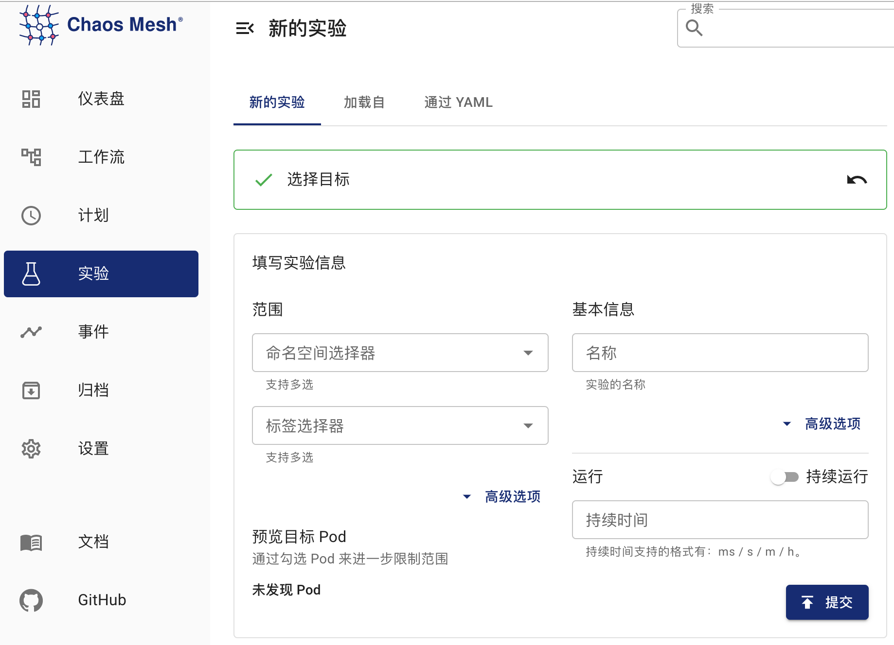

Chaos Mesh 通过 [Byteman](https://github.com/chaos-mesh/byteman) 模拟 JVM 应用故障，主要支持以下类型的故障：：

- 抛出自定义异常
- 触发垃圾回收
- 增加方法延迟
- 指定方法返回值
- 设置 Byteman 配置文件触发故障
- 增加 JVM 压力

本文主要介绍如何创建以上故障类型的 JVM 实验。

## 使用 Dashboard 方式创建实验

1. 单击实验页面中的“新的实验”按钮创建实验：

   

2. 在“选择目标”处选择 “JVM 故障”，然后选择具体行为（如 `RETURN`），最后填写具体配置：

   

   具体配置的填写方式，参考[字段说明](#字段说明)。

3. 填写实验信息，指定实验范围以及实验计划运行时间：

   

4. 提交实验。

## 使用 YAML 方式创建实验

下面将以指定返回值为例，展示 JVMChaos 的使用方法与效果。以下内容中涉及的 YAML 文件均可在 [examples/jvm](https://github.com/chaos-mesh/chaos-mesh/tree/master/examples/jvm) 中找到，以下步骤默认的工作路径也是在 `examples/jvm` 中。 默认 Chaos Mesh 安装的命名空间为 `chaos-testing`。

### 第 1 步：创建被测应用

[helloworld](https://github.com/WangXiangUSTC/byteman-example/tree/main/example.helloworld) 是一个简单的 Java 应用，此处作为被测应用。被测应用定义在 `example/jvm/app.yaml` 中，内容如下：

```yaml
apiVersion: v1
kind: Pod
metadata:
  name: helloworld
  namespace: helloworld
spec:
  containers:
    - name: helloworld
      # source code: https://github.com/WangXiangUSTC/byteman-example/tree/main/example.helloworld
      # this application will print log like this below:
      # 0. Hello World
      # 1. Hello World
      # ...
      image: xiang13225080/helloworld:v1.0
      imagePullPolicy: IfNotPresent
```

1. 创建应用所属的 namespace：

```shell
kubectl create namespace helloworld
```

2. 建立该应用 Pod：

```shell
kubectl apply -f app.yaml
```

3. 执行 `kubectl -n helloworld get pods`，预期能够观察到命名空间 `helloworld` 中名为 `helloworld` 的 Pod，等待其 `READY` 为 `1/1` 后进行下一步。

```shell
kubectl -n helloworld get pods
```

预期结果如下：

```text
kubectl get pods -n helloworld            
NAME         READY   STATUS    RESTARTS   AGE
helloworld   1/1     Running   0          2m
```

### 第 2 步：观测未被注入时的行为

在注入前你可以先观测应用 `helloworld` 未被注入时的行为，例如：

```shell
kubectl -n helloworld logs -f helloworld
```

输出如下所示：

```shell
0. Hello World
1. Hello World
2. Hello World
3. Hello World
4. Hello World
5. Hello World
```

可以看到 `helloworld` 每隔一秒输出一行 `Hello World`，每行的编号依次递增。

### 第 3 步：注入 JVMChaos 并验证

1. 指定返回值的 JVMChaos 内容如下：

```yaml
apiVersion: chaos-mesh.org/v1alpha1
kind: JVMChaos
metadata:
  name: return
  namespace: helloworld
spec:
  action: return
  class: Main
  method: getnum
  value: "9999"
  mode: all
  selector:
    namespaces:
      - helloworld
```

JVMChaos 将 `getnum` 方法的返回值修改为数字 `9999`，也就是让 `helloworld` 的每行输出的编号都设置为 `9999`。

2. 注入指定返回值的 JVMChaos：

```shell
kubectl apply -f ./jvm-return-example.yaml
```

3. 查看 helloworld 的最新日志：

```shell
kubectl -n helloworld logs -f helloworld
```

日志如下所示：

```shell
Rule.execute called for return_0:0
return execute
caught ReturnException
9999. Hello World
```

## 字段说明

| 参数 | 类型 | 说明 | 默认值 | 是否必填 | 示例 |
| --- | --- | --- | --- | --- | --- |
| action | string | 表示具体的故障类型，支持 latency、return、exception、stress、gc、ruleData。 | 无 | 是 | return |
| mode | string | 表示选择 Pod 的方式，支持 one、all、fixed、fixed-percent、random-max-percent。 | 无 | 是 | `one` |

关于 action 的取值的含义，可参考：

| 名称   | 含义                                   |
| ------ | -------------------------------------- |
| latency  | 增加方法调用延迟                       |
| return | 修改方法返回值                             |
| exception | 抛出自定义异常           |
| stress    | 提高 java 进程 CPU 使用率，或者造成       内存溢出（支持堆、栈溢出）    |
| gc    | 触发垃圾回收 |
| ruleData    | 设置 Byteman 配置触发故障 |

针对不同的 `action`，有不同的配置项可以填写。

### latency 相关参数

| 参数      | 类型                    | 说明                     | 是否必填 |
| --------- | ----------------------- | ------------------------ | -------- |
| class     |  string 类型        | Java 类的名称    | 是       |
| method      | string 类型           | 方法名称      | 是       |
| latency | int 类型 | 增加方法的延迟时间，单位为 ms    | 是       |
| port   | int 类型     | 附加到 Java 进程 agent 的端口号，通过该端口号将故障注入到 Java 进程 | 否       |

### return 相关参数

| 参数      | 类型                    | 说明                     | 是否必填 |
| --------- | ----------------------- | ------------------------ | -------- |
| class     |  string 类型        | Java 类的名称    | 是       |
| method      | string 类型           | 方法名称      | 是       |
| value | string 类型 | 指定方法的返回值，目前支持数字和字符串类型的返回值，如果为字符串，则需要使用双引号，例如："chaos"。    | 是       |
| port   | int 类型     | 附加到 Java 进程 agent 的端口号，通过该端口号将故障注入到 Java 进程 | 否       |

### exception 相关参数

| 参数      | 类型                    | 说明                     | 是否必填 |
| --------- | ----------------------- | ------------------------ | -------- |
| class     |  string 类型        | Java 类的名称    | 是       |
| method      | string 类型           | 方法名称      | 是       |
| exception | string 类型 | 抛出的自定义异常，例如：'java.io.IOException("BOOM")'   | 是       |
| port   | int 类型     | 附加到 Java 进程 agent 的端口号，通过该端口号将故障注入到 Java 进程 | 否       |

### stress 相关参数

| 参数      | 类型                    | 说明                     | 是否必填 |
| --------- | ----------------------- | ------------------------ | -------- |
| cpuCount     |  int 类型        | 增加 CPU 压力所使用的 CPU 核的数量，`cpuCount` 和 `memType` 中必须配置一个    | 否       |
| memType      | string 类型           | 内存 OOM 的类型，目前支持 "stack" 和 "heap" 两种类型      | 无       |
| port   | int 类型     | 附加到 Java 进程 agent 的端口号，通过该端口号将故障注入到 Java 进程 | 否       |

### gc 相关参数

| 参数      | 类型                    | 说明                     | 是否必填 |
| --------- | ----------------------- | ------------------------ | -------- |
| port   | int 类型     | 附加到 Java 进程 agent 的端口号，通过该端口号将故障注入到 Java 进程 | 否       |

### ruleData 相关参数

| 参数      | 类型                    | 说明                     | 是否必填 |
| --------- | ----------------------- | ------------------------ | -------- |
| ruleData     |  srting 类型        | 指定 Byteman 配置数据    | 是       |
| port   | int 类型     | 附加到 Java 进程 agent 的端口号，通过该端口号将故障注入到 Java 进程 | 否       |

需要根据具体的 Java 程序，并参考 [byteman-rule-language](https://downloads.jboss.org/byteman/4.0.16/byteman-programmers-guide.html#the-byteman-rule-language) 编写规则配置文件，例如：

```txt
RULE modify return value
CLASS Main
METHOD getnum
AT ENTRY
IF true
DO
    return 9999
ENDRULE
```

将配置中的换行转换为换行符 "\n"，将转换后的数据设置为参数 "ruleData" 的值，如上的配置转换为：

```txt
\nRULE modify return value\nCLASS Main\nMETHOD getnum\nAT ENTRY\nIF true\nDO return 9999\nENDRULE\n"
```
