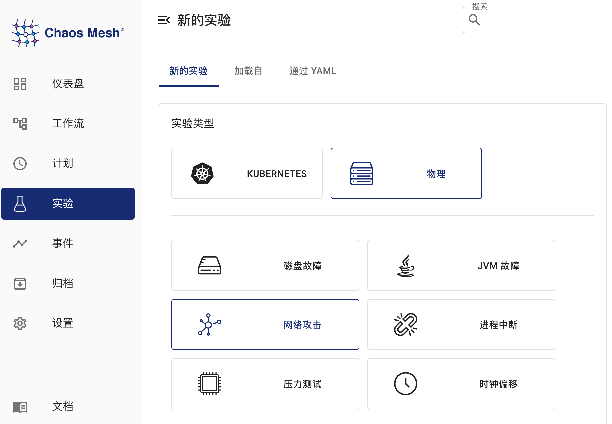
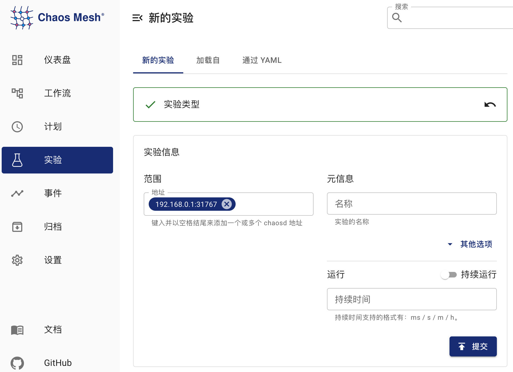

本文档介绍如何在 Chaos Mesh 中创建 PhysicalMachineChaos 混沌实验，以模拟物理机或虚拟机中的网络、磁盘、压力、JVM、时间等故障。

## PhysicalMachineChaos 介绍

PhysicalMachineChaos 可用于在物理或虚拟机中模拟网络、磁盘、压力、JVM、时间等故障。

## 部署 Chaosd Server

在使用 Chaos Mesh 创建 PhysicalMachineChaos 混沌实验前，你需要在待注入故障的所有物理机或虚拟机中部署服务模式的 chaosd。chaosd 的部署方法请参考 [chaosd 的下载和部署](chaosd-overview.md#下载和部署)。

在部署完成后，运行以下命令启动服务模式 chaosd：

```bash
chaosd server --port 31767
```

## 使用 Dashboard 方式创建实验

1. 单击实验页面中的**新的实验**按钮创建实验：

   

2. 在**实验类型**处选择**物理**，然后选择具体实验类型，例如**网络攻击**。然后选择具体的行为，最后再填写相应的配置：

   

3. 填写实验信息，指定实验范围以及实验计划运行时间：

   

4. 提交实验。

## 使用 YAML 方式创建实验

1. 将实验配置写入到文件 `physicalmachine.yaml` 中，写入内容的示例如下：

   ```yaml
   apiVersion: chaos-mesh.org/v1alpha1
   kind: PhysicalMachineChaos
   metadata:
     name: physical-network-delay
     namespace: chaos-testing
   spec:
     action: network-delay
     address:
       - 172.16.112.130:31767
     network-delay:
       device: ens33
       ip-address: 140.82.112.3
       latency: 1000ms
     duration: '10m'
   ```

   该实验配置向指定物理机或虚拟机中的 chaosd 服务发送 HTTP 请求，触发网络延迟实验。

2. 使用 kubectl 创建实验，命令如下：

   ```bash
   kubectl apply -f physicalmachine.yaml
   ```

### 配置说明

| 参数 | 类型 | 说明 | 默认值 | 是否必填 | 示例 |
| :-- | :-- | :-- | :-- | :-- | :-- |
| action | string | 定义物理机故障的行为，可选值为 "stress-cpu", "stress-mem", "disk-read-payload", "disk-write-payload", "disk-fill", "network-corrupt", "network-duplicate", "network-loss", "network-delay", "network-partition", "network-dns", "process", "jvm-exception", "jvm-gc", "jvm-latency", "jvm-return", "jvm-stress", "jvm-rule-data", "clock" | 无 | 是 | "stress-cpu" |
| address | string 数组 | 选择注入故障的 chaosd 服务地址 | [] | 是 | ["192.168.0.10:31767"] |
| duration | string | 指定实验的持续时间 | 无 | 是 | 30s |

每种故障行为都有特定的配置。以下部分介绍各种故障类型以及对应的配置方法。

#### CPU 压力

模拟 CPU 压力场景，将 action 设置为 "stress-cpu"，对应的配置可参考[模拟 CPU 压力相关参数说明](simulate-heavy-stress-in-physical-nodes.md#模拟-CPU-压力相关参数说明)。

#### 内存压力

模拟内存压力场景，将 action 设置为 "stress-mem"，对应的配置可参考[模拟内存压力相关参数说明](simulate-heavy-stress-in-physical-nodes.md#模拟内存压力相关参数说明)。

#### 磁盘读负载

模拟磁盘读负载，将 action 设置为 "disk-read-payload"，对应的配置可参考[模拟磁盘读负载相关参数说明](simulate-disk-pressure-in-physical-nodes.md#模拟磁盘读负载相关参数说明)。

#### 磁盘写负载

模拟磁盘读负载，将 action 设置为 "disk-write-payload"，对应的配置可参考[模拟磁盘写负载相关参数说明](simulate-disk-pressure-in-physical-nodes.md#模拟磁盘写负载相关参数说明)。

#### 磁盘填充

模拟磁盘填充，将 action 设置为 "disk-fill"，对应的配置可参考[模拟磁盘填充相关参数说明](simulate-disk-pressure-in-physical-nodes.md#模拟磁盘填充相关参数说明)。

#### 网络包错误

模拟网络包错误，将 action 设置为 "network-corrupt"，对应的配置可参考[网络包错误相关参数说明](simulate-network-chaos-in-physical-nodes.md#网络包错误相关参数说明)。

#### 网络包延迟

模拟网络包延迟，将 action 设置为 "network-delay"，对应的配置可参考[网络包错误相关参数说明](simulate-network-chaos-in-physical-nodes.md#网络包错误相关参数说明)。

#### 网络包重复

模拟网络包重复，将 action 设置为 "network-duplicate"，对应的配置可参考[网络包重复相关参数说明](simulate-network-chaos-in-physical-nodes.md#网络包重复相关参数说明)。

#### 网络包丢失

模拟网络包丢失，将 action 设置为 "network-loss"，对应的配置可参考[网络包丢失相关参数说明](simulate-network-chaos-in-physical-nodes.md#网络包丢失相关参数说明)。

#### 网络分区

模拟网络分区，将 action 设置为 "network-partition"，对应的配置可参考[网络分区相关参数说明](simulate-network-chaos-in-physical-nodes.md#网络分区相关参数说明)。

#### DNS 故障

模拟 DNS 故障， 将 action 设置为 "network-dns"，对应的配置可参考[DNS 故障相关参数说明](simulate-network-chaos-in-physical-nodes.md#DNS-故障相关参数说明)。

#### 进程故障

模拟进程故障，将 action 设置为 "process"，对应的配置可参考[进程故障相关参数说明](simulate-process-chaos-in-physical-nodes.md#进程故障相关参数说明)。

#### JVM 应用抛出自定义异常

模拟 JVM 应用抛出自定义异常，将 action 设置为 "jvm-exception"，对应的配置可参考[抛出自定义异常相关参数说明](simulate-jvm-application-chaos-in-physical-nodes.md#抛出自定义异常相关参数说明)。

#### JVM 应用增加方法延迟

模拟 JVM 应用增加方法延迟，将 action 设置为 "jvm-latency"，对应的配置可参考[增加方法延迟相关参数说明](simulate-jvm-application-chaos-in-physical-nodes.md#增加方法延迟相关参数说明)。

#### JVM 应用修改方法返回值

模拟 JVM 应用修改方法返回值，将 action 设置为 "jvm-return"，对应的配置可参考[修改方法返回值相关参数说明](simulate-jvm-application-chaos-in-physical-nodes.md#修改方法返回值相关参数说明)。

#### JVM 应用触发垃圾回收

模拟 JVM 应用触发垃圾回收，将 action 设置为 "jvm-gc"，对应的配置可参考[触发垃圾回收相关参数说明](simulate-jvm-application-chaos-in-physical-nodes.md#触发垃圾回收相关参数说明)。

#### JVM 应用使用 Byteman 配置触发故障

JVM 应用使用 Byteman 配置触发故障，将 action 设置为 "jvm-rule-data"，对应的配置可参考[设置 Byteman 配置触发故障相关参数说明](simulate-jvm-application-chaos-in-physical-nodes.md#设置-Byteman-配置触发故障相关参数说明)。

#### 时间偏移

（正在持续更新中）
