本文主要介绍 Chaos Mesh v2.1.0 的使用方法，包括如何通过 Chaos Mesh 混沌实验干扰 NGINX 应用程序、如何通过 Chasos Mesh 的 Workflow 创建复杂的混沌测试流程并查看实验流程和结果等等。

## 准备环境

### 部署 Kubernetes 和 Chaos Mesh

在开始之前，请确保你的电脑中安装了 [Docker](https://www.docker.com/)。

本章节介绍如何使用脚本 `install.sh` 部署 Kubernetes 和 Chaos Mesh。该脚本是 Chaos Mesh 提供的一键部署脚本，可以运行以下操作：

- 自动检查本地环境。
- 安装 [kind 工具](https://kind.sigs.k8s.io/)（以下简称为 kind）。
- 使用 kind 在本地部署并启动一个 Kubernetes 集群。
- 在通过脚本部署的 Kubernetes 集群上安装 Chaos Mesh。

:::note 注意

- 建议**仅**在快速上手体验 Chaos Mesh 或在测试环境中使用上述方式部署 Kubernetes 和 Chaos Mesh。
- 在生产环境中，需通过 [使用 Helm 安装 Chaos Mesh](./production-installation-using-helm.md) 中提供的部署方式来部署 Kubernetes 和 Chaos Mesh。

:::

1. 运行 `install.sh`：

    ```bash
    curl -sSL https://mirrors.chaos-mesh.org/v2.1.2/install.sh | bash -s -- --local kind
    ```

    完整运行脚本约需需要几分钟时间，请耐心等待。

    安装完成后，确认 Chaos Mesh 的所有 Pod 都处于 Running 状态：

    ```bash
    kubectl get pods -n chaos-testing
    ```

    结果如下所示：

    ```log
    NAME                                        READY   STATUS    RESTARTS   AGE
    chaos-controller-manager-588df5cdd7-qzxjn   1/1     Running   0          1m
    chaos-controller-manager-588df5cdd7-vd7qj   1/1     Running   0          1m
    chaos-controller-manager-588df5cdd7-wtrtf     1/1     Running   0          1m
    chaos-daemon-p7zdb                                       1/1     Running   0          1m
    chaos-dashboard-7c87549798-k5m9s             1/1     Running   0          1m
    ```

2. 为 Chaos Dashboard 服务做端口转发：

    ```bash
    kubectl port-forward -n chaos-testing svc/chaos-dashboard 2333:2333 --address 0.0.0.0
    ```

   完成后，你可以通过在浏览器中输入网址 `127.0.0.1:2333` 来访问 Chaos Dashboard，其界面如下：

   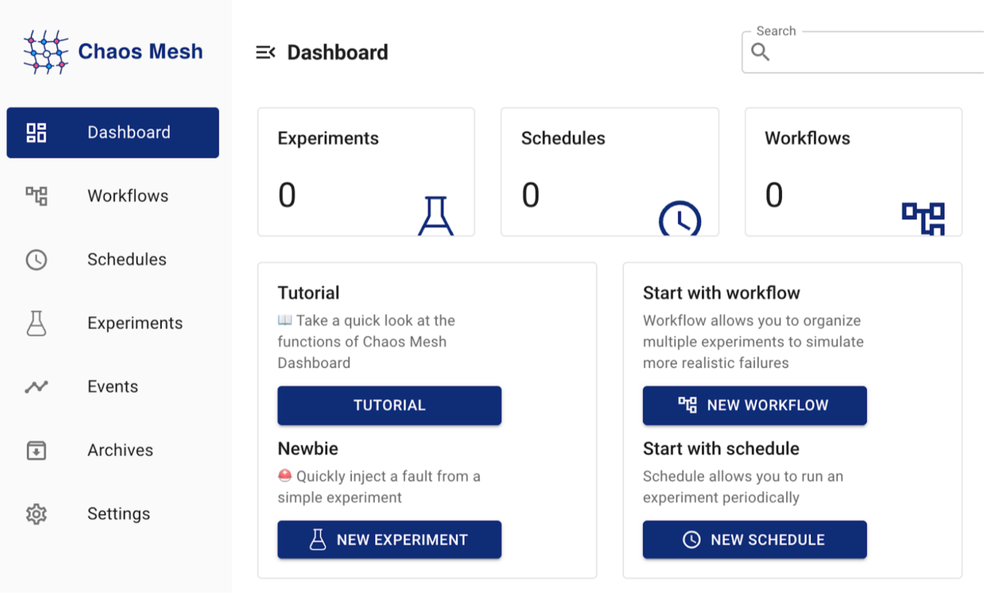

### 部署测试应用

本文将 NGINX 和 WebShow 选为进行混沌实验的应用。

#### 部署 NGINX

NGINX 是用于进行反向代理、负载平衡等工作的应用程序。在本测试中，你只需要使用 NGINX 的基本功能，访问该应用的主页即可。

1. 创建 NGINX 服务：

    ```bash
    kubectl apply -f  https://raw.githubusercontent.com/chaos-mesh/chaos-mesh/master/examples/nginx/nginx.yaml
    ```

2. 查看 Pod 状态，确认其状态为 Running：

    ```bash
    kubectl get pods -l app=nginx
    ```

    输出如下所示：

    ```log
    NAME READY STATUS RESTARTS AGE
    nginx-694dd977cd-j9vql 1/1 Running 0 1m
    ```

3. 为 NGINX 服务做端口转发：

    ```bash
    kubectl port-forward --address 0.0.0.0 svc/nginx 80:80 -n nginx
    ```

    在浏览器中访问 `http://localhost/`。如果页面显示如下内容，说明 NGINX 正在正常工作：

    ```log
    {"app": "Chaos App", "status": "Running"}
    ```

#### 部署 WebShow

WebShow 是 Chaos Mesh 提供的一个 Demo 应用程序。在本文中，WebShow 为 Chaos Mesh 混沌实验的待测试目标，用于观察在网络延时下该应用的工作状态。你可以在 WebShow 应用页面上通过折线图直接观察自身到 kube-system 命名空间下 Pod 的网络延迟。

1. 部署 WebShow：

    ```bash
    curl -sSL https://mirrors.chaos-mesh.org/v1.0.3/web-show/deploy.sh | sh
    ```

2. 查看网络延迟情况：

   在浏览器中访问 `http://localhost:8081/`，访问 kube-system 命名空间下 Pod 的网络延迟情况。下图为页面示例，该页面中显示 Pod 的网络延迟很低，基本都在 2ms 以内。

   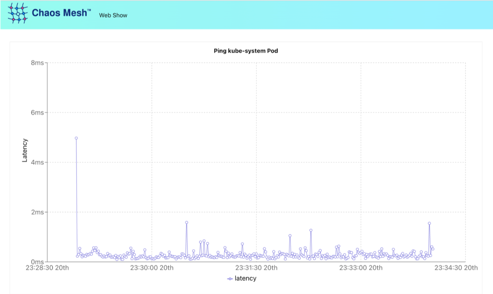

## 测试 NGINX 服务

本章节介绍创建 Chaos Mesh 混沌实验并通过其实验干扰 NGINX 服务的方法。该实验的目的为通过 Chaos Mesh 混沌实验向 NGINX 注入 HTTP 故障，从而修改 NGINX 的返回数据。

1. 创建实验、选择故障类型。

    访问 Chaos Dashboard 页面后，点击左侧的 "NEW EXPERIMENT" 按钮创建新实验。

    创建后，选择实验类型为 "KUBERNETES"、故障类型为 "HTTP FAULT"。

    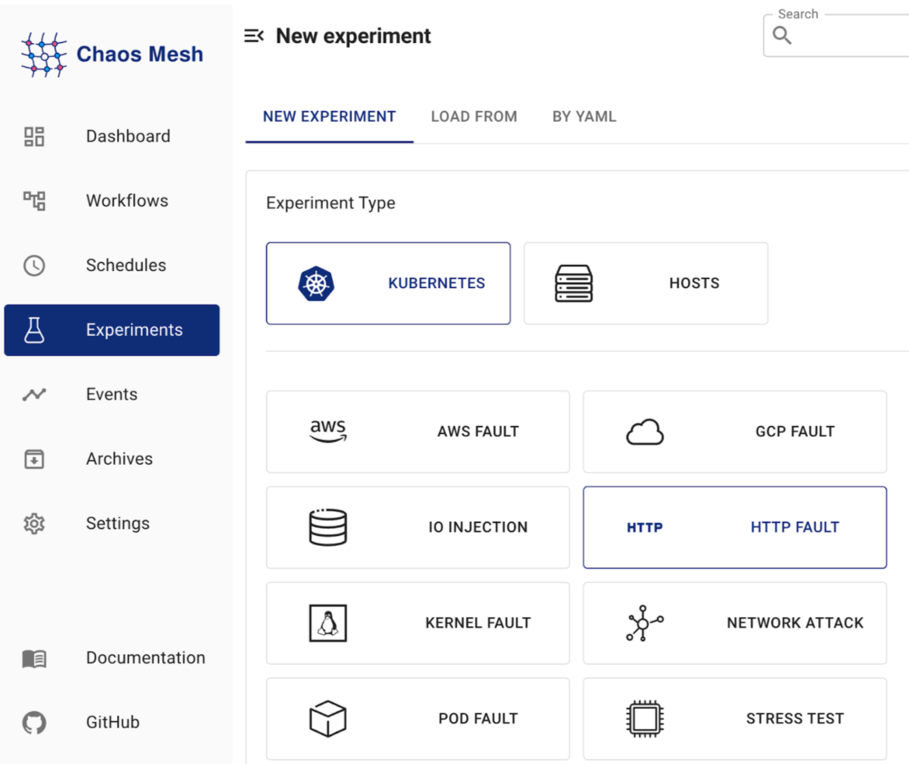

2. 设置 HTTP 实验参数。

    - 故障行为："RESPONSE PATCH"
    - Port："80"（NGINX 提供服务的端口）
    - Patch Body Type："json"
    - Patch Body Value："{"status":"Failed","reason":"hacked by Chaos Mesh"}"

    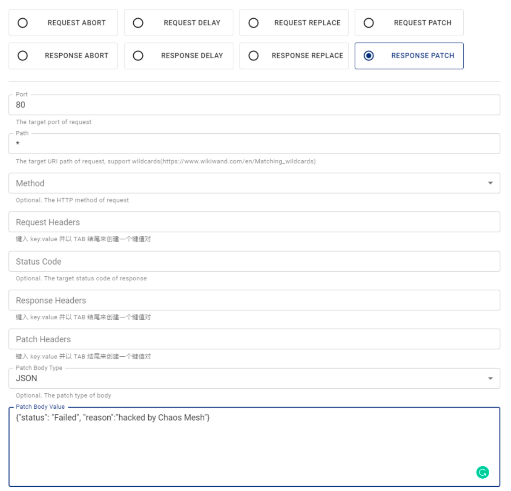

3. 填写实验的选择范围和基本信息，提交实验。

    参考以下图片的内容设置实验的选择范围和基本信息后，点击 "Submit" 提交实验。

    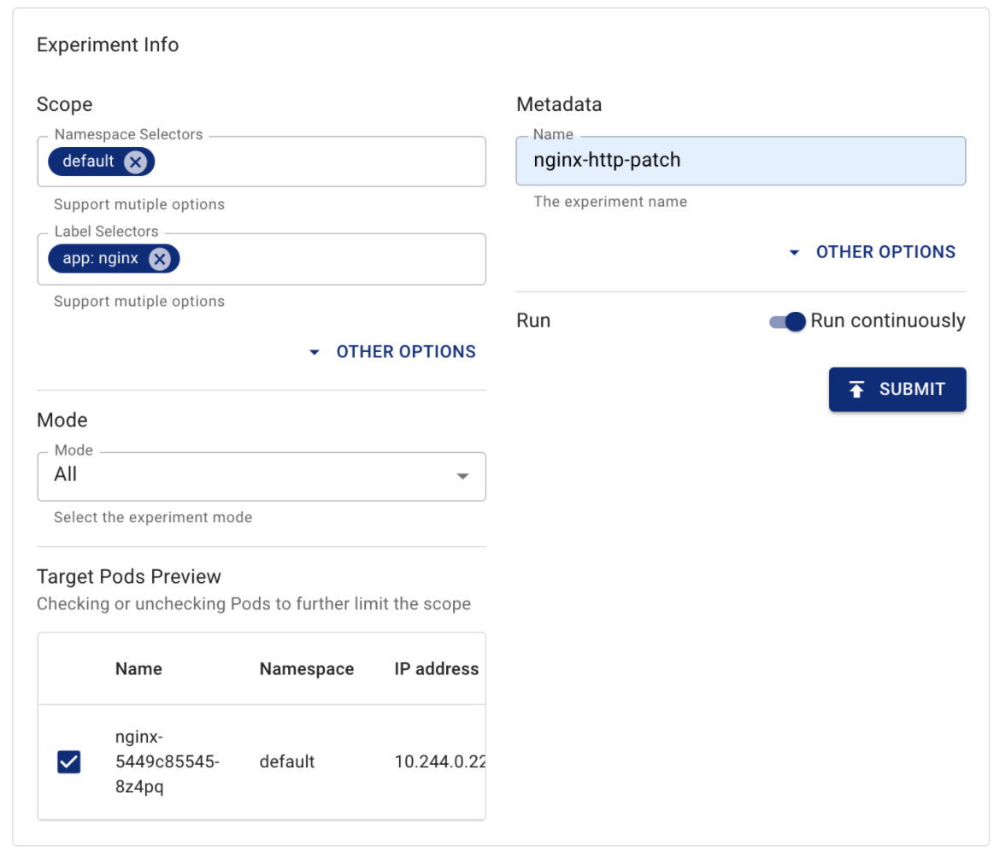

4. 查看故障注入状态。

    你可以在实验列表中看到自己创建的实验和实验的配置详情，并在 "Events" 部分中看到故障注入状态。

    以下图片的 "Events" 部分显示故障注入已成功。

   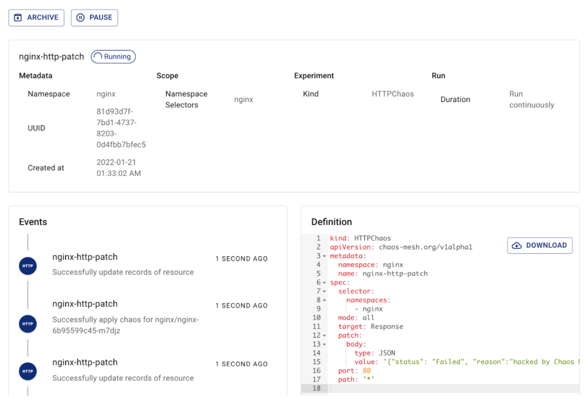

5. 验证实验效果。

   在浏览器中访问 `http://localhost/`。如果可以看到页面上显示如下内容，则说明故障注入已生效，该实验成功地修改了 NGINX 的返回数据：

    ```bash
    {"app":"Chaos App","reason":"hacked by Chaos Mesh","status":"Failed"}
    ```

## 测试 WebShow 服务

本章节介绍如何在一个 Workflow 创建多个网络故障任务，并通过这个 Workflow 对 WebShow 服务进行干扰。

在以下示例中，Chaos Mesh 预计向 WebShow 服务注入网络延迟，观察在网络延时下该应用的工作状态。Chaos Mesh 将先使 WebShow 延迟 10ms 后，持续一段时间的延迟状态，其后再将延迟降低到先前水平，最后再把延迟提高到 20ms。

1. 访问 Chaos Dashboard，创建 Workflow。

   访问 Chaos Dashboard 页面后，点击左侧的 "NEW WORKFLOW" 按钮来创建一个新的 Workflow。

2. 设置任务信息。

    将任务类型设置为 "single"、实验类型设为 "KUBERNETES"、故障类型设为 "NETWORK ATTACK"。

   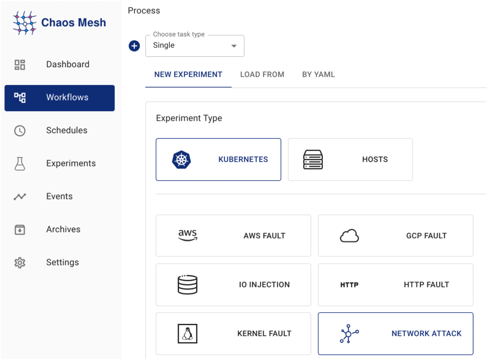

3. 选择故障行为。

    将故障行为选为 "DELAY"，并把 "Latency" 设置为 10ms，表示增加 10ms 的网络延迟。

   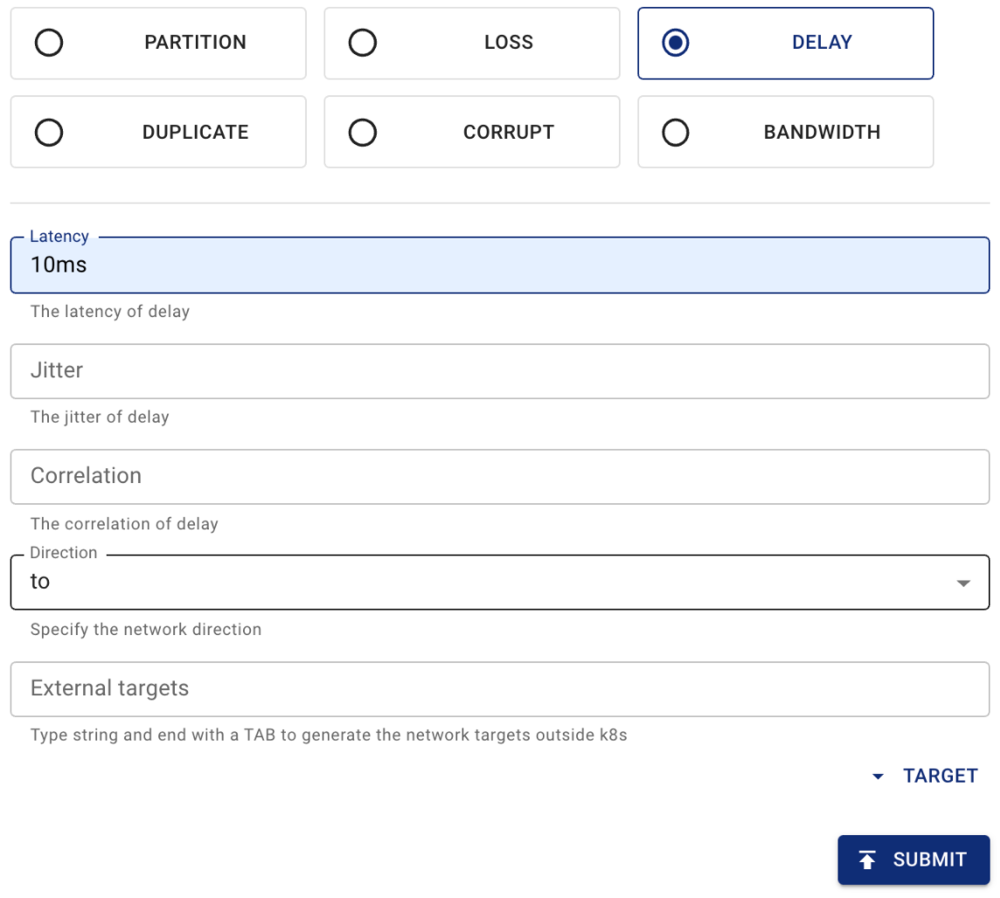

4. 填写实验的选择范围和基本信息。

   将实验范围设置为 "app: web-show"，表示该实验指针对 WebShow 应用程序。另外，填写实验的基本信息，将实验命名为 "delay1"，实验持续时间设置为 "30s"：

   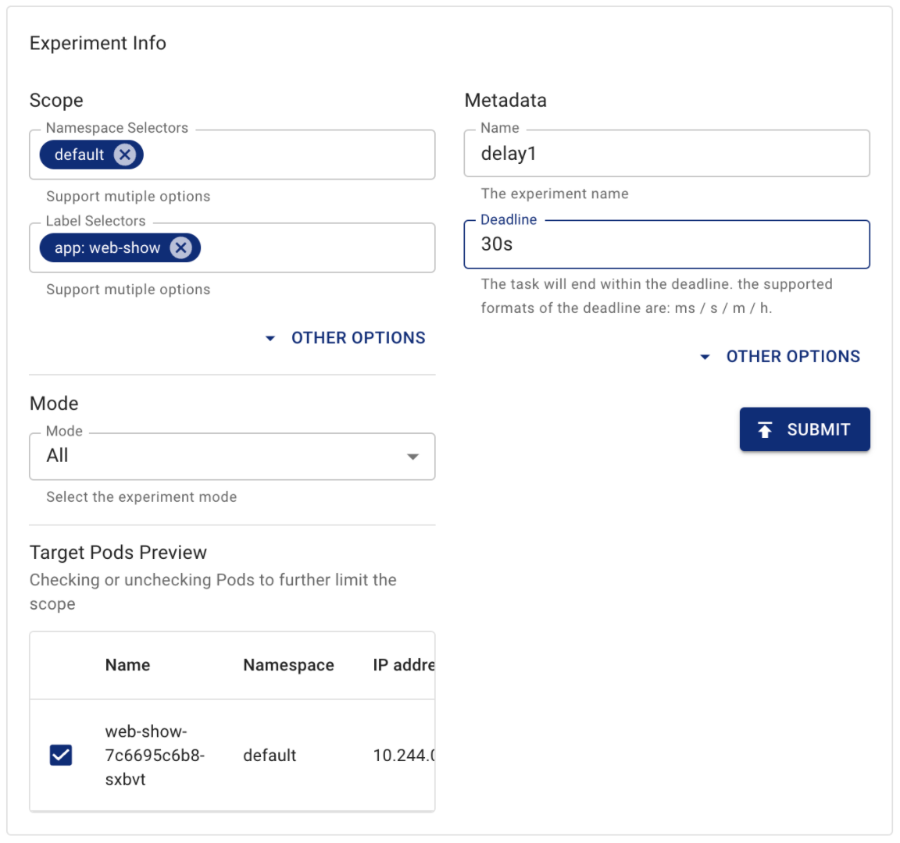

5. 再创建一个新的任务。

    将任务类型选为 "Suspend"。该类型的任务正如其名字的含义一样，并不会做任何事情。该实验的持续时间设置为 "30s"：

   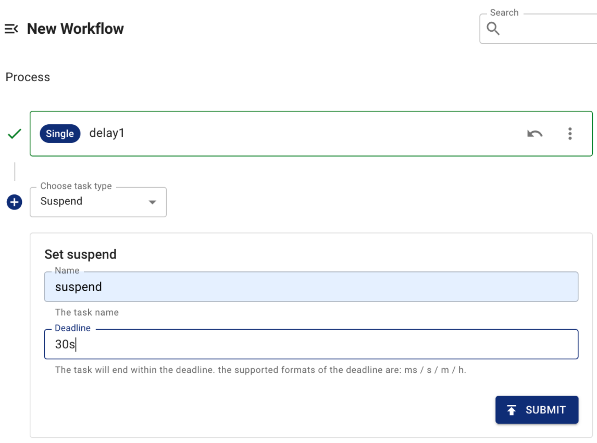

6. 再创建一个新的任务。

    将实验类型选为 "single"、故障行为选为 "DELAY"、"Latency" 设置为 20ms。具体创建流程与创建 "delay1" 的流程相同（第 2 步至第 4 步）。

7. 创建 3 个任务后，填写 Workflow 元信息。

    根据图片所示填写元信息后，点击 "SUBMIT WORKFLOW" 按钮提交 Workflow。

   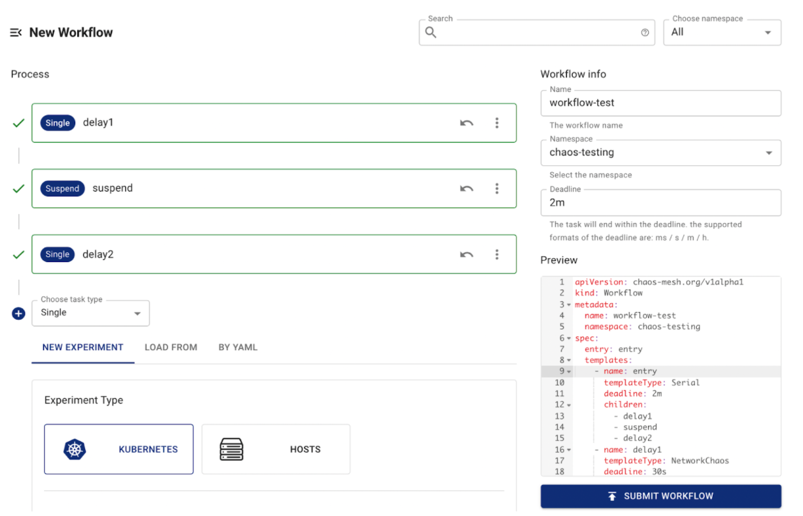

8. 验证 Workflow 效果。

   在浏览器中访问 `http://localhost:8081/`。等待一段时间（大约 90s），将看到如下图所示的折线图：

   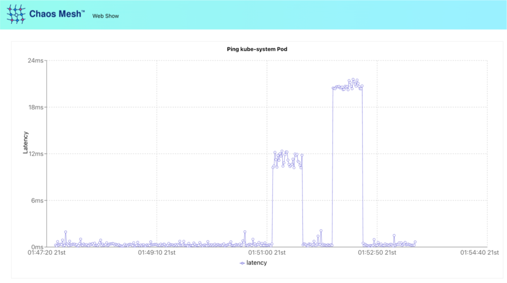

   你可以发现网络延迟先增加到了 10ms 左右，持续一段时间后，其延迟降低到先前水平，之后又上升到了 20ms 左右。这符合我们的 Workflow 设置，说明使用 Workflow 成功地注入了多个网络延迟故障。

## 问题反馈

如果在操作的过程中遇到了问题，或有兴趣帮助我们改进这一工具，欢迎在 [CNCF Slack](https://cloud-native.slack.com/archives/C0193VAV272) 向 Chaos Mesh 团队反馈，或者直接在 GitHub 创建一个 [issue](https://github.com/chaos-mesh/chaos-mesh/issues)。