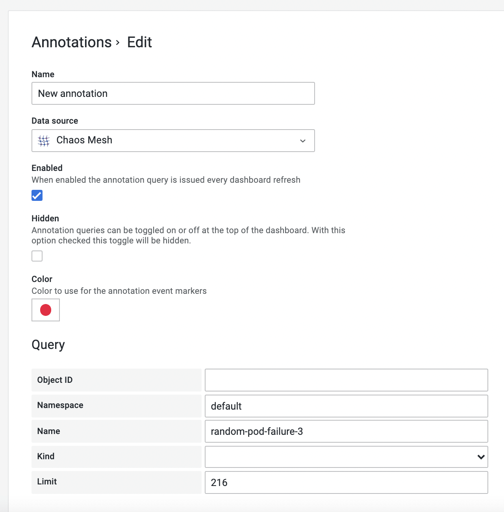
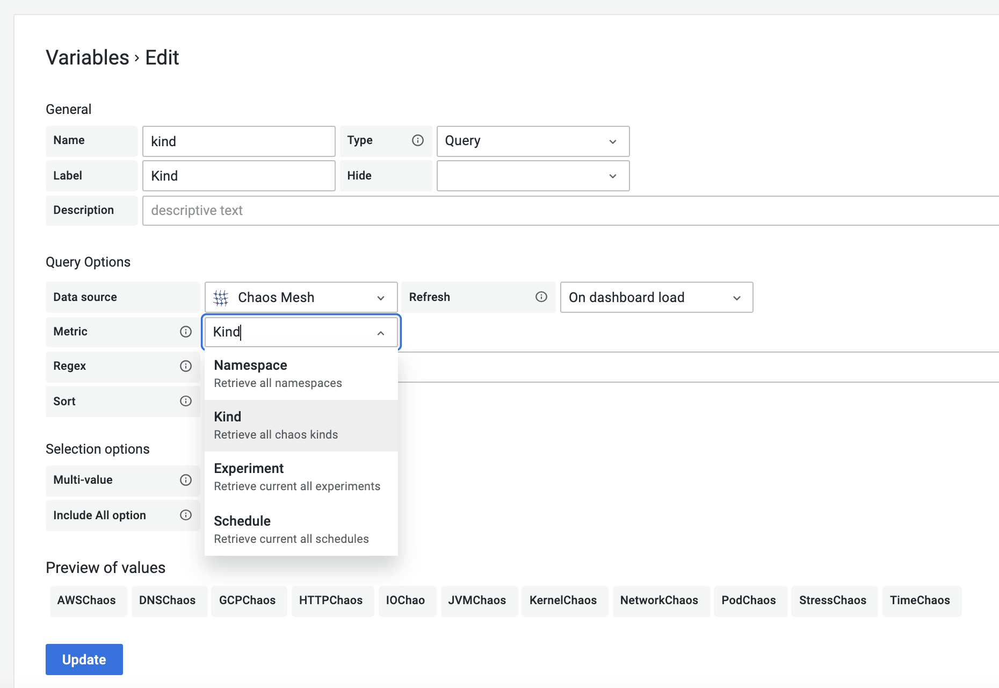

:::note 注意

可以使用该插件的最小 Grafana 版本是 `7.0.0`。(要求 Grafana >= `7.0.0`)

:::

:::note 注意

由于 Grafana 还没有受理 Chaos Mesh Data Source 的插件提交，所以目前无法使用 `grafana-cli` 进行安装。

以下步骤为如何在本地安装 Data Source 插件。

:::

## 安装

通过如下命令下载插件 zip 包或前往 <https://github.com/chaos-mesh/datasource/releases> 下载：

```shell
curl -LO https://github.com/chaos-mesh/datasource/releases/download/v2.1.0/chaosmeshorg-datasource-2.1.0.zip
```

下载完成后，进行解压：

```shell
unzip chaosmeshorg-datasource-2.1.0.zip -d YOUR_PLUGIN_DIR
```

:::tip 小贴士

参考 <https://grafana.com/docs/grafana/latest/plugins/installation/#install-a-packaged-plugin> 找到插件目录。

:::

然后更新并保存 `grafana.ini` 文件为：

```ini
[plugins]
  allow_loading_unsigned_plugins = chaosmeshorg-datasource
```

最后重启 Grafana 即可加载插件。

## 设置

安装完成后，前往 **Configuration -> Data sources** 中添加 Chaos Mesh，然后进入到配置页面：


只有 `URL` 字段需要填写，其他字段可以忽略。

假设你在本地安装了 Chaos Mesh，Dashboard 会默认在 `2333` 端口导出 API。所以，如果你没有修改任何东西，可以直接填写 `http://localhost:2333`。

然后使用 `port-forward` 命令来激活:

```shell
kubectl port-forward -n chaos-testing svc/chaos-dashboard 2333:2333
```

最后，点击 **Save & Test** 来测试连接。如果显示成功的通知，则说明设置已经完成。

## Query

Data Source 插件会以事件的视角来观测 Chaos Mesh，以下几个选项负责过滤不同的事件：

- **Object ID** - 通过对象的 UUID 进行过滤
- **Namespace** - 通过不同的命名空间进行过滤
- **Name** - 通过对象名进行过滤
- **Kind** - 通过类型 (PodChaos, Schedule...) 进行过滤
- **Limit** - 限制事件的数量

它们将会作为参数被传递到 `/api/events` API 中。

## Annotations

你可以通过 Annotations 来集成 Chaos Mesh 的事件到面板上，以下为创建的示例：



请参考 [Query](#query) 的内容来填写相应的字段。

## Variables

如果你选择类型为 `Query` 并选择数据源为 `Chaos Mesh`，你可以通过不同的指标来检索变量：



以下是可以使用的变量类型：

- `Namespace`

  选择后，所有可用的命名空间将直接显示在值的预览中，无需额外工作。

- `Kind`

  与命名空间相同。获取所有种类。

- `Experiment`

  与命名空间相同。获取所有实验的名称。

- `Schedule`

  与命名空间相同。获取所有时间表的名称。

## 遇到问题

你可以在 [CNCF Slack](https://cloud-native.slack.com/archives/C0193VAV272) 向社区提问或前往 <https://github.com/chaos-mesh/datasource/issues> 向我们提交 issues。

## 更多

想要了解更多，请前往 [chaos-mesh/datasource](https://github.com/chaos-mesh/datasource) 获取更多信息。
