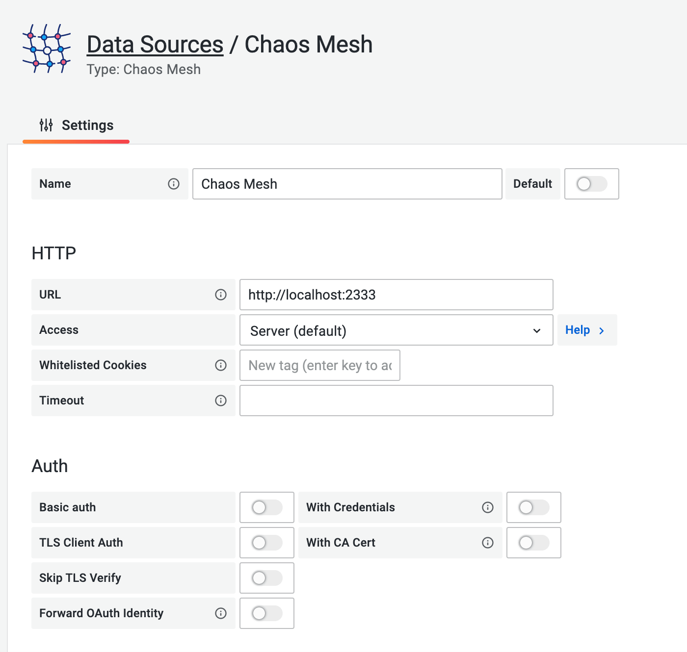
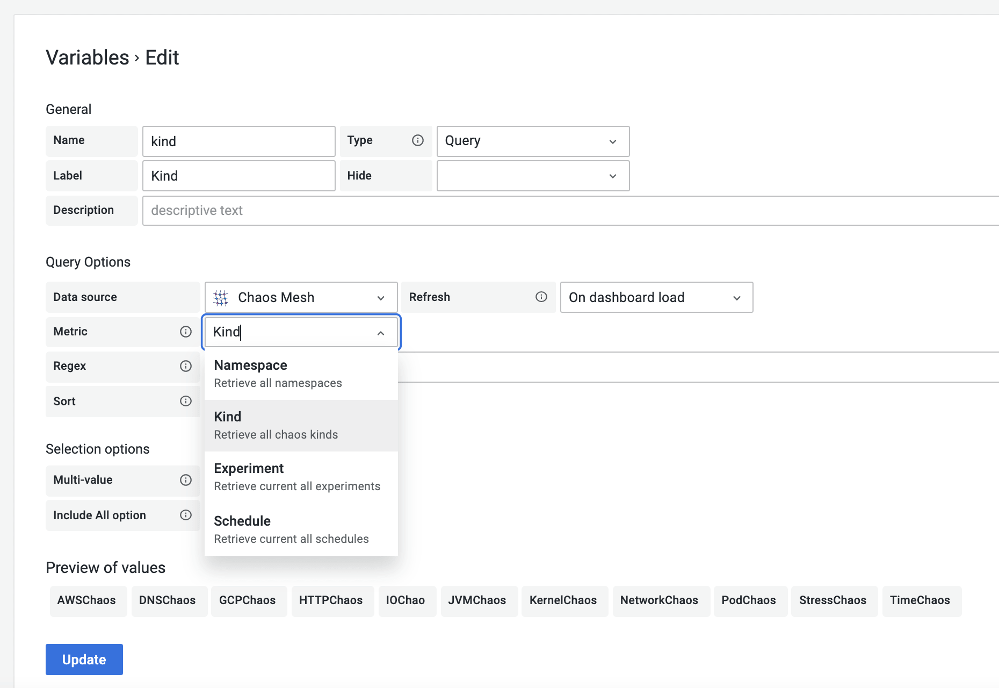
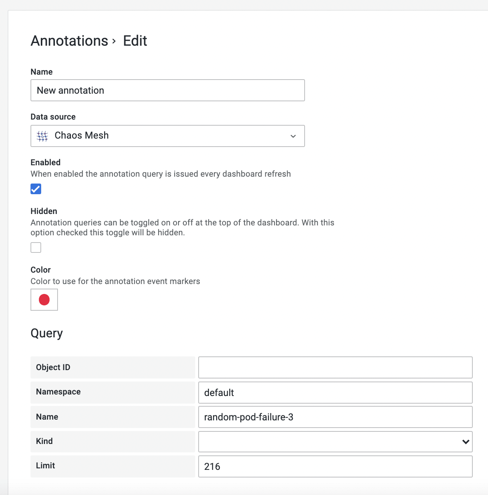

本文档介绍如何在 Grafana 中安装 Data Source 插件，并将其配置为观测 Chaos Mesh 事件。

:::note

该插件要求 Chaos Mesh **>= 2.1**、Grafana **>= 10.0**。

我们仅在 Grafana 10.0.3 上测试过该插件，它可能支持更低的版本，但我们无法确定。升级到 Grafana v10 是因为 [Angular 支持已弃用](https://github.com/chaos-mesh/datasource/issues/55)。如果遇到任何问题，请提交 issue 告知我们。

:::

## 安装

### 通过 Grafana 界面安装

[https://grafana.com/docs/grafana/latest/administration/plugin-management/#install-a-plugin](https://grafana.com/docs/grafana/latest/administration/plugin-management/#install-a-plugin)

### 通过 CLI 安装

```sh
grafana-cli plugins install chaosmeshorg-datasource
```

### 手动安装

使用以下命令下载插件的 zip 压缩包，或前往 https://github.com/chaos-mesh/datasource/releases 下载：

```shell
curl -LO https://github.com/chaos-mesh/datasource/releases/download/v3.0.0/chaosmeshorg-datasource-3.0.0.zip
```

下载完成后，解压：

```shell
unzip chaosmeshorg-datasource-3.0.0.zip -d YOUR_PLUGIN_DIR
```

:::tip

如需查找插件目录，可参考 https://grafana.com/docs/grafana/latest/plugins/installation/#install-a-packaged-plugin。

:::

然后更新并保存 `grafana.ini` 文件：

```ini
[plugins]
  allow_loading_unsigned_plugins = chaosmeshorg-datasource
```

:::tip

如需查找配置文件，可参考 https://grafana.com/docs/grafana/latest/administration/configuration/#config-file-locations。

:::

最后，重启 Grafana 以加载插件。

## 设置

安装完成后，前往 **Administration -> Data sources** 并添加 Chaos Mesh，然后进入配置页面：



假设你已在本地安装 Chaos Mesh，Chaos Dashboard 默认会在 `2333` 端口暴露 API。因此，如果没有修改任何配置，可以直接填写 `http://localhost:2333`。

然后使用 `port-forward` 命令使 API 可被外部访问：

```shell
kubectl port-forward -n chaos-mesh svc/chaos-dashboard 2333:2333
```

最后，点击 **Save & test** 测试连接。如果显示成功通知，则说明设置已完成。

### 认证

如果你在部署 Chaos Mesh 时启用了[权限认证](./manage-user-permissions.md)，需要在配置中添加 `Authorization` 请求头。可以按照以下步骤添加：

1. 点击 **Add header** 按钮。
2. 在 **Header** 字段中填写 `Authorization`。
3. 按照[此章节](./manage-user-permissions.md#创建用户并绑定权限)获取 token。
4. 在 **Value** 字段中填写 `Bearer YOUR_TOKEN`。

然后不要忘记点击 **Save & test** 测试连接。

## Query

Data Source 插件以事件的视角观测 Chaos Mesh，以下选项用于过滤不同的事件：

- **Object ID**

  > 按对象 UUID 过滤。

- **Namespace**

  > 按命名空间过滤。

- **Name**

  > 按对象名称过滤。

- **Kind**

  > 按类型过滤（例如 PodChaos、NetworkChaos、Schedule）。如果你在 Chaos Mesh 中实现了新的类型，也可以输入任意类型。

- **Limit**

  > 限制事件的数量。

以上选项都会作为参数传递给 `/api/events` API。

## 变量

Data Source 插件支持通过不同的指标添加查询变量：



- **Namespace**

  > 选择后，所有可用的命名空间会直接显示在 **Preview of values** 中。

- **Kind**

  > 与 **Namespace** 相同。获取所有类型。

- **Experiment/Schedule/Workflow**

  > 与 **Namespace** 相同。获取当前所有的实验/调度/工作流。
  >
  > 你也可以指定 `queries` 以进一步过滤值，例如 `?namespace=default` 只会获取 `default` 命名空间中的实验/调度/工作流。

## Annotations

你可以通过注解（annotations）将事件集成到面板中。以下是一个创建示例，它会获取所有 PodChaos 事件：



请参考 [Query](#query) 填写相应字段。

## 问题反馈

如果在安装或设置过程中遇到问题，欢迎在 [CNCF Slack](https://cloud-native.slack.com/archives/C0193VAV272) 向社区提问，或创建 [GitHub issue](https://github.com/chaos-mesh/datasource/issues) 与 Chaos Mesh 团队沟通。

## 探索更多

如果你想了解更多关于 Data Source 插件的细节，欢迎在 [chaos-mesh/datasource](https://github.com/chaos-mesh/datasource) 查看源代码。
