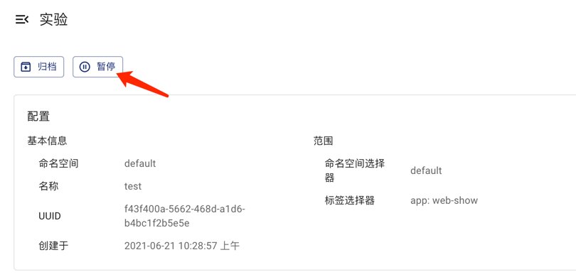
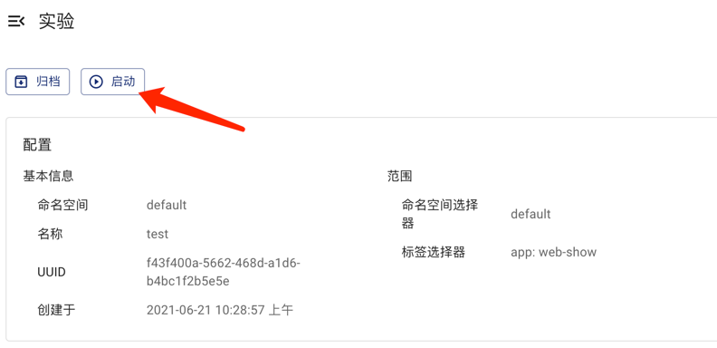
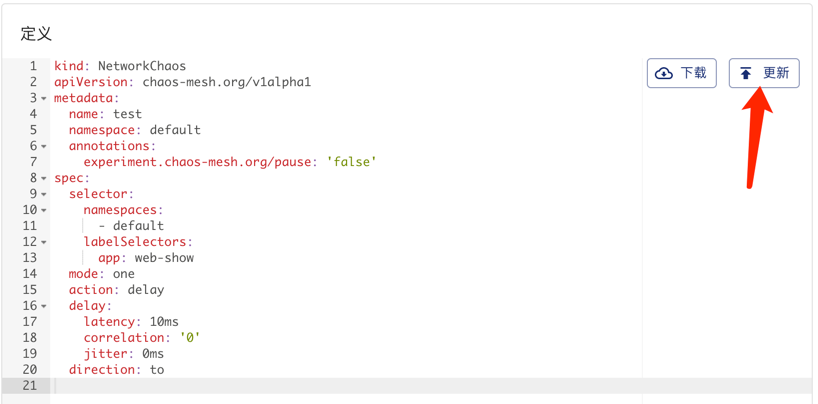
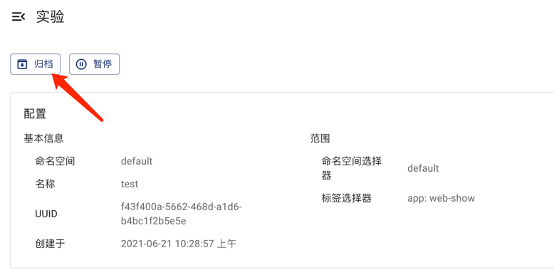

本文档介绍如何使用 Chaos Mesh 创建并运行混沌实验、查看混沌实验运行情况、暂停混沌实验、更新混沌实验以及清理混沌实验。

## 创建混沌实验

使用 Chaos Mesh，你可以创建以下两类混沌实验：

- 一次性混沌实验：是最小粒度的混沌实验。创建后，实验会立刻向测试目标注入已配置的故障。如果配置了 `duration` 参数，故障在 `duration` 指定的时间结束后会自动恢复。当暂停或者删除混沌实验时，故障会立刻被恢复。
- 定时或循环混沌实验: 是可以定时运行或循环进行的混沌实验。创建时需要定义实验的时间调度规则。

### 一次性混沌实验

要创建一次性混沌实验，你可以采用以下两种方式之一：

- 使用 Dashboard 新建混沌实验，然后点击**提交**按钮运行实验。更多详细步骤，请参阅具体的混沌实验类型文档。
- 使用 YAML 文件定义混沌实验，然后使用 `kubectl` 命令创建并运行实验。
  要使用 YAML 文件方式定义混沌实验并运行实验，请完成以下操作：

1. 新建一个 YAML 文件用于定义混沌实验。在此 YAML 文件中，依据混沌实验类型，添加相应的配置参数。

   以模拟网络故障为例，新建一个包含如下配置示例的 `network-delay.yaml` 文件。

   ```yaml
   apiVersion: chaos-mesh.org/v1alpha1
   kind: NetworkChaos
   metadata:
     name: network-delay
   spec:
     action: delay # the specific chaos action to inject
     mode: one # the mode to run chaos action; supported modes are one/all/fixed/fixed-percent/random-max-percent
     selector: # pods where to inject chaos actions
       namespaces:
         - default
       labelSelectors:
         'app': 'web-show' # the label of the pod for chaos injection
     delay:
       latency: '10ms'
     duration: '12s'
   ```

   示例 YAML 文件中定义了一个持续 `12s` 的网络延迟故障，实验目标是 `default namespace` 下带有 `"app": "web-show"` 标签的应用。关于网络故障的更多配置信息，请参考[模拟网络故障](simulate-network-chaos-on-kubernetes.md)。

2. 使用 `kubectl apply -f` 命令创建并运行此混沌实验：

   ```yaml
   kubectl apply -f network-delay.yaml
   ```

3. 混沌实验开始后，如需检查混沌实验的运行情况，请使用 `kubectl describe` 命令查看此混沌实验对象的 `status` 或者 `event`。

   ```yaml
   kubectl describe networkchaos network-delay
   ```

   要了解详细的运行结果检查步骤，请参考[检查实验结果](inspect-chaos-experiments.md)。

### 定时或循环混沌实验

Chaos Mesh 提供 `Schedule` 对象，帮助创建定时混沌实验和循环混沌实验。

要创建定时或循环混沌实验，请进行以下操作：

1. 新建一个 YAML 文件用于定义混沌实验。在此 YAML 文件中，需要配置 `Schedule` 相关参数用于定义具体的时间调度规则，然后依据混沌实验类型配置故障相关参数。

   以模拟一个定时的网络故障为例，新建一个包含如下配置示例的 `schedule-delay-example.yaml` 文件。

   ```yaml
   apiVersion: chaos-mesh.org/v1alpha1
   kind: Schedule
   metadata:
     name: schedule-delay-example
   spec:
     schedule: '5 * * * *'
     historyLimit: 2
     concurrencyPolicy: 'Allow'
     type: 'NetworkChaos'
     networkChaos:
       action: delay
       mode: one
       selector:
         namespaces:
           - default
         labelSelectors:
           'app': 'web-show'
       delay:
         latency: '10ms'
       duration: '12s'
   ```

   示例 YAML 文件中定义了一个可以在每个小时的第 5 分钟自动运行的网络延迟故障。更详细的调度规则定义，请参考[定义调度规则](define-scheduling-rules.md)。

   :::note 注意
   如果不设置 `duration` 参数，表示故障行为会一直持续下去，直到暂停或者删除混沌实验。
   :::

2. 使用 `kubectl apply -f` 命令创建并运行混沌实验。

   ```yaml
   kubectl apply -f schedule-delay-example.yaml
   ```

3. 混沌实验开始后，如需检查混沌实验的运行情况，请使用 kubectl describe 命令查看此混沌实验对象的 status 或者 event。

   ```yaml
   kubectl describe networkchaos schedule-delay-example
   ```

   要了解详细的运行结果检查步骤，请参考[检查实验结果](inspect-chaos-experiments.md)。

## 暂停混沌实验

### 使用命令暂停或者恢复混沌实验

在混沌实验运行过程中，如需暂停混沌实验，可以使用命令设置暂停注解。

例如，要暂停默认命名空间中一个名为 `network-delay` 的混沌实验，你可以使用以下命令：

```yaml
kubectl annotate networkchaos network-delay experiment.chaos-mesh.org/pause=true
```

执行此命令后，注入的故障会被立刻恢复。如果想将此混沌实验从暂停状态中恢复到正常执行状态，可以通过如下命令：

```yaml
kubectl annotate networkchaos network-delay experiment.chaos-mesh.org/pause-
```

### 使用 Dashboard 暂停或者恢复混沌实验

如果你想通过 Dashboard 暂停或者恢复混沌实验，找到对应的混沌实验点击**暂停**或者**启动**按钮即可。





## 更新混沌实验

创建混沌实验后，如需更新混沌实验，可以编辑混沌实验对象的配置参数。

:::note 注意

- 对于已经正常运行的一次性混沌实验，目前仅支持更新当前故障行为的持续时间（`duration` 参数），不支持更新其他故障配置参数。
- 对于定时或循环混沌实验，对 `duration` 参数的更新将在当前正在执行的故障注入行为结束后生效。

:::

### 使用命令更新混沌实验

如果使用 YAML 文件方式管理混沌实验，可以通过下列命令更新混沌实验：

```yaml
vim network-delay.yaml # modify network-delay.yaml to what you want
kubectl apply -f network-delay.yaml
```

如果只需要更新某个特定字段，也可以直接通过 `kubectl patch` 命令更新：

```yaml
kubectl patch networchaos network-delay -p '{"spec":{"duration":"30s"}}'
```

运行此命令后，`network-delay` 混沌实验的持续时间将更新为 30s。

更多通过 `kubectl` 命令来更新对象的操作，请参考 [kubectl 文档](https://kubernetes.io/docs/reference/kubectl/cheatsheet/)。

### 使用 Dashboard 更新混沌实验

如果你想要在 Dashboard 更新混沌实验，可以点击对应混沌实验的**更新**按钮，通过编辑对应的对象进行更新。



## 清理混沌实验

### 使用命令删除混沌实验

结束混沌实验后，可以通过 `kubectl delete` 命令删除混沌实验。混沌实验删除后，注入的故障会被立刻恢复：

```yaml
kubectl delete -f network-delay.yaml
## or delete the chaos object directly
kubectl delete networkchaos network-delay
```

如果删除操作被阻塞，这意味着有一些目标对象的故障行为无法恢复。你可以查看 Chaos Mesh 的日志进行故障排查，或者直接在 GitHub 创建一个 [issue](https://github.com/pingcap/chaos-mesh/issues) 向 Chaos Mesh 团队反馈问题。此外，你也可以通过以下命令强制删除混沌实验：

```yaml
kubectl annotate networkchaos web-show-network-delay chaos-mesh.chaos-mesh.org/cleanFinalizer=forced
```

### 使用 Dashboard 删除混沌实验

如果你想要在 Dashboard 上删除混沌实验并归档到历史记录汇总，可以点击对应混沌实验的**归档**按钮。


