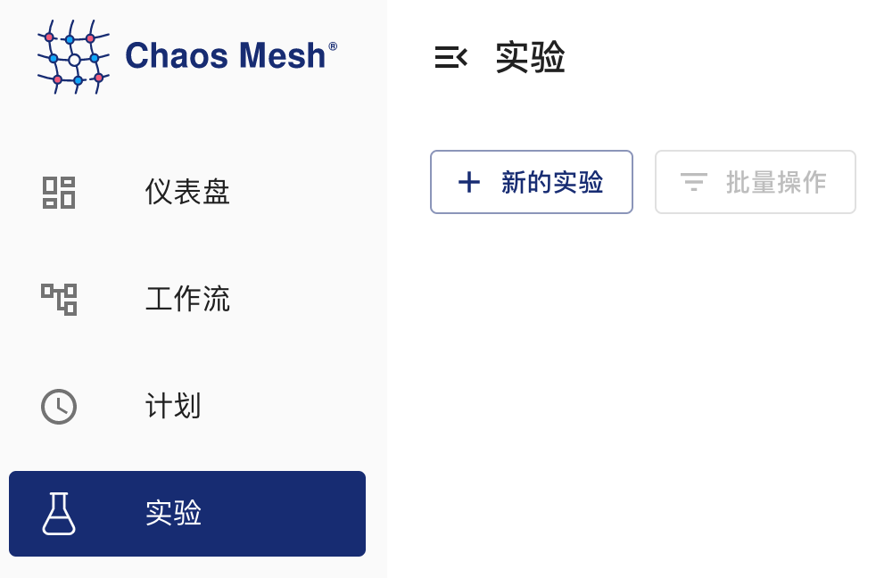

本文档主要介绍如何在 Chaos Mesh 中创建 DNSChaos 混沌实验，以模拟 DNS 故障。

## DNSChaos 介绍

DNSChaos 可以用于模拟错误的 DNS 响应，例如在收到 DNS 请求时返回错误，或者返回随机的 IP 地址。

## 部署 Chaos DNS Service

在使用 Chaos Mesh 创建 DNSChaos 混沌实验前，你需要部署一个专门的 DNS 服务用于注入故障，命令如下：

```bash
helm upgrade chaos-mesh chaos-mesh/chaos-mesh --namespace=chaos-testing --set dnsServer.create=true
```

执行后，可以通过如下命令检查 DNS 服务的状态是否正常：

```bash
kubectl get pods -n chaos-testing -l app.kubernetes.io/component=chaos-dns-server
```

确认 Pod 的状态为 `Running` 即可。

## 注意事项

1. 目前 DNSChaos 只支持 DNS 记录类型 `A` 和 `AAAA`。

2. Chaos DNS 服务运行的带有 [k8s_dns_chaos](https://github.com/chaos-mesh/k8s_dns_chaos) 插件的 CoreDNS。如果 Kubernetes 集群本身的 CoreDNS 服务包含一些特殊配置，你可以通过编辑 configMap `dns-server-config`，使 Chaos DNS 服务的配置与 K8s CoreDNS 服务的配置一致，编辑命令如下：

   ```bash
   kubectl edit configmap dns-server-config -n chaos-testing
   ```

## 使用 Dashboard 方式创建实验

1. 单击实验页面中的“新的实验”按钮创建实验：

   

2. 在“选择目标”处选择 “DNS 故障”，然后选择具体行为，例如 `ERROR`，最后填写匹配规则：

   

   图中配置的匹配规则可以对域名 `google.com`、`chaos-mesh.org` 和 `github.com` 生效，即对这三个域名发送 DNS 请求将返回错误。具体的匹配规则填写方式，参考[配置说明](#配置说明)中 `patterns` 字段的介绍。

3. 填写实验信息，指定实验范围以及实验计划运行时间：

   

4. 提交实验。

## 使用 YAML 方式创建实验

1. 将实验配置写入到文件 `dnschaos.yaml` 中，内容如下所示：

   ```yaml
   apiVersion: chaos-mesh.org/v1alpha1
   kind: DNSChaos
   metadata:
     name: dns-chaos-example
     namespace: chaos-testing
   spec:
     action: random
     mode: all
     patterns:
       - google.com
       - chaos-mesh.*
       - github.?om
     selector:
       namespaces:
         - busybox
   ```

   该实验配置可以对域名 `google.com`、`chaos-mesh.org` 和 `github.com` 生效，对这三个域名发送 DNS 请求将返回随机 IP 地址。具体的匹配规则填写方式，参考[配置说明](#配置说明)中 `patterns` 字段的介绍。

2. 使用 kubectl 创建实验，命令如下：

   ```bash
   kubectl apply -f dnschaos.yaml
   ```

### 配置说明

| 参数 | 类型 | 说明 | 默认值 | 是否必填 | 示例 |
| :-- | :-- | :-- | :-- | :-- | :-- |
| action | string | 定义 DNS 故障的行为，值可以为 `random` 或 `error`。当值为 `random` 时， DNS 服务返回随机的 IP 地址；当值为 `error` 时 DNS 服务返回错误 | 无 | 是 | `random` 或 `error` |
| patterns | string 数组 | 选择匹配故障行为的域名模版， 支持占位符 `?` 以及通配符 `*` | [] | 否 | `google.com`，`chaos-mesh.org`，`github.com` |
| mode | string | 指定实验的运行方式，可选择的方式包括：`one`（表示随机选出一个符合条件的 Pod）、`all`（表示选出所有符合条件的 Pod）、`fixed`（表示选出指定数量且符合条件的 Pod）、`fixed-percent`（表示选出占符合条件的 Pod 中指定百分比的 Pod）、`random-max-percent`（表示选出占符合条件的 Pod 中不超过指定百分比的 Pod） | 无 | 是 | `fixed` |
| value | string | 取决与 `mode` 的配置，为 `mode` 提供对应的参数。例如，当你将 `mode` 配置为 `fixed-percent` 时，`value` 用于指定 Pod 的百分比 | 无 | 否 | 1 |
| selector | struct | 指定注入故障的目标 Pod，详情请参考[定义实验范围](./define-chaos-experiment-scope.md) | 无 | 是 |  |

:::note 注意

- `patterns` 配置中的通配符必须位于字符串的尾部，例如 `chaos-mes*.org` 是不合法的配置。

- 当 `patterns` 没有配置时，默认对所有域名注入故障。

:::
