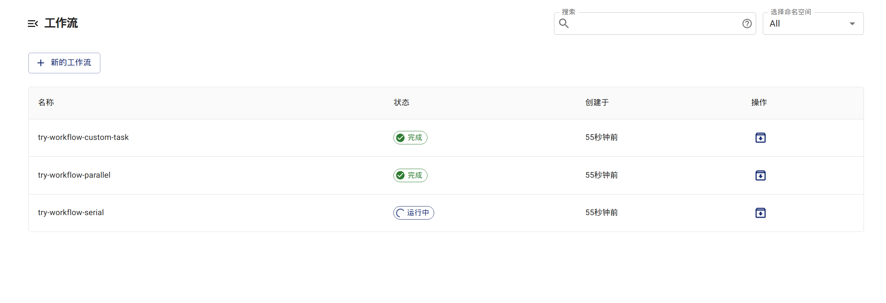
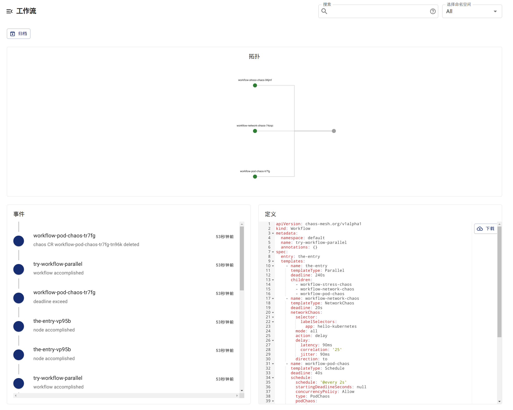

## 通过 Chaos Dashboard 检查 Workflow 状态

1. 在 Chaos Dashboard 中列出所有的 Workflow。



2. 选择你想要检查的 Workflow，查看 Workflow 的详细信息。



## 通过 `kubectl` 检查 Workflow 状态

1. 执行以下命令来获取指定命名空间中已经创建的 Workflow：

   ```shell
   kubectl -n <namespace> get workflow
   ```

2. 根据上一步输出的 Workflow 列表，选择想查看的 Workflow 并在以下命令中指定其名称。执行命令以获取该 Workflow 下的所有 WorkflowNode：

   ```shell
   kubectl -n <namespace> get workflownode --selector="chaos-mesh.org/workflow=<workflow-name>"
   ```

   Workflow 在执行过程中的步骤会以 WorkflowNode 这一 CustomResource 来表示。

3. 执行以下命令来获取指定 WorkflowNode 的详细状态：

   ```shell
   kubectl -n <namespace> describe workflownode <workflow-node-name>
   ```

   输出内容包括当前节点是否执行完成、并行/串行节点的执行状态、对应的 Chaos 实验对象等。
