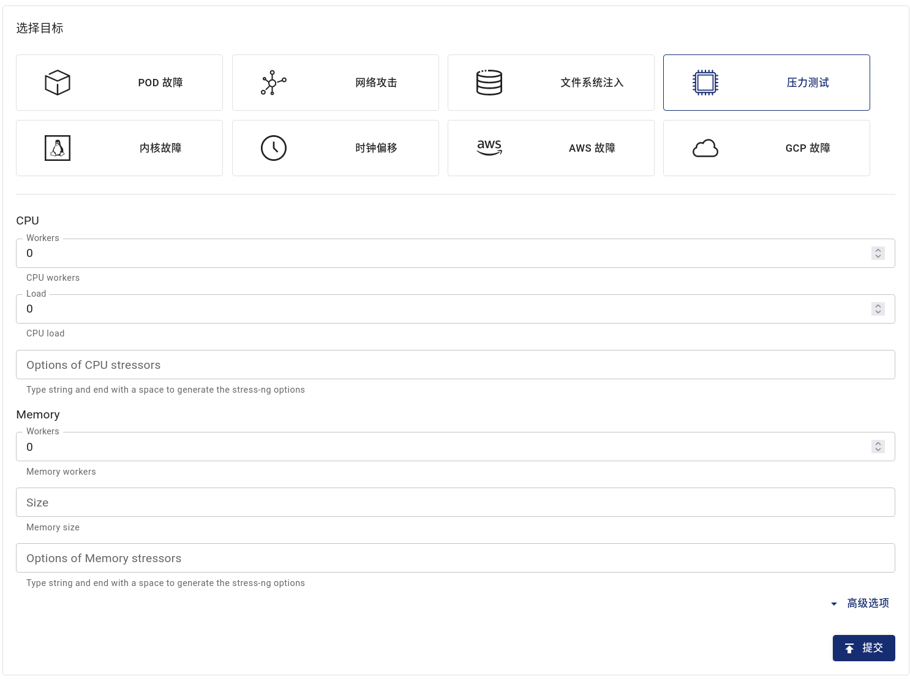

## StressChaos 介绍

Chaos Mesh 提供的 StressChaos 实验类型可用于模拟容器内压力的场景。本文档介绍如何创建 StressChaos 实验以及相关的配置文件说明。

你可以在 Chaos Dashboard 中创建实验，也可以使用 YAML 配置文件的方式创建实验。

## 使用 Chaos Dashboard 创建实验

1. 打开 Chaos Dashboard 面板，单击实验页面中“**新的实验**”按钮创建实验：

   

2. 在“**选择目标**”区域选择“**压力测试**”，然后填写实验内容，配置字段详见[配置说明](#字段说明)中的介绍。

   

3. 填写实验信息，指定实验范围以及计划的实验运行时间：

   

4. 提交实验。

## 使用 YAML 方式创建实验

1. 将实验配置写入到 YAML 配置文件中。本文档以 `memory-stress.yaml` 文件为例，内容如下所示：

   ```yaml
   apiVersion: chaos-mesh.org/v1alpha1
   kind: StressChaos
   metadata:
     name: memory-stress-example
     namespace: chaos-testing
   spec:
     mode: one
     selector:
       labelSelectors:
         'app': 'app1'
     stressors:
       memory:
         workers: 4
         size: '256MB'
   ```

   该实验配置会在选中容器中创建进程，不断分配和在内存中进行读写，最多占用 256MB 内存。

2. 准备好配置文件后，使用 `kubectl` 创建实验，命令如下：

   ```bash
   kubectl apply -f memory-stress.yaml
   ```

### 字段说明

以上 YAML 配置文件中的字段说明如下：

| 参数 | 类型 | 说明 | 默认值 | 是否必填 | 示例 |
| --- | --- | --- | --- | --- | --- |
| duration | string | 指定具体实验的持续时间 | 无 | 是 | `30s` |
| stressors | [Stressors](#stressors) | 指定 CPU 或内存压力的参数 | 无 | 否 |  |
| stressngStressors | string | 指定 stress-ng 的参数来达到更丰富的压力注入 | 无 | 否 | `--clone 2` |
| mode | string | 指定实验的运行方式，可选择的方式包括：`one`（表示随机选出一个符合条件的 Pod）、`all`（表示选出所有符合条件的 Pod）、`fixed`（表示选出指定数量且符合条件的 Pod）、`fixed-percent`（表示选出占符合条件的 Pod 中指定百分比的 Pod）、`random-max-percent`（表示选出占符合条件的 Pod 中不超过指定百分比的 Pod） | 无 | 是 | `one` |
| value | string | 取决于 `mode` 的配置，为 `mode` 提供对应的参数。例如，当你将 `mode` 配置为 `fixed-percent` 时，`value` 用于指定 Pod 的百分比 | 无 | 否 | 1 |
| containerNames | []string | 指定注入的容器名称 | 无 | 否 | `["nginx"]` |
| selector | struct | 指定注入故障的目标 Pod，详情请参考[定义实验范围](./define-chaos-experiment-scope.md) | 无 | 是 |  |

#### Stressors

| 参数   | 类型                              | 说明                | 默认值 | 是否必填 | 示例 |
| ------ | --------------------------------- | ------------------- | ------ | -------- | ---- |
| memory | [MemoryStressor](#memorystressor) | 指定内存压力的参数  | 无     | 否       |      |
| cpu    | [CPUStressor](#cpustressor)       | 指定 CPU 压力的参数 | 无     | 否       |      |

##### MemoryStressor

| 参数 | 类型 | 说明 | 默认值 | 是否必填 | 示例 |
| --- | --- | --- | --- | --- | --- |
| workers | int | 指定施加内存压力的线程个数 |  | 是 | `1` |
| size | string | 指定分配内存的大小或是占总内存的百分比，分配内存的总和为 `size` |  | 否 | `256MB`/`25%` |

##### CPUStressor

| 参数 | 类型 | 说明 | 默认值 | 是否必填 | 示例 |
| --- | --- | --- | --- | --- | --- |
| workers | int | 指定施加 CPU 压力的线程个数 |  | 是 | `1` |
| load | int | 指定占据 CPU 的百分比。`0` 意味着没有增加额外的负载，`100` 意味着满负载。总的负载为 `workers * load`。 |  | 否 | `50` |
