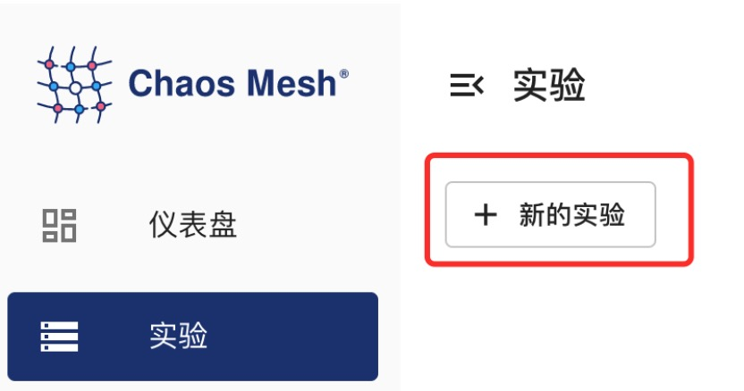

本文档介绍如何使用 Chaos Mesh 为 Kubernetes Pod 注入故障，模拟 Pod 或容器故障，并提供 Chaos Dashboard 和 YAML 文件两种方式用于创建 PodChaos 实验。

## PodChaos 介绍

PodChaos 是 Chaos Mesh 中的一种故障类型，通过创建 PodChaos 类型的混沌实验，你可以模拟指定 Pod 或者容器发生故障的情景。目前，PodChaos 支持模拟以下故障类型：

- Pod Failure：向指定的 Pod 中注入故障，使得该 Pod 在一段时间内处于不可用的状态。
- Pod Kill：杀死指定的 Pod 。为了保证 Pod 能够成功重启，需要配置 ReplicaSet 或者类似的机制。
- Container Kill：杀死位于目标 Pod 中的指定容器。

## 使用限制

Chaos Mesh 可以向任意 Pod 注入 PodChaos，无论是否绑定到 Deployment、StatefulSet、DaemonSet 或其他控制器。但是在向独立的 Pod 注入 PodChaos 时，可能会有不同的预期。例如，当我们向独立的 Pod 注入 "pod-kill" 混沌时，无法保证应用程序能够在故障发生后恢复正常。

## 注意事项

创建 PodChaos 实验前，请确保以下事项：

- 目标 Pod 上没有运行 Chaos Mesh 的 Control Manager。
- 如果故障类型为 Pod Kill，配置了 ReplicaSet 或者类似保证 Pod 能够自动重启的机制。

## 使用 Chaos Dashboard 方式创建实验

:::note 注意

在使用 Chaos Dashboard 创建实验前：

- 确保已经安装了 Chaos Dashboard。
- 如果已安装 Chaos Dashboard，你可以通过运行 `kubectl port-forward` 命令的方式访问 Dashboard：

  ```bash
  kubectl port-forward -n chaos-testing svc/chaos-dashboard 2333:2333
  ```

  然后可以在浏览器中输入 [`http://localhost:2333`](http://localhost:2333) 访问 Chaos Dashboard。

:::

1. 单击实验页面中的**新的实验**按钮创建实验。

   

2. 在**选择目标**处选择 **POD 故障**，并选择具体行为，例如 **POD FAILURE**。

3. 填写实验信息，指定实验范围以及实验计划运行时间。

4. 提交实验。

## 使用 YAML 配置文件创建实验

### pod-failure 示例

1. 将实验配置写入到文件中 `pod-failure.yaml`，内容示例如下：

   ```yaml
   apiVersion: chaos-mesh.org/v1alpha1
   kind: PodChaos
   metadata:
     name: pod-failure-example
     namespace: chaos-testing
   spec:
     action: pod-failure
     mode: one
     duration: '30s'
     selector:
       labelSelectors:
         'app.kubernetes.io/component': 'tikv'
   ```

   依据此配置示例，Chaos Mesh 将向指定的 Pod 中注入 `pod-failure` 故障，将使该 Pod 在 30 秒内处于不可用的状态。

2. 使用 `kubectl` 创建实验，命令如下：

   ```bash
   kubectl apply -f ./pod-failure.yaml
   ```

### pod-kill 示例

1. 将实验配置写入到文件中 `pod-kill.yaml`，内容示例如下：

   ```yaml
   apiVersion: chaos-mesh.org/v1alpha1
   kind: PodChaos
   metadata:
     name: pod-kill-example
     namespace: chaos-testing
   spec:
     action: pod-kill
     mode: one
     selector:
       namespaces:
         - tidb-cluster-demo
       labelSelectors:
         'app.kubernetes.io/component': 'tikv'
   ```

   依据此配置示例，Chaos Mesh 将向指定的 Pod 中注入 `pod-kill` 故障，将使该 Pod 被杀死一次。

2. 使用 `kubectl` 创建实验，命令如下：

   ```bash
   kubectl apply -f ./pod-kill.yaml
   ```

### container-kill 示例

1. 将实验配置写入到文件中 `container-kill.yaml`，内容示例如下：

   ```yaml
   apiVersion: chaos-mesh.org/v1alpha1
   kind: PodChaos
   metadata:
     name: container-kill-example
     namespace: chaos-testing
   spec:
     action: container-kill
     mode: one
     containerNames: ['prometheus']
     selector:
       labelSelectors:
         'app.kubernetes.io/component': 'monitor'
   ```

   依据此配置示例，Chaos Mesh 将向指定的 Container 中注入 `container-kill` 故障，将使该 Container 被杀死一次。

2. 使用 `kubectl` 创建实验，命令如下：

   ```bash
   kubectl apply -f ./container-kill.yaml
   ```

### 字段说明

下表介绍以上 YAML 配置文件中的字段。

| 参数 | 类型 | 说明 | 默认值 | 是否必填 | 示例 |
| --- | --- | --- | --- | --- | --- |
| action | string | 指定要注入的故障类型，仅支持 `pod-failure`、`pod-kill`、`container-kill` | 无 | 是 | `pod-kill` |
| mode | string | 指定实验的运行方式，可选择的方式包括：`one`（表示随机选出一个符合条件的 Pod）、`all`（表示选出所有符合条件的 Pod）、`fixed`（表示选出指定数量且符合条件的 Pod）、`fixed-percent`（表示选出占符合条件的 Pod 中指定百分比的 Pod）、`random-max-percent`（表示选出占符合条件的 Pod 中不超过指定百分比的 Pod） | 无 | 是 | `one` |
| value | string | 取决与 `mode` 的配置，为 `mode` 提供对应的参数。例如，当你将 `mode` 配置为 `fixed-percent` 时，`value` 用于指定 Pod 的百分比。 | 无 | 否 | 1 |
| selector | struct | 指定注入故障的目标 Pod，详情请参考[定义实验范围](./define-chaos-experiment-scope.md) | 无 | 是 |  |
| containerNames | []string | 当你将 `action` 配置为 `container-kill` 时，此配置为必填，用于指定注入故障的目标 container 名 | 无 | 否 | ['prometheus'] |
| gracePeriod | int64 | 当你将 `action` 配置为 `pod-kill` 时，需要填写此项，用于指定删除 Pod 之前的持续时间 | 0 | 否 | 0 |
| duration | string | 指定实验的持续时间 | 无 | 是 | 30s |

## “Pod Failure” 混沌实验的一些注意事项

简言之，这里有几个关于使用 "Pod Failure" 混沌实验的建议：

- 如果你正在运行一个气隙或网络隔离的 Kubernetes 集群，请更换一个可用的 "pause image"。
- 为容器配置 `livenessProbe` 和 `readinessProbe`。

Pod Failure 混沌实验将会改变目标 Pod 中每个容器的 `image` 为 "pause image"，这是一个特殊的镜像，不会执行任何操作。我们使用 `gcr.io/google-containers/pause:latest` 作为默认的 "pause image"，你可以在 helm values `controllerManager.podChaos.podFailure.pauseImage` 中更改它。

下载 "pause image" 将会消耗时间，并且这个时间将会被计入实验的持续时间中。所以你可能会发现，"实际受影响的时间" 可能会比配置的时间短。这是推荐设置可用的 "pause image" 的另一个原因。

另外一个迷惑的点是，"pause image" 可以在未配置 `command` 的容器中正常工作。所以，如果容器未配置 `command`，`livenessProbe` 和 `readinessProbe`，它将会被视为 `Running` 和 `Ready`，即使它已经被改变为 "pause image"，并且实际上不提供正常功能， 或者被视为不可用。所以建议为容器配置 `livenessProbe` 和 `readinessProbe`。
