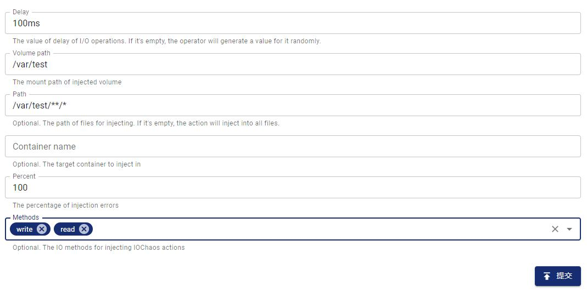

本文档主要介绍如何在 Chaos Mesh 中创建 IOChaos 混沌实验。

## IOChaos 介绍

IOChaos 是 Chaos Mesh 中的一种故障类型。通过创建 IOChaos 类型的混沌实验，你可以模拟文件系统发生故障的情景。目前，IOChaos 支持模拟以下故障类型：

- latency：为文件系统调用加入延迟
- fault：使文件系统调用返回错误
- attrOverride：修改文件属性
- mistake：使文件读到或写入错误的值

详细的功能介绍参见[使用 YAML 文件创建实验](#使用-yaml-文件创建实验)。

## 注意事项

1. 创建 IOChaos 实验前，请确保目标 Pod 上没有运行 Chaos Mesh 的 Controller Manager。

2. IOChaos 可能会损坏你的数据，在生产环境中请**谨慎**使用。

## 使用 Dashboard 创建实验

1. 单击实验页面中的**新的实验**按钮创建实验。

   

2. 在**选择目标**处选择**文件系统注入**，并选择具体行为，如**LATENCY**。

   

3. 填写实验信息，指定实验范围以及实验计划运行时间。

   

   

4. 提交实验。

   

## 使用 YAML 文件创建实验

### latency 示例

1. 将实验配置写入到文件中 `io-latency.yaml`，内容示例如下：

   ```yaml
   apiVersion: chaos-mesh.org/v1alpha1
   kind: IOChaos
   metadata:
     name: io-latency-example
     namespace: chaos-testing
   spec:
     action: latency
     mode: one
     selector:
       labelSelectors:
         app: etcd
     volumePath: /var/run/etcd
     path: '/var/run/etcd/**/*'
     delay: '100ms'
     percent: 50
     duration: '400s'
   ```

   依据此配置示例，Chaos Mesh 将向 `/var/run/etcd` 目录注入延迟故障，使该目录下的所有文件系统操作（包括读，写，列出目录内容等）产生 100 毫秒延迟。

2. 使用 `kubectl` 创建实验，命令如下：

   ```bash
   kubectl apply -f ./io-latency.yaml
   ```

### fault 示例

1. 将实验配置写入到文件中 `io-fault.yaml`，内容示例如下：

   ```yaml
   apiVersion: chaos-mesh.org/v1alpha1
   kind: IOChaos
   metadata:
     name: io-fault-example
     namespace: chaos-testing
   spec:
     action: fault
     mode: one
     selector:
       labelSelectors:
         app: etcd
     volumePath: /var/run/etcd
     path: /var/run/etcd/**/*
     errno: 5
     percent: 50
     duration: '400s'
   ```

   依据此配置示例，Chaos Mesh 将向 `/var/run/etcd` 目录注入文件错误故障，使该目录下的所有文件系统操作有 50% 的概率发生错误，并返回错误码 5 (Input/output error)。

2. 使用 `kubectl` 创建实验，命令如下：

   ```bash
   kubectl apply -f ./io-fault.yaml
   ```

### attrOverride 示例

1. 将实验配置写入到文件中 `io-attr.yaml`，内容示例如下：

   ```yaml
   apiVersion: chaos-mesh.org/v1alpha1
   kind: IOChaos
   metadata:
     name: io-attr-example
     namespace: chaos-testing
   spec:
     action: attrOverride
     mode: one
     selector:
       labelSelectors:
         app: etcd
     volumePath: /var/run/etcd
     path: /var/run/etcd/**/*
     attr:
       perm: 72
     percent: 10
     duration: '400s'
   ```

   依据此配置示例，Chaos Mesh 将向 `/var/run/etcd` 目录注入 `attrOverride` 故障，使该目录下的所有文件系统操作将有 10% 的概率使目标文件的权限变为 72（即八进制下的 110），这将使得文件只能由拥有者与其所在的组执行，无权进行其他操作。

2. 使用 `kubectl` 创建实验，命令如下：

   ```bash
   kubectl apply -f ./io-attr.yaml
   ```

### mistake 示例

1. 将实验配置写入到文件中 `io-mistake.yaml`，内容示例如下：

   ```yaml
   apiVersion: chaos-mesh.org/v1alpha1
   kind: IOChaos
   metadata:
     name: io-mistake-example
     namespace: chaos-testing
   spec:
     action: mistake
     mode: one
     selector:
       labelSelectors:
         app: etcd
     volumePath: /var/run/etcd
     path: /var/run/etcd/**/*
     mistake:
       filling: zero
       maxOccurrences: 1
       maxLength: 10
     methods:
       - READ
       - WRITE
     percent: 10
     duration: '400s'
   ```

   依据此配置示例，Chaos Mesh 将向 `/var/run/etcd` 目录注入读写错误故障，使该目录下的读写操作将有 10% 的概率将发生错误。其中以字节为单位，最大长度为 10 的 1 处随机位置将被替换为 0。

2. 使用 `kubectl` 创建实验，命令如下：

   ```bash
   kubectl apply -f ./io-mistake.yaml
   ```

### 字段说明

#### 通用字段

| 参数 | 类型 | 说明 | 默认值 | 是否必填 | 示例 |
| --- | --- | --- | --- | --- | --- |
| action | string | 表示具体的故障类型，仅支持 latency、fault、attrOverride、mistake |  | 是 | latency |
| mode | string | 指定实验的运行方式，可选择的方式包括：`one`（表示随机选出一个符合条件的 Pod）、`all`（表示选出所有符合条件的 Pod）、`fixed`（表示选出指定数量且符合条件的 Pod）、`fixed-percent`（表示选出占符合条件的 Pod 中指定百分比的 Pod）、`random-max-percent`（表示选出占符合条件的 Pod 中不超过指定百分比的 Pod） | 无 | 是 | `one` |
| selector | struct | 指定注入故障的目标 Pod，详情请参考[定义实验范围](./define-chaos-experiment-scope.md) | 无 | 是 |  |
| value | string | 取决与 `mode` 的配置，为 `mode` 提供对应的参数。例如，当你将 `mode` 配置为 `fixed-percent` 时，`value` 用于指定 Pod 的百分比 | 无 | 否 | 1 |
| volumePath | string | volume 在目标容器内的挂载点，必须为挂载的根目录 |  | 是 | /var/run/etcd |
| path | string | 注入错误的生效范围，可以是通配符，也可以是单个文件 | 默认对所有文件生效 | 否 | /var/run/etcd/\*_/_ |
| methods | []string | 需要注入故障的文件系统调用类型，具体支持的类型见[附录 A](#附录-a：methods-类型) | 所有类型 | 否 | READ |
| percent | int | 每次操作发生故障的概率，单位为% | 100 | 否 | 100 |
| containerNames | []string | 指定注入的容器名 |  | 否 |  |
| duration | string | 指定具体实验的持续时间 |  | 是 | 30s |

#### 与 action 相关的字段

这些字段仅在 action 为对应值时才有意义：

- latency

  | 参数  | 类型   | 说明           | 默认值 | 是否必填 | 示例   |
  | ----- | ------ | -------------- | ------ | -------- | ------ |
  | delay | string | 具体的延迟时长 |        | 是       | 100 ms |

- fault

  | 参数  | 类型 | 说明         | 默认值 | 是否必填 | 示例 |
  | ----- | ---- | ------------ | ------ | -------- | ---- |
  | errno | int  | 返回的错误号 |        | 是       | 22   |

  常见的错误号见[附录 B](#附录-b：常见错误号)

- attrOverride

  | 参数 | 类型             | 说明               | 默认值 | 是否必填 | 示例 |
  | ---- | ---------------- | ------------------ | ------ | -------- | ---- |
  | attr | AttrOverrideSpec | 具体的属性覆写规则 |        | 是       | 见下 |

  AttrOverrideSpec 定义如下

  | 参数 | 类型 | 说明 | 默认值 | 是否必填 | 示例 |
  | --- | --- | --- | --- | --- | --- |
  | ino | int | ino 的号 |  | 否 |  |
  | size | int | 文件大小 |  | 否 |  |
  | blocks | int | 文件占用块数 |  | 否 |  |
  | atime | TimeSpec | 最后访问时间 |  | 否 |  |
  | mtime | TimeSpec | 最后修改时间 |  | 否 |  |
  | ctime | TimeSpec | 最后状态变更时间 |  | 否 |  |
  | kind | string | 文件类型，详见 [fuser::FileType](https://docs.rs/fuser/0.7.0/fuser/enum.FileType.html) |  | 否 |  |
  | perm | int | 文件权限的十进制表示 |  | 否 | 72（八进制下为 110） |
  | nlink | int | 硬链接数量 |  | 否 |  |
  | uid | int | 所有者的用户 ID |  | 否 |  |
  | gid | int | 所有者的组 ID |  | 否 |  |
  | rdev | int | 设备 ID |  | 否 |  |

  TimeSpec 定义如下

  | 参数 | 类型 | 说明                 | 默认值 | 是否必填 | 示例 |
  | ---- | ---- | -------------------- | ------ | -------- | ---- |
  | sec  | int  | 以秒为单位的时间戳   |        | 否       |      |
  | nsec | int  | 以纳秒为单位的时间戳 |        | 否       |      |

  关于参数的具体含义，你可以参考 [man stat](https://man7.org/linux/man-pages/man2/lstat.2.html) 。

- mistake

  | 参数    | 类型        | 说明         | 默认值 | 是否必填 | 示例 |
  | ------- | ----------- | ------------ | ------ | -------- | ---- |
  | mistake | MistakeSpec | 具体错误规则 |        | 是       |      |

  MistakeSpec 定义如下

  | 参数 | 类型 | 说明 | 默认值 | 是否必填 | 示例 |
  | --- | --- | --- | --- | --- | --- |
  | filling | string | 错误数据的填充内容，只能为 zero（填充 0）或 random（填充随机字节） |  | 是 |  |
  | maxOccurrences | int | 错误在每一次操作中最多出现次数 |  | 是 | 1 |
  | maxLength | int | 每次错误的最大长度（单位为字节） |  | 是 | 1 |

:::warning 警告

不推荐在除了 READ 和 WRITE 之外的文件系统调用上使用 mistake 错误。这可能会导致预期之外的结果，包括但不限于文件系统损坏、程序崩溃等。

:::

## 本地调试

如果你不确定某个 Chaos 的效果，也可以使用 [toda](https://github.com/chaos-mesh/toda) 在本地测试相应功能。Chaos Mesh 同样使用 toda 实现 IOChaos。

## 附录 A：methods 类型

- lookup
- forget
- getattr
- setattr
- readlink
- mknod
- mkdir
- unlink
- rmdir
- symlink
- rename
- link
- open
- read
- write
- flush
- release
- fsync
- opendir
- readdir
- releasedir
- fsyncdir
- statfs
- setxattr
- getxattr
- listxattr
- removexattr
- access
- create
- getlk
- setlk
- bmap

详见 [fuser::Filesystem](https://docs.rs/fuser/0.7.0/fuser/trait.Filesystem.html)

## 附录 B：常见错误号

- 1: Operation not permitted
- 2: No such file or directory
- 5: I/O error
- 6: No such device or address
- 12: Out of memory
- 16: Device or resource busy
- 17: File exists
- 20: Not a directory
- 22: Invalid argument
- 24: Too many open files
- 28: No space left on device

详见 [Linux 源码](https://raw.githubusercontent.com/torvalds/linux/master/include/uapi/asm-generic/errno-base.h)
