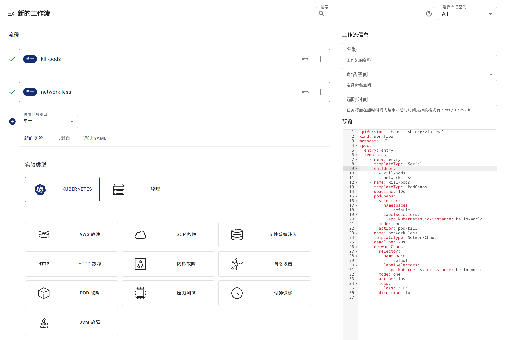
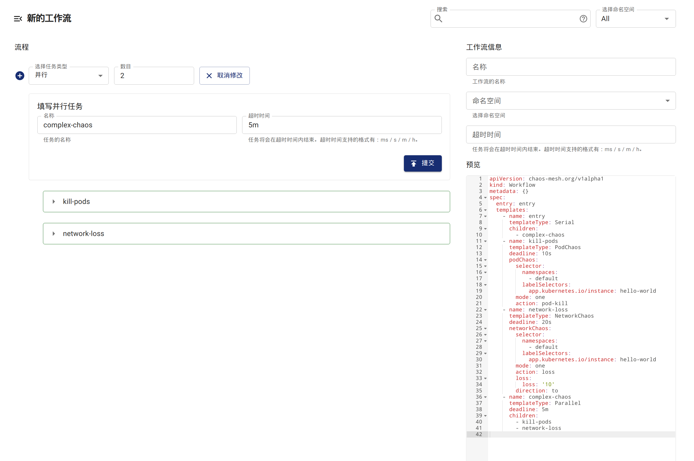
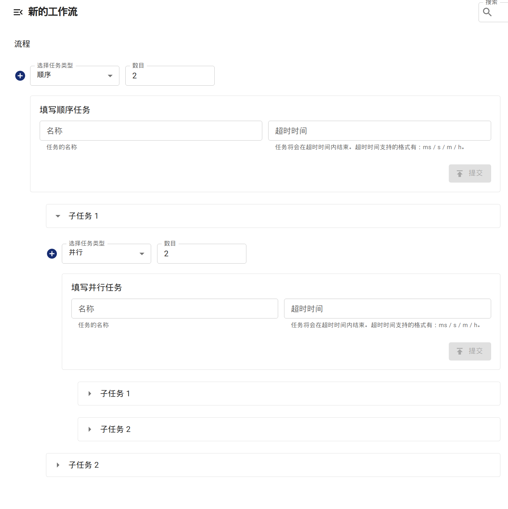

Chaos Mesh 工作流提供了串行与并行两种实验编排方式。你可以依据实验需求，编排调度多个实验的运行方式。

- 如果你想要按照顺序进行多个混沌实验，可以使用串行节点。
- 如果你想要同时进行多个混沌实验，可以使用并行节点。

在设计串行节点与并行节点时使用了[组合模式](https://en.wikipedia.org/wiki/Composite_pattern)，可以包含多个任意类型的节点，并以特定的模式执行这些被组合的节点。这也意味着你可以嵌套组合串行与并行节点来实现复杂的调度。

## 串行运行实验

在工作流中创建 `templates` 时，使用 `templateType: Serial` 便可以声明一个串行节点。

串行节点中另一个必需的字段为 `children`，类型为 `[]string` ，值为串行执行的其他 `template` 名称。例如：

```yaml
apiVersion: chaos-mesh.org/v1alpha1
kind: Workflow
metadata:
  name: try-workflow-serial
spec:
  entry: serial-of-3-node
  templates:
    - name: serial-of-3-node
      templateType: Serial
      deadline: 240s
      children:
        - workflow-stress-chaos
        - suspending
        - workflow-network-chaos
    - name: suspending
      templateType: Suspend
      deadline: 10s
    - name: workflow-network-chaos
      templateType: NetworkChaos
      deadline: 20s
      networkChaos:
        direction: to
        action: delay
        mode: all
        selector:
          labelSelectors:
            'app': 'hello-kubernetes'
        delay:
          latency: '90ms'
          correlation: '25'
          jitter: '90ms'
    - name: workflow-stress-chaos
      templateType: StressChaos
      deadline: 20s
      stressChaos:
        mode: one
        selector:
          labelSelectors:
            'app': 'hello-kubernetes'
        stressors:
          cpu:
            workers: 1
            load: 20
            options: ['--cpu 1', '--timeout 600']
```

声明了一个串行节点，名为 `serial-of-3-node`，将按照顺序执行 `workflow-stress-chaos`，`suspending` 与 `workflow-network-chaos`。待所有任务完成后，串行节点被标记为完成。

串行节点执行时，会依次执行 `children` 中声明的任务，保持同一时间点只有一个任务在执行。

串行节点中的 `deadline` 为可选字段，目的是限制整个串行流程的最长执行时间。若达到了这个时间，其下属的子节点将会被停止，未执行的节点也不会再执行。若所有子节点先于 `deadline` 完成了行为，串行节点会立刻被标记为完成，`deadline` 没有任何影响。

## 并行运行实验

在工作流中创建 `templates` 时，使用 `templateType: Parallel` 便可以声明一个并行节点。

并行节点中另一个必需的字段为 `children`，类型为 `[]string`，值为并行执行的其他 `template` 名称。例如：

```yaml
apiVersion: chaos-mesh.org/v1alpha1
kind: Workflow
metadata:
  name: try-workflow-parallel
spec:
  entry: parallel-of-2-chaos
  templates:
    - name: parallel-of-2-chaos
      templateType: Parallel
      deadline: 240s
      children:
        - workflow-stress-chaos
        - workflow-network-chaos
    - name: workflow-network-chaos
      templateType: NetworkChaos
      deadline: 20s
      networkChaos:
        direction: to
        action: delay
        mode: all
        selector:
          labelSelectors:
            'app': 'hello-kubernetes'
        delay:
          latency: '90ms'
          correlation: '25'
          jitter: '90ms'
    - name: workflow-stress-chaos
      templateType: StressChaos
      deadline: 20s
      stressChaos:
        mode: one
        selector:
          labelSelectors:
            'app': 'hello-kubernetes'
        stressors:
          cpu:
            workers: 1
            load: 20
            options: ['--cpu 1', '--timeout 600']
```

声明了一个并行节点，名为 `parallel-of-2-chaos`，将同时执行 `workflow-stress-chaos` 与 `workflow-network-chaos`。待所有任务完成后，并行节点被标记为完成。

并行节点执行时，会同时执行 `children` 中所有声明的任务。

并行节点同样存在 `deadline` 可选字段，类似于串行节点，目的是限制整个并行流程的最长执行时间。若达到了这个时间，其下属的子节点将会被停止。若所有子节点先于 `deadline` 完成了行为，并行节点会立刻被标记为完成，`deadline` 没有任何影响。

## 通过 Chaos Dashboard 创建串行或并行节点的工作流

### 创建串行节点

Chaos Dashboard 会创建一个预定义的串行节点，名为 `entry`。因此，当在 Chaos Dashboard 中创建串行节点的工作流时，默认会在 `entry` 下创建流程。



### 创建并行节点

你可以在 Chaos Dashboard 中创建一个并行节点 `Parallel`，然后在该节点下创建子节点。



### 嵌套串行节点与并行节点

你可以将串行与并行节点嵌套在一起，从而创建更复杂的流程。


