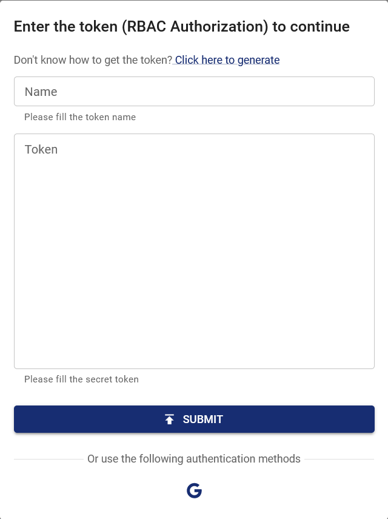

如果 Chaos Mesh 集群部署于 Google Cloud Platform，用户将能够通过 Google OAuth 验证登入 Chaos Dashboard。本文档将介绍如何配置和启用这项功能。

## 创建用于登陆验证的 OAuth Client

根据 [Setting up OAuth 2.0](https://support.google.com/cloud/answer/6158849?hl=en) 创建用于接入 GCP 的 OAuth 2.0 客户端，并获得 Client ID 与 Client Secret。

1. 进入 [Google Cloud Platform 控制台](https://console.cloud.google.com/)。
2. 选择一个项目。
3. 如果没有自动打开 APIs & services 页面，请在控制台的左侧菜单中手动选择 APIs & services。
4. 点击位于左侧的 Credentials。
5. 点击 Create Credentials，并选择 OAuth client ID。
6. 应用类型选择 Web Application，填入合适的名称以及 Chaos Dashboard 对应的 redirect urls。Chaos Dashboard 的 redirect urls 将位于 `ROOT_URL/api/auth/gcp/callback`，其中 `ROOT_URL` 是 dashboard 的根地址，例如 `http://localhost:2333`，可以通过 `helm` 的 `dashboard.rootUrl` 配置项进行配置。
7. 点击创建。

完成创建后，即可获得该客户端的 Client ID 与 Client Secret，请保存这两项内容，供在后续步骤中使用。

## 填写配置并启动 Chaos Mesh

要启动这项功能，需要打开 Chaos Mesh 的 helm charts ，设置以下配置项：

1. `dashboard.gcpSecurityMode` 需要设置为 `true`
2. `dashboard.gcpClientId` 需要设置为上一步骤中获得的 Client ID
3. `dashboard.gcpClientSecret` 需要设置为上一步骤中获得的 Client Secret
4. `dashboard.rootUrl` 需要设置为 Chaos Dashboard 的根地址

如果已经安装并运行了 Chaos Mesh，可以通过 `helm upgrade` 命令来更新配置；如果还未安装 Chaos Mesh，则可以通过 `helm install` 进行安装。

## 使用

打开 Chaos Dashboard，点击验证窗口下方的 Google Icon。



登入 Google 账号并授予 OAuth Client 权限后，页面会自动跳转至 Chaos Dashboard，并提示用户已登录。此时，用户的权限与该 Google 账户在集群中的权限一致。如需设置额外的用户权限，可以使用 RBAC 的方式来赋予其对应权限，例如：

```yaml
kind: ClusterRole
apiVersion: rbac.authorization.k8s.io/v1
metadata:
  name: chaos-mesh-cluster-manager
rules:
  - apiGroups:
      - chaos-mesh.org
    resources: ['*']
    verbs: ['get', 'list', 'watch', 'create', 'delete', 'patch', 'update']
---
kind: ClusterRoleBinding
apiVersion: rbac.authorization.k8s.io/v1
metadata:
  name: cluster-manager-binding
  namespace: chaos-mesh
subjects:
  - kind: User
    name: example@gmail.com
roleRef:
  kind: ClusterRole
  name: chaos-mesh-cluster-manager
  apiGroup: rbac.authorization.k8s.io
```

这一配置为用户 `example@gmail.com` 赋予了浏览或创建所有类型混沌实验的权限。
