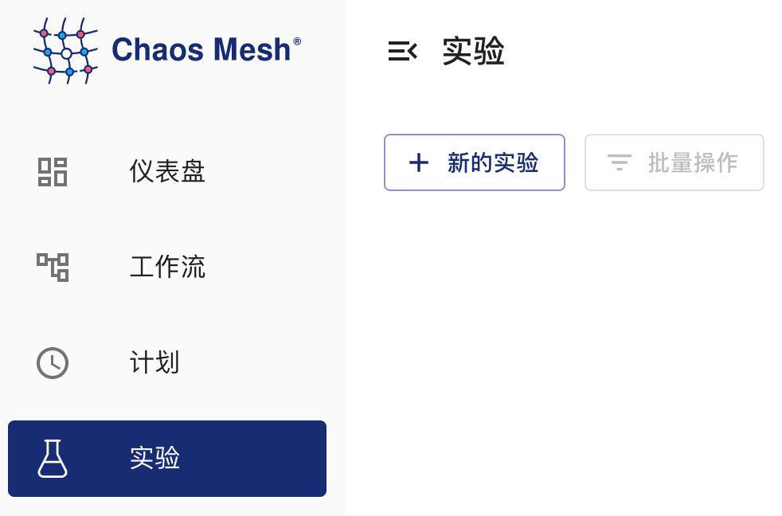
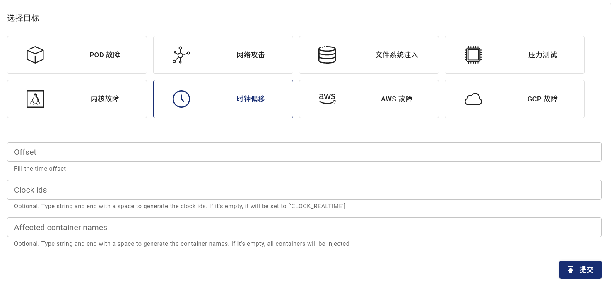
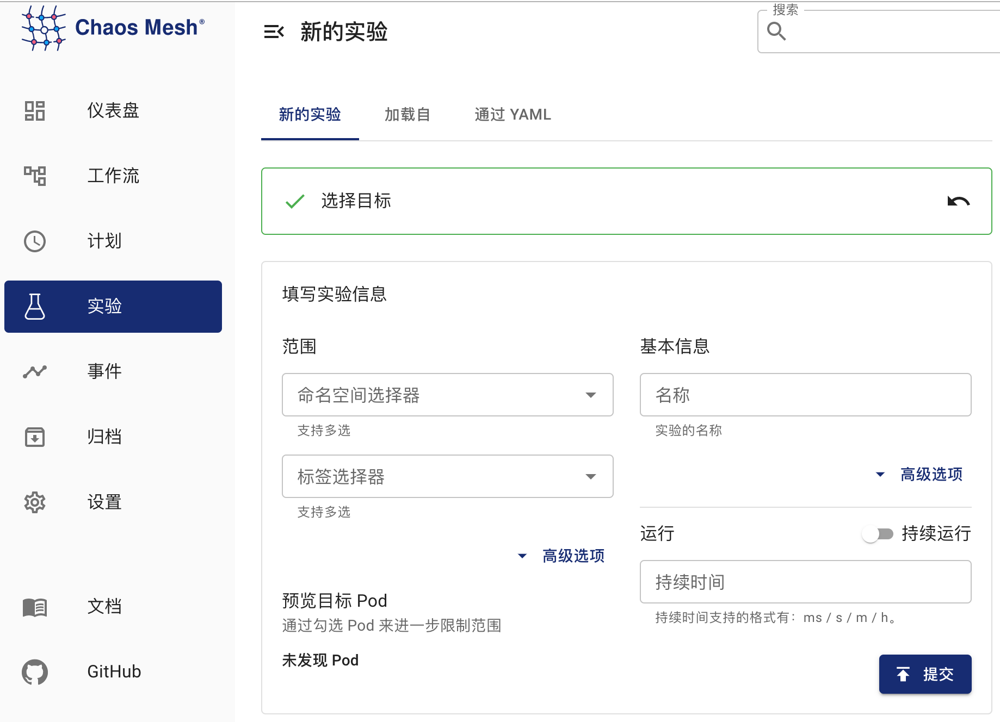

## TimeChaos 介绍

Chaos Mesh 提供的 TimeChaos 实验类型可用于模拟时间偏移的场景。本文档介绍如何创建 TimeChaos 实验以及相关的配置文件说明。

:::note 提示

TimeChaos 只影响容器中 PID 命名空间的 PID `1` 进程，以及 PID `1` 的子进程。例如，通过`kubectl exec` 启动的进程不会被影响。

:::

你可以在 Chaos Dashboard 中创建实验，也可以使用 YAML 配置文件的方式创建实验。

## 使用 Chaos Dashboard 创建实验

1. 打开 Chaos Dashboard 面板，单击实验页面中“**新的实验**”按钮创建实验：

   

2. 在“**选择目标**”区域选择“**时钟偏移**”，然后填写选定的时钟和偏移量。

   

3. 填写实验信息，指定实验范围以及计划的实验运行时间：

   

4. 提交实验。

## 使用 YAML 方式创建实验

1. 将实验配置写入到 YAML 配置文件中。本文档以 `time-shift.yaml` 文件为例，内容如下所示：

   ```yaml
   apiVersion: chaos-mesh.org/v1alpha1
   kind: TimeChaos
   metadata:
     name: time-shift-example
     namespace: chaos-mesh
   spec:
     mode: one
     selector:
       labelSelectors:
         'app': 'app1'
     timeOffset: '-10m100ns'
   ```

   该实验配置会使指定 Pod 中进程的时间向前偏移 10 分钟 100 纳秒。

2. 准备好配置文件后，使用 `kubectl` 创建实验，命令如下：

   ```bash
   kubectl apply -f time-shift.yaml
   ```

以上 YAML 配置文件中的字段说明如下：

| 参数 | 类型 | 说明 | 默认值 | 是否必填 | 示例 |
| --- | --- | --- | --- | --- | --- |
| timeOffset | string | 指定时间偏移的长度 | 无 | 是 | `-5m` |
| clockIds | []string | 指定时间偏移作用的时钟，详见 [`clock_gettime` 文档](https://man7.org/linux/man-pages/man2/clock_gettime.2.html) | `["CLOCK_REALTIME"]` | 否 | `["CLOCK_REALTIME","CLOCK_MONOTONIC"]` |
| mode | string | 指定实验的运行方式，可选择的方式包括：`one`（表示随机选出一个符合条件的 Pod）、`all`（表示选出所有符合条件的 Pod）、`fixed`（表示选出指定数量且符合条件的 Pod）、`fixed-percent`（表示选出占符合条件的 Pod 中指定百分比的 Pod）、`random-max-percent`（表示选出占符合条件的 Pod 中不超过指定百分比的 Pod） | 无 | 是 | `one` |
| value | string | 取决于 `mode` 的配置，为 `mode` 提供对应的参数。例如，当你将 `mode` 配置为 `fixed-percent` 时，`value` 用于指定 Pod 的百分比 | 无 | 否 | 1 |
| containerNames | []string | 指定注入的容器名称 | 无 | 否 | `["nginx"]` |
| selector | struct | 指定注入故障的目标 Pod，详情请参考[定义实验范围](./define-chaos-experiment-scope.md) | 无 | 是 |  |
