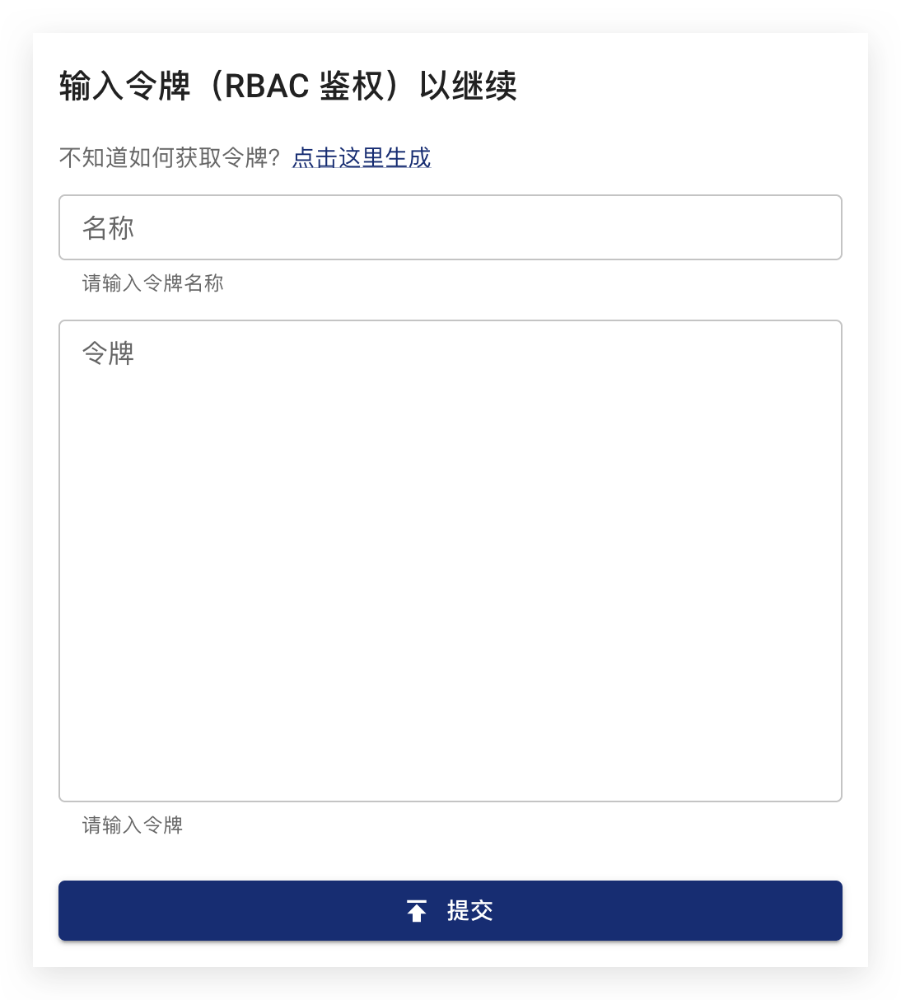
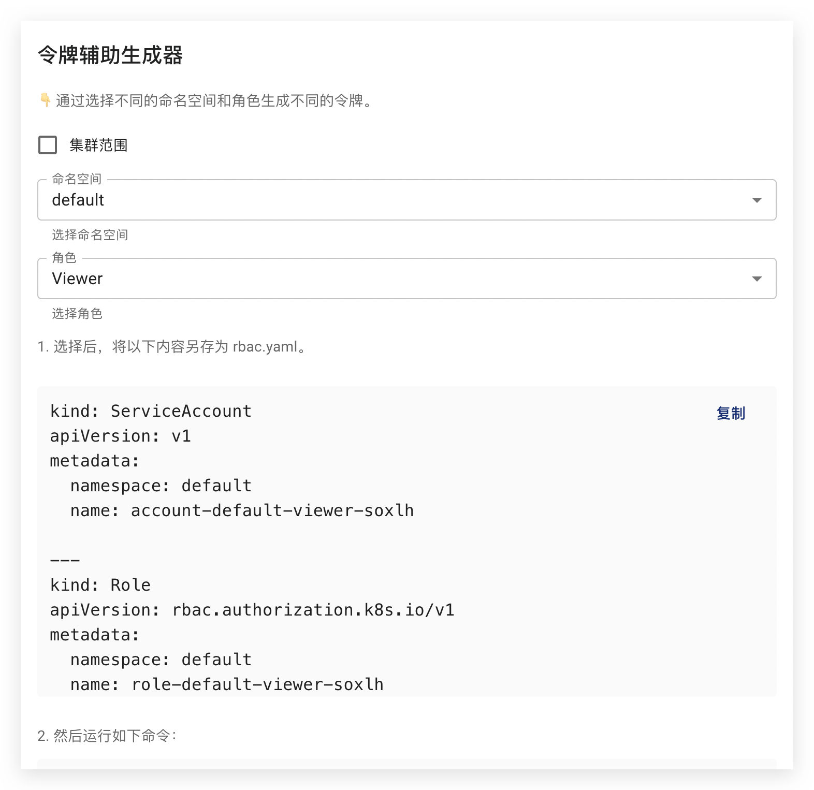
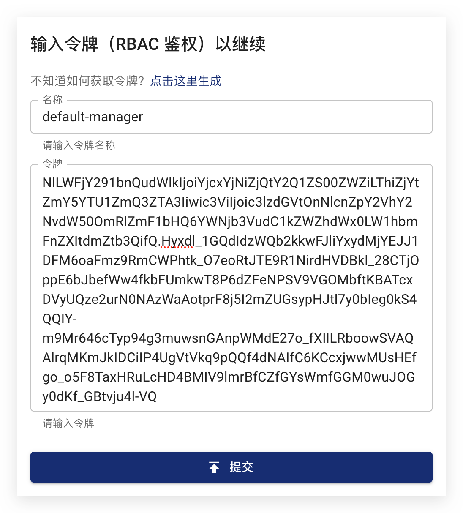
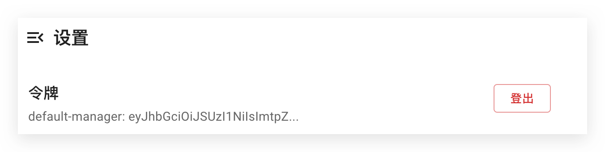

import PickHelmVersion from '@site/src/components/PickHelmVersion'

本文档介绍如何在 Chaos Mesh 中进行用户权限管理，包括创建用户并绑定权限、管理令牌以及开启/关闭权限验证功能。

Chaos Mesh 使用 Kubernetes 原生的 [RBAC](https://kubernetes.io/zh/docs/reference/access-authn-authz/rbac/) 功能来管理用户角色和权限。用户在创建、查看、管理混沌实验时，需要拥有 `chaos-mesh.org` 这个 `apiGroups` 下混沌实验自定义资源的相应权限。

:::note 提示

使用 Helm 安装 Chaos Mesh 时，默认开启权限验证功能。对于生产环境及其他安全要求较高的场景，建议保持权限验证功能开启。如果只是想体验 Chaos Mesh 的功能，希望关闭权限验证从而快速创建混沌实验，可以直接参阅[权限验证功能的开启及关闭](#开启或关闭权限验证功能)部分了解如何关闭权限验证。

:::

### 创建用户并绑定权限

你可以直接通过 Chaos Mesh Dashboard 界面创建用户并绑定权限。在访问 Dashboard 时会有登录窗口弹出，点击**“点击这里生成”**：



点击后，弹出的窗口如下所示：



需在弹出的窗口上执行下面的操作至第 3 步：

1. 选择权限范围

   如要获取整个 Kubernetes 混沌实验的相应权限，勾选**集群范围**方框。如果在**命名空间**下拉选项中指定了 namespace，则只获取该 namespace 下的权限。

2. 选择角色

   目前 Chaos Mesh 提供了以下角色：

   - Manager：拥有混沌实验的创建、查看、更新、删除等所有权限。
   - Viewer：只拥有混沌实验的查看权限。

3. 生成 RBAC 配置

   在确定了所创建权限的范围和角色后，Dashboard 页面上会显示对应的 RBAC 配置。例如， `default` namespace 下 Manager 角色的 RBAC 配置如下所示：

   ```yaml
   kind: ServiceAccount
   apiVersion: v1
   metadata:
     namespace: default
     name: account-default-manager-vfmot

   ---
   kind: Role
   apiVersion: rbac.authorization.k8s.io/v1
   metadata:
     namespace: default
     name: role-default-manager-vfmot
   rules:
   - apiGroups: [""]
     resources: ["pods", "namespaces"]
     verbs: ["get", "watch", "list"]
   - apiGroups:
     - chaos-mesh.org
     resources: [ "*" ]
     verbs: ["get", "list", "watch", "create", "delete", "patch", "update"]

    ---
   apiVersion: rbac.authorization.k8s.io/v1
   kind: RoleBinding
   metadata:
     name: bind-default-manager-vfmot
     namespace: default
   subjects:
   - kind: ServiceAccount
     name: account-default-manager-vfmot
     namespace: default
   roleRef:
     kind: Role
     name: role-default-manager-vfmot
     apiGroup: rbac.authorization.k8s.io
   ```

   点击 Dashboard 窗口中 RBAC 配置右上角的**复制**将 RBAC 配置内容复制到剪切板，然后写入到本地文件 `rbac.yaml`。

4. 创建用户并绑定权限

   在终端中运行以下命令：

   ```bash
   kubectl apply -f rbac.yaml
   ```

5. 生成令牌

   复制 Dashboard 中第 3 步“最后获取令牌”下的命令，并在终端中运行：

   ```bash
   kubectl describe -n default secrets account-default-manager-vfmot
   ```

   输出如下所示：

   ```log
   Name:         account-default-manager-vfmot-token-n4tg8
   Namespace:    default
   Labels:       <none>
   Annotations:  kubernetes.io/service-account.name: account-default-manager-vfmot
                 kubernetes.io/service-account.uid: b71b3bf4-cd5e-4efb-8bf6-ff9a55fd7e07

   Type:  kubernetes.io/service-account-token

   Data
   ====
   ca.crt:     1111 bytes
   namespace:  7 bytes
   token:      eyJhbG...
   ```

   复制以上输出中的 token 的数据，用于下一步的登录。

6. 使用创建的用户登录 Chaos Mesh

   点击 Dashboard 令牌辅助生成器窗口上的**关闭**，返回到登录窗口。在**令牌**输入框中输入上一步复制的 token 数据，并在**名称**输入框中给该令牌输入一个有意义的名称，建议使用权限的范围和角色，例如 `default-manager`。输入完成后，点击**提交**进行登录:

   

:::note 提示

- 需要保证执行 kubectl 的本地用户具有集群的管理权限，从而可以创建用户、绑定不同的权限、并获取 token。

- 如果没有部署 Chaos Mesh Dashboard，也可以自行生成相应的 RBAC 配置，通过 kubectl 创建用户并绑定权限。

:::

### 登出令牌

如要使用另一个令牌，在 Dashboard Web 页面中点击**设置**，如下所示：



在页面的最上方，你可以看到**登出**按钮。点击该按钮就可以登出当前令牌。

### 开启或关闭权限验证功能

使用 Helm 安装 Chaos Mesh 时，默认开启权限验证功能。对于生产环境及其他安全要求较高的场景，建议都保持权限验证功能开启。如果只是想体验 Chaos Mesh 的功能，希望关闭权限验证从而快速创建混沌实验，可以在 Helm 命令中设置 `--set dashboard.securityMode=false`，命令如下所示：

<PickHelmVersion>
helm upgrade chaos-mesh chaos-mesh/chaos-mesh --namespace=chaos-mesh --version latest --set dashboard.securityMode=false
</PickHelmVersion>

如果想重新开启权限验证功能，再重新设置 `--set dashboard.securityMode=true` 即可。
