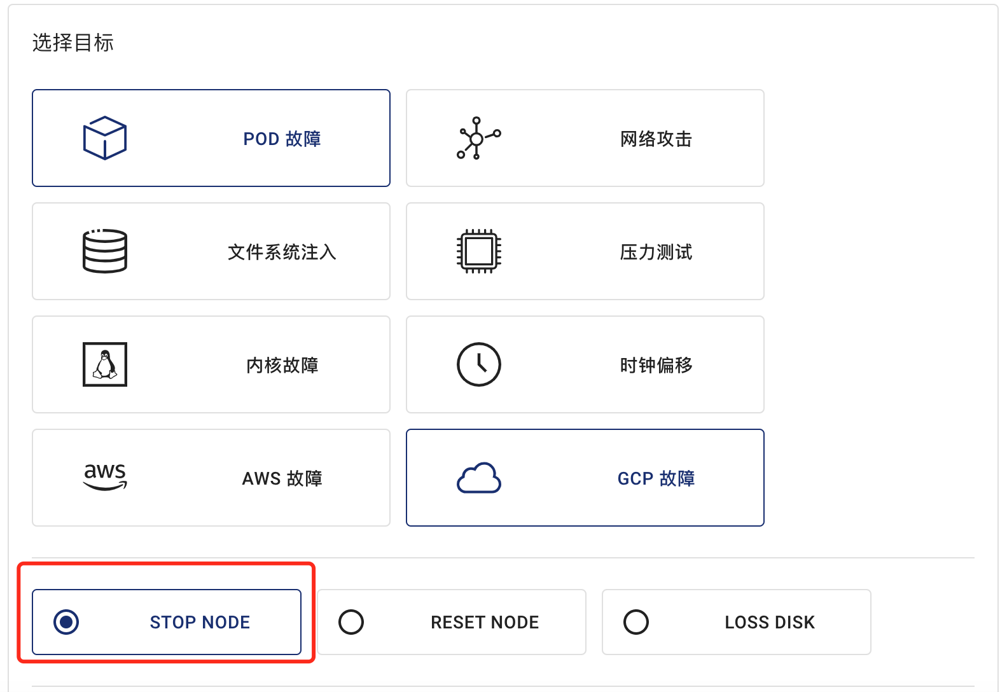

本文档介绍如何使用 Chaos Mesh 为 GCP 节点注入故障，并提供 Dashboard 和 YAML 文件两种方式用于创建 GCPChaos 实验。

## GCPChaos 介绍

GCPChaos 是 Chaos Mesh 中的一种故障类型。通过创建 GCPChaos 类型的混沌实验，你可以模拟指定的 GCP 实例发生故障的情景。目前，GCPChaos 支持模拟以下故障类型：

- **Node Stop**：使指定的 GCP 实例进入停止状态。
- **Node Reset**：重置指定的 GCP 实例。
- **Disk Loss**：从指定的 GCP 实例中卸载存储卷。

## 创建 Secret 文件

为了方便地连接 GCP 集群，你可以提前创建一个 Kubernetes Secret 文件用于存储认证相关信息。

以下是一个 `secret` 文件示例：

```yaml
apiVersion: v1
kind: Secret
metadata:
  name: cloud-key-secret
  namespace: chaos-mesh
type: Opaque
stringData:
  service_account: your-gcp-service-account-base64-encode
```

- **name** 表示 Kubernetes Secret 对象的名字。
- **namespace** 表示 Kubernetes Secret 对象的命名空间。
- **service_account** 存储 GCP 集群的服务账号密钥。请注意，你需要对 GCP 集群的服务账号密钥进行 [Base64](https://zh.wikipedia.org/wiki/Base64) 编码。如需了解 GCP 服务账号密钥详情，请参阅[创建和管理服务帐号密钥](https://cloud.google.com/iam/docs/creating-managing-service-account-keys)。

## 使用 Dashboard 方式创建实验

:::note 注意

在使用 Dashboard 方式创建实验前，请确保满足以下条件：

1. 已安装 Dashboard。
2. 可以通过 `kubectl port-forward` 方式访问 Dashboard：

   ```bash
   kubectl port-forward -n chaos-mesh svc/chaos-dashboard 2333:2333
   ```

   接着你可以在浏览器通过[`http://localhost:2333`](http://localhost:2333)访问 Dashboard 。

:::

1. 单击实验页面中的**新的实验**按钮创建实验。

   

2. 在**选择目标**处选择 **GCP 故障**，并选择具体行为，例如 **STOP NODE**。

   

3. 填写实验信息，指定实验范围以及实验计划运行时间。

   

   

4. 提交实验。

## 使用 YAML 方式创建实验

### node-stop 示例

1. 将实验配置写入到文件 `gcpchaos-node-stop.yaml` 中，内容如下所示：

   ```yaml
   apiVersion: chaos-mesh.org/v1alpha1
   kind: GCPChaos
   metadata:
     name: node-stop-example
     namespace: chaos-mesh
   spec:
     action: node-stop
     secretName: 'cloud-key-secret'
     project: 'your-project-id'
     zone: 'your-zone'
     instance: 'your-instance-name'
     duration: '5m'
   ```

   依据此配置示例，Chaos Mesh 将向指定的 GCP 实例中注入 node-stop 故障，使该 GCP 实例在 5 分钟时间内处于不可用的状态。

   更多关于停止 GCP 实例的信息，请参考[停止 GCP 实例](https://cloud.google.com/compute/docs/instances/stop-start-instance)。

2. 使用 `kubectl` 创建实验，命令如下：

   ```bash
   kubectl apply -f gcpchaos-node-stop.yaml
   ```

### node-reset 示例

1. 将实验配置写入到文件 `gcpchaos-node-reset.yaml` 中，内容如下所示：

   ```yaml
   apiVersion: chaos-mesh.org/v1alpha1
   kind: GCPChaos
   metadata:
     name: node-reset-example
     namespace: chaos-mesh
   spec:
     action: node-reset
     secretName: 'cloud-key-secret'
     project: 'your-project-id'
     zone: 'your-zone'
     instance: 'your-instance-name'
     duration: '5m'
   ```

   依据此配置示例，Chaos Mesh 将向指定的 GCP 实例中注入 node-reset 故障，使该 GCP 实例重置一次。

   更多关于重置 GCP 实例的信息，请参考[重置 GCP 实例](https://cloud.google.com/compute/docs/instances/stop-start-instance#resetting_an_instance)。

2. 使用 `kubectl` 创建实验，命令如下：

   ```bash
   kubectl apply -f gcpchaos-node-reset.yaml
   ```

### disk-loss 示例

1. 将实验配置写入到文件 `gcpchaos-disk-loss.yaml` 中，内容如下所示：

   ```yaml
   apiVersion: chaos-mesh.org/v1alpha1
   kind: GCPChaos
   metadata:
     name: disk-loss-example
     namespace: chaos-mesh
   spec:
     action: disk-loss
     secretName: 'cloud-key-secret'
     project: 'your-project-id'
     zone: 'your-zone'
     instance: 'your-instance-name'
     deviceNames: ['disk-name']
     duration: '5m'
   ```

   依据此配置示例，Chaos Mesh 将向指定的 GCP 实例中注入 disk-loss 故障，使该 GCP 实例在 5 分钟内与指定存储设备分离。

   更多关于分离 GCP 存储设备的信息，请参考 [分离 GCP 存储](https://cloud.google.com/compute/docs/reference/rest/v1/instances/detachDisk)。

2. 使用 `kubectl` 创建实验，命令如下：

   ```bash
   kubectl apply -f gcpchaos-disk-loss.yaml
   ```

### 字段说明

下表介绍以上 YAML 配置文件中的字段。

| 参数 | 类型 | 说明 | 默认值 | 是否必填 | 示例 |
| --- | --- | --- | --- | --- | --- |
| action | string | 指定故障类型，可选择的类型包括：node-stop、node-reset、disk-loss | node-stop | 是 | node-stop |
| mode | string | 指定实验的运行方式，可选择的方式包括：`one`（表示随机选出一个符合条件的 Pod）、`all`（表示选出所有符合条件的 Pod）、`fixed`（表示选出指定数量且符合条件的 Pod）、`fixed-percent`（表示选出占符合条件的 Pod 中指定百分比的 Pod）、`random-max-percent`（表示选出占符合条件的 Pod 中不超过指定百分比的 Pod） | 无 | 是 | `one` |
| value | string | 取决与 `mode` 的配置，为 `mode` 提供对应的参数。例如，当你将 `mode` 配置为 `fixed-percent` 时，`value` 用于指定 Pod 的百分比。 | 无 | 否 | 1 |
| secretName | string | 指定存储 GCP 认证信息的 Kubernetes Secret 名字 | 无 | 否 | cloud-key-secret |
| project | string | 指定 GCP 项目的 ID | 无 | 是 | real-testing-project |
| zone | string | 指定 GCP 实例区域 | 无 | 是 | us-central1-a |
| instance | string | 指定 GCP 实例的名称 | 无 | 是 | gke-xxx-cluster--default-pool-xxx-yyy |
| deviceNames | []string | 当 action 为 disk-loss 必填，指定设备磁盘 ID | 无 | 否 | ["your-disk-id"] |
| duration | string | 指定实验的持续时间 | 无 | 是 | 30s |
