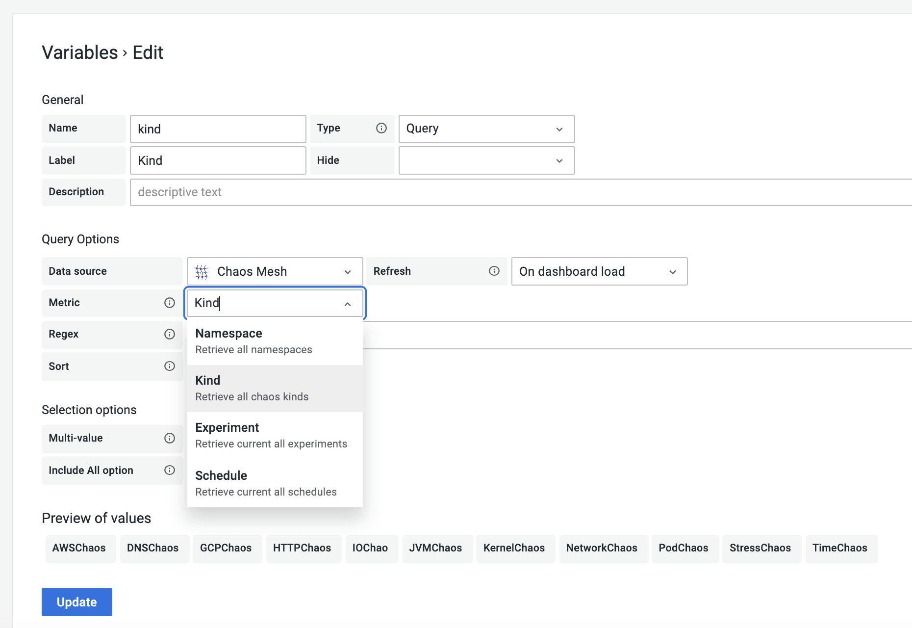

本文档介绍如何在本地 Grafana 安装 Data Source 插件，并使用 Grafana Data Source 进行观测。

:::note 注意

- Grafana 应为 v7.0.0 或更高版本。
- Chaos Mesh 应为 v2.1.0 或更高版本。

:::

## 使用 grafana-cli 安装 Data Source 插件

```shell
grafana-cli plugins install chaosmeshorg-datasource
```

## 手动安装 Data Source 插件

作为备选，你也可以通过以下步骤在本地 Grafana 安装 Data Source 插件：

1. 通过如下命令下载插件 zip 包，或前往 https://github.com/chaos-mesh/datasource/releases 下载该压缩包：

   ```shell
   curl -LO https://github.com/chaos-mesh/datasource/releases/download/v2.2.3/chaosmeshorg-datasource-2.2.3.zip
   ```

   下载完成后，将插件解压至 Grafana 插件目录：

   ```shell
   unzip chaosmeshorg-datasource-2.2.3.zip -d YOUR_PLUGIN_DIR
   ```

   :::tip 小贴士

   如需查找插件目录，可参考 https://grafana.com/docs/grafana/latest/plugins/installation/#install-a-packaged-plugin。

   :::

2. 然后更新并保存 Grafana 的配置文件 `grafana.ini`，将插件添加至 `allow_loading_unsigned_plugins` 以保证 Grafana 可以加载未签名的插件：

   ```ini
   [plugins]
     allow_loading_unsigned_plugins = chaosmeshorg-datasource
   ```

   :::tip 小贴士

   如需查找配置文件，可参考 https://grafana.com/docs/grafana/latest/administration/configuration/#config-file-locations。

   :::

3. 完成修改后，重启 Grafana 即可加载 Data Source 插件。

## 设置 Data Source 插件

1. 成功在本地 Grafana 安装 Data Source 插件后，前往 **Configuration -> Data sources**，在此处添加 Chaos Mesh 后，进入如下配置页面：

   

   在本页面中，只有 `URL` 字段需要填写，其他字段可以忽略。

   假设你已经在本地安装了 Chaos Mesh，Dashboard 会默认在 `2333` 端口导出 API。因此，如果你没有修改任何东西，可以直接在 `URL` 中填写 `http://localhost:2333`。

2. 然后使用 `port-forward` 命令让 API 可被外部访问:

   ```shell
   kubectl port-forward -n chaos-mesh svc/chaos-dashboard 2333:2333
   ```

3. 点击 **Save & Test** 来测试连接。如果显示成功的通知，则说明设置已经完成。

## Query

Data Source 插件会以事件的视角来观测 Chaos Mesh，以下几个选项负责过滤不同的事件：

- `Object ID`: 通过对象的 UUID 进行过滤
- `Namespace`: 通过不同的命名空间进行过滤
- `Name`: 通过对象名进行过滤
- `Kind`: 通过类型（PodChaos, Schedule 等）进行过滤
- `Limit`: 限制事件的数量

对这些选项的设置会作为参数被传递到 `/api/events` API 中。

## Annotations

你可以通过设置 Annotations 把 Chaos Mesh 的事件集成到面板上，具体创建示例如下：


如需了解如何填写 Annotations 中的字段，请参考 [Query](#query)。

## Variables

你可以通过设置不同的变量来动态地查询 Chaos Mesh 的事件。



以下是插件提供的变量类型：

- `Namespace`: 选择后，所有可用的命名空间将直接显示在页面下方的 `Preview of values`。
- `Kind`: 与命名空间相同。获取所有种类。
- `Experiment`: 与命名空间相同。获取所有实验的名称。
- `Schedule`: 与命名空间相同。获取所有时间表的名称。

## 问题反馈

如果在安装或设置的过程中遇到了问题，欢迎在 [CNCF Slack](https://cloud-native.slack.com/archives/C0193VAV272) 向社区提问，或者直接在 GitHub 创建一个 [issue](https://github.com/chaos-mesh/datasource/issues) 向 Chaos Mesh 团队反馈。

## 探索更多

如果你想了解更多内容， 欢迎在 [chaos-mesh/datasource](https://github.com/chaos-mesh/datasource) 查看插件的源代码。
