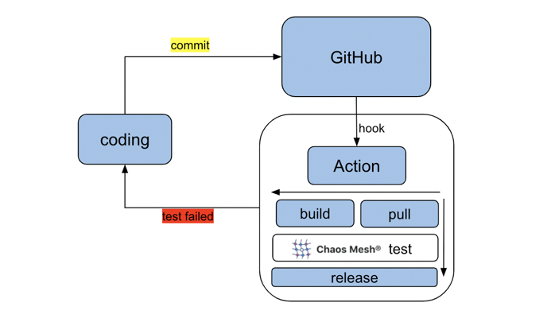
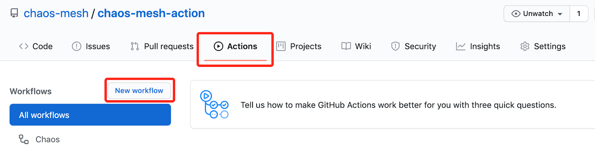

This document describes how to integrate Chaos Mesh to customize the continuous integration (CI) using chaos-mesh-action. This helps you identify issues that have been introduced into system development before product releases.

chaos-mesh-action is a GitHub action that has been released on [GitHub Marketplace](https://github.com/marketplace/actions/chaos-mesh). Its source code is on [GitHub](https://github.com/chaos-mesh/chaos-mesh-action) as well.

## Design of chaos-mesh-action

[GitHub Action](https://docs.github.com/en/actions) is the continuous integration (CI) and continuous deployment (CD) feature natively supported by GitHub. Using GitHub Action, you can easily automate and customize software development workflows right in your repository with GitHub Actions.

Equipped with GitHub Action, Chaos Mesh can be easily integrated into your daily development and tests, which ensures that all code submitted on GitHub is bug-free (to pass tests at least) without affecting the current logic. The image below shows chaos-mesh-action integrated into the CI workflow:



## Use chaos-mesh-action in GitHub workflow

chaos-mesh-action works for GitHub workflow. GitHub workflow is a configurable automated process. You can set up GitHub workflows in your repository to build, test, pack, publish or deploy any GitHub project. To integrate Chaos Mesh into your CI, take the following process:

- Step 1: Design workflow
- Step 2: Create workflow
- Step 3: Run workflow

### Step 1: Design workflow

Before designing a workflow, take the following questions into consideration:

- What features do you want to test in this workflow?
- What type of fault will be injected?
- How to verify the correctness of the system?

For example, we can design a simple workflow for tests. The steps below can be included:

1. Create two Pods in the Kubernetes cluster.
2. Send ping request from one Pod to another Pod.
3. Use Chaos Mesh to inject the network latency fault to test whether the ping command is affected.

### Step 2: Create workflow

After the workflow is designed, take the following steps to create a workflow.

1. Enter the GitHub repository of the software to be tested.
2. Create a workflow by clicking `Actions` and then click `New workflow`.



In essence, workflow is a sequentially automated job configuration. Note that the following job is configured in a single file. To provide a clear explanation, the script is split into different working groups, as shown below in:

- Set the workflow name and the trigger rules.

  Name the workflow to "Chaos". When you commit code or create a pull request to a master branch, this workflow is triggered.

  ```yaml
  name: Chaos

  on:
    push:
      branches:
        - master
    pull_request:
      branches:
        - master
  ```

- Install the CI-related environment.

  This configuration specifies the operating system (Ubuntu) and creates a Kind cluster using helm/kind-action. After that, it prints the cluster information. Finally, it checks out the GitHub repository that the workflow is to access.

  ```yaml
  jobs:
    build:
      runs-on: ubuntu-latest
      steps:
        - name: Creating kind cluster
          uses: helm/kind-action@v1.0.0-rc.1

        - name: Print cluster information
          run: |
            kubectl config view
            kubectl cluster-info
            kubectl get nodes
            kubectl get pods -n kube-system
            helm version
            kubectl version

        - uses: actions/checkout@v2
  ```

- Deploy an application.

  In the following example, this job deploys an application that creates two Kubernetes Pods.

  ```yaml
  - name: Deploy an application
       run: |
         kubectl apply -f https://raw.githubusercontent.com/chaos-mesh/apps/master/ping/busybox-statefulset.yaml
  ```

- Inject faults using Chaos Mesh.

  ```yaml
  - name: Run chaos mesh action
      uses: chaos-mesh/chaos-mesh-action@v0.5
      env:
        CHAOS_MESH_VERSION: v1.0.0
        CFG_BASE64: YXBpVmVyc2lvbjogY2hhb3MtbWVzaC5vcmcvdjFhbHBoYTEKa2luZDogTmV0d29ya0NoYW9zCm1ldGFkYXRhOgogIG5hbWU6IG5ldHdvcmstZGVsYXkKICBuYW1lc3BhY2U6IGJ1c3lib3gKc3BlYzoKICBhY3Rpb246IGRlbGF5ICMgdGhlIHNwZWNpZmljIGNoYW9zIGFjdGlvbiB0byBpbmplY3QKICBtb2RlOiBhbGwKICBzZWxlY3RvcjoKICAgIHBvZHM6CiAgICAgIGJ1c3lib3g6CiAgICAgICAgLSBidXN5Ym94LTAKICBkZWxheToKICAgIGxhdGVuY3k6ICIxMG1zIgogIGR1cmF0aW9uOiAiNXMiCiAgc2NoZWR1bGVyOgogICAgY3JvbjogIkBldmVyeSAxMHMiCiAgZGlyZWN0aW9uOiB0bwogIHRhcmdldDoKICAgIHNlbGVjdG9yOgogICAgICBwb2RzOgogICAgICAgIGJ1c3lib3g6CiAgICAgICAgICAtIGJ1c3lib3gtMQogICAgbW9kZTogYWxsCg==
  ```

  Using chaos-mesh-action, Chaos Mesh is be installed and injects faults automatically. You only need to prepare the configuration of the chaos experiment and get its value encoded in base64. If you want to inject network latency to the Pod, you can use the following configuration example:

  ```yaml
  apiVersion: chaos-mesh.org/v1alpha1
  kind: NetworkChaos
  metadata:
    name: network-delay
    namespace: busybox
  spec:
    action: delay # the specific chaos action to inject
    mode: all
    selector:
      pods:
        busybox:
          - busybox-0
    delay:
      latency: '10ms'
    duration: '5s'
    scheduler:
      cron: '@every 10s'
    direction: to
    target:
      selector:
        pods:
          busybox:
            - busybox-1
      mode: all
  ```

  Get the base64-encoded value of the chaos experiment configuration file above using the command below:

  ```bash
  base64 chaos.yaml
  ```

- Verify the correctness of the system.

  In this job, the workflow sends ping requests from one Pod to another Pod and observes the network latency.

  ```yaml
  - name: Verify
       run: |
         echo "do some verification"
         kubectl exec busybox-0 -it -n busybox -- ping -c 30 busybox-1.busybox.busybox.svc
  ```

### Step 3: Run workflow

Once a workflow is created, you can trigger it by creating a pull request to a master branch. Once the workflow completes its running process, the output of the job verification is similar to the one below:

```log
do some verification
Unable to use a TTY - input is not a terminal or the right kind of file
PING busybox-1.busybox.busybox.svc (10.244.0.6): 56 data bytes
64 bytes from 10.244.0.6: seq=0 ttl=63 time=0.069 ms
64 bytes from 10.244.0.6: seq=1 ttl=63 time=10.136 ms
64 bytes from 10.244.0.6: seq=2 ttl=63 time=10.192 ms
64 bytes from 10.244.0.6: seq=3 ttl=63 time=10.129 ms
64 bytes from 10.244.0.6: seq=4 ttl=63 time=10.120 ms
64 bytes from 10.244.0.6: seq=5 ttl=63 time=0.070 ms
64 bytes from 10.244.0.6: seq=6 ttl=63 time=0.073 ms
64 bytes from 10.244.0.6: seq=7 ttl=63 time=0.111 ms
64 bytes from 10.244.0.6: seq=8 ttl=63 time=0.070 ms
64 bytes from 10.244.0.6: seq=9 ttl=63 time=0.077 ms
……
```

The output shows a series of 10-milliseconds delays, and each delay lasts for 5 seconds (which is 5 times). This is consistent with the configuration of chaos experiments that are injected using chaos-mesh-action.

## What's next

Currently, chaos-mesh-action has been applied in [TiDB Operator](https://github.com/pingcap/tidb-operator). By injecting Pod faults into the workflow, you can verify the restart of the Operator instances. This is to ensure that the TiDB Operator can work properly when a Pod of TiDB operator is randomly deleted by the injected fault. For details, see the [TiDB Operator Workflow page](https://github.com/pingcap/tidb-operator/actions?query=workflow%3Achaos).

In the future, chaos-mesh-action will be applied in more TiDB tests to ensure the stability of TiDB and its components. Your are welcome to use chaos-mesh-action to create your own workflow.

If you find any issue in chaos-mesh-action, or find any information is missing, you are welcome to create an [GitHub issue](https://github.com/pingcap/chaos-mesh/issues) or a [pull request (PR)](https://github.com/chaos-mesh/chaos-mesh/pulls) in the Chaos Mesh repository. You can also join our slack channel [#project-chaos-mesh](https://slack.cncf.io/) in the [CNCF](https://www.cncf.io/) workspace.
