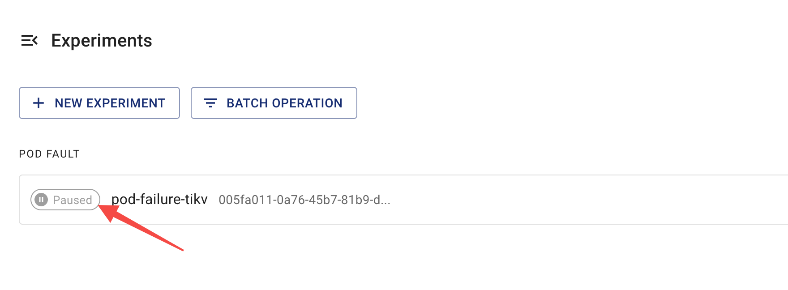

This document describes how to use Chaos Mesh to check running status and results of chaos experiments.

## Introduction to steps of a chaos experiment

In Chaos Mesh, the life cycle of a chaos experiment is divided into four steps, according to its running process:

- Injecting: Chaos experiment is in the process of fault injection. Normally, this step lasts for a short time. If the "Injecting" step lasts a long time, it may be due to some exceptions in the chaos experiment. In this case, you can check `Events` to find the cause of the exceptions.
- Running: After the faults have been successfully injected into all target pods, the chaos experiment starts running.
- Paused: when executing a [paused](run-a-chaos-experiment.md/#pause-chaos-experiments) process for a running chaos experiment, Chaos Mesh restores the injected faults from all target pods, which indicates the experiment is paused.
- Finished: if the `duration` parameter of the experiment is configured, and when the experiment runs it up, Chaos Mesh restores the injected faults from all target pods, which indicates that the experiment is finished.

## Check results using Chaos Dashboard

You can check the running steps of chaos experiments on any of the following pages using Chaos Dashboard:

- List of chaos experiments:

  

- Details of chaos experiments:

  

:::note

- If the **"Injecting"** step lasts for a long time, it may be due to some anomalies in the chaos experiment (e.g. the configured selectors have not selected target pods where to inject chaos actions). In this case, you can check **`Events`** to find the cause of the exceptions and check the configuration of the chaos experiment.
- Chaos Dashboard only displays [main steps of a chaos experiment](#Introduction-to-steps-of-a-Chaos-experiment). For more detailed information about experiment status and results, run the `kubectl` command.
  :::

## Check results using the `kubectl` command

To confirm the results of chaos experiments, use the following `kubectl describe` command to check the `Status` and `Events` of experiment objects.

```shell
kubectl describe podchaos pod-failure-tikv -n tidb-cluster
```

The expected output is as follows:

```shell
...
Status:
  Conditions:
    Reason:
    Status:  False
    Type:    Paused
    Reason:
    Status:  True
    Type:    Selected
    Reason:
    Status:  True
    Type:    AllInjected
    Reason:
    Status:  False
    Type:    AllRecovered
  Experiment:
    Container Records:
      Id:            tidb-cluster/basic-tikv-0
      Phase:         Injected
      Selector Key:  .
    Desired Phase:   Run
Events:
  Type    Reason           Age   From          Message
  ----    ------           ----  ----          -------
  Normal  FinalizerInited  39s   finalizer     Finalizer has been inited
  Normal  Paused           39s   desiredphase  Experiment has been paused
  Normal  Updated          39s   finalizer     Successfully update finalizer of resource
  Normal  Updated          39s   records       Successfully update records of resource
  Normal  Updated          39s   desiredphase  Successfully update desiredPhase of resource
  Normal  Started          17s   desiredphase  Experiment has started
  Normal  Updated          17s   desiredphase  Successfully update desiredPhase of resource
  Normal  Applied          17s   records       Successfully apply chaos for tidb-cluster/basic-tikv-0
  Normal  Updated          17s   records       Successfully update records of resource
```

The above output contains two parts:

- `Status`

  Based on the running process of the chaos experiment, the `Status` provides four types of status records:

  - `Paused`: indicates the chaos experiment is in the "Paused" step.
  - `Selected`: indicates the chaos experiment had correctly selected the target pods where to inject chaos actions.
  - `AllInjected`: indicates the faults have been successfully injected to all target pods.
  - `AllRecoverd`: indicates the injected faults have been succesfully restored from all target pods.

  The actual running status of current chaos experiments can be inferred from these four types of status records. For example:

  - When `Paused`、`Selected`、`AllRecoverd` is `True` and `AllInjected` is `False`, it indicates the current chaos experiment is paused.
  - When `Paused` is `True`, it indicates the current chaos experiment is paused. However, if the `Selected` is `False` at the same time, then it means the current experiment cannot select the target pods where to inject chaos actions.

  :::note
  You can get more information from the combination of the above status records, for example, when `Paused` is `True`, it indicates the experiment is paused, but if the `Selected` is `False` at the same time, then it means the current experiment cannot select the target pods where to inject chaos actions.
  :::

- `Events`

  It contains the records of actions conducted during the whole life cycle of a chaos experiment, which can help to check experiment status and troubleshoot issues.
