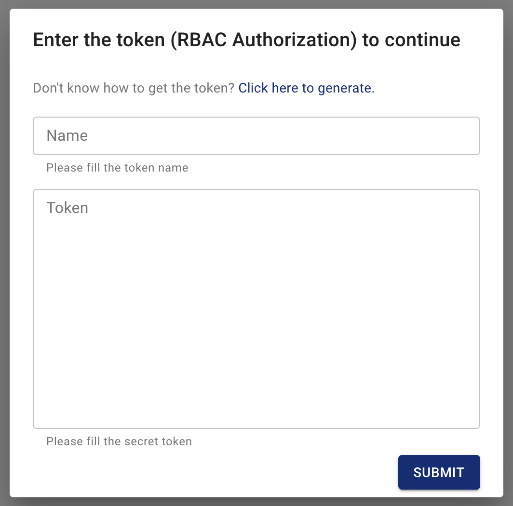
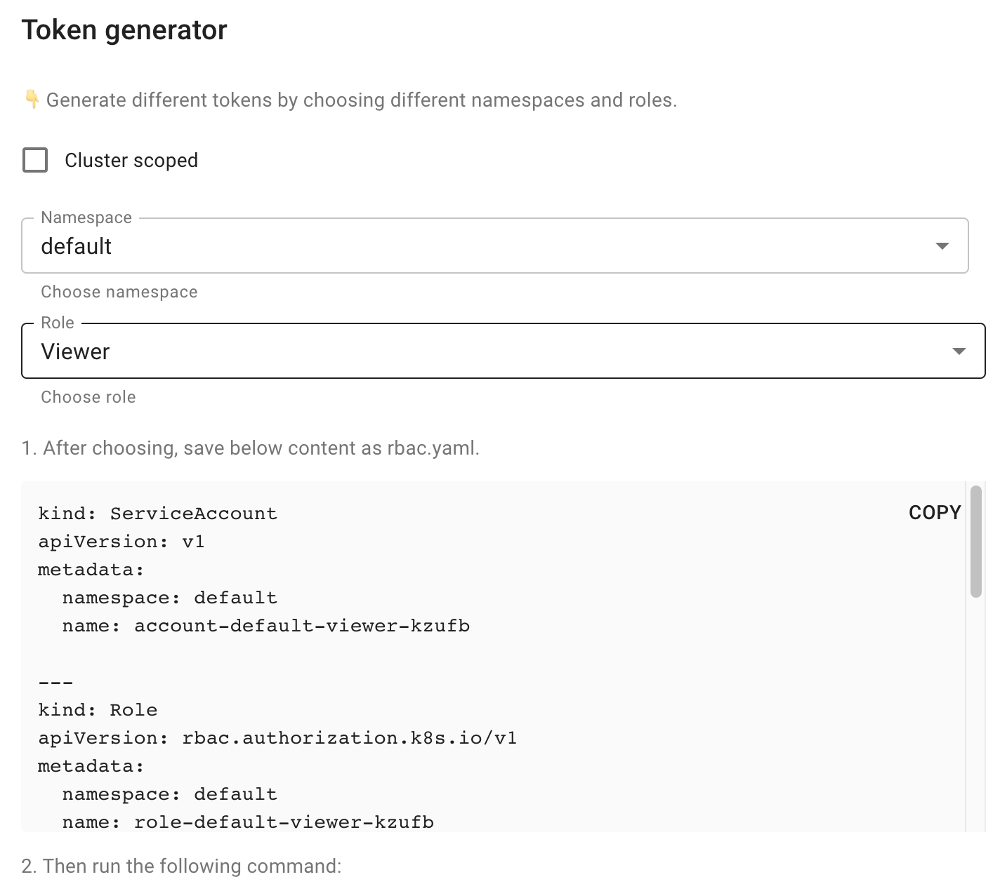
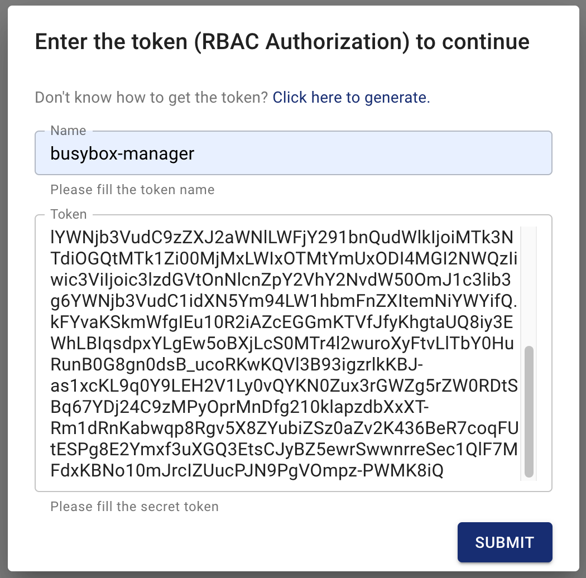
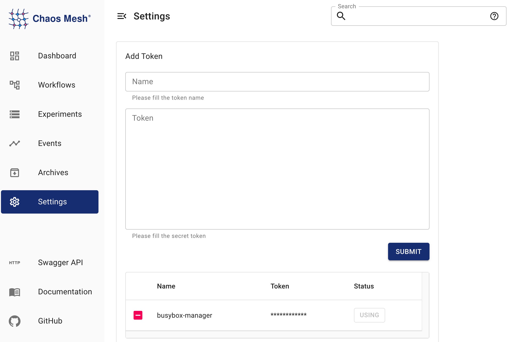

import PickHelmVersion from '@site/src/components/PickHelmVersion'

This document describes how to manage user permissions in Chaos Mesh, including creating user account of different roles, binding permissions for users, managing tokens, and enable or disable permission authentication.

Chaos Mesh uses the native [RBAC](https://kubernetes.io/docs/reference/access-authn-authz/rbac/) features in Kubernetes to manage user roles and permissions. To create, view and manage Chaos experiments, users need to have the corresponding permissions in the `apiGroups` of `chaos-mesh.org` to customize resources of Chaos experiments.

:::note

If Chaos Mesh is installed using Helm, permission authentication is enabled by default. For production environments and other scenarios with high security requirements, it is recommended to keep the permission authentication feature enabled. If you just want to give Chaos Mesh a try and quickly create Chaos experiments without enabling the permission authentication feature, you can refer to [Enable or disable permission authentication](#enable-or-disable-permission-authentication) to learn how to disable the feature.

:::

### Create user accounts and bind permissions

You can create user accounts and bind permissions directly through the Chaos Mesh Dashboard interface. When you access the Dashboard, a login window pops up. Click the link **Click here to generate**:



After you click the link, another window pops up as follows:



The steps to create user accounts and bind permissions are as follows. You need to perform the first three of the following steps in the pop-up window:

1. Choose the permission scope

   If you want to give the account the appropriate permissions for all Chaos experiments in Kubernetes, check the **Cluster scoped** box. If you specify a namespace in the **Namespace** dropdown option box, the account only has permissions in that specified namespace.

2. Choose the user role

   Currently, Chaos Mesh provides the following user roles:

   - Manager, who has all permissions to create, view, update, and delete Chaos experiments.
   - Viewer, who has only the view permission for Chaos experiments.

3. Generate RBAC configurations

   After determining the permission scope and user role of the created account, the Dashboard shows the corresponding RBAC configuration on the pop-up window page. For example, the RBAC configurations for a manager account in the namespace `busybox` looks like this:

   ```yaml
     kind: ServiceAccount
     apiVersion: v1
     metadata:
       namespace: busybox
       name: account-busybox-manager-zcbaf

     ---
     kind: Role
     apiVersion: rbac.authorization.k8s.io/v1
     metadata:
       namespace: busybox
       name: role-busybox-manager-zcbaf
     rules:
     - apiGroups: [""]
       resources: ["pods", "namespaces"]
       verbs: ["get", "watch", "list"]
     - apiGroups:
       - chaos-mesh.org
       resources: [ "*" ]
       verbs: ["get", "list", "watch", "create", "delete", "patch", "update"]

     ---
     apiVersion: rbac.authorization.k8s.io/v1
     kind: RoleBinding
     metadata:
       name: bind-busybox-manager-zcbaf
       namespace: busybox
     subjects:
     - kind: ServiceAccount
       name: account-busybox-manager-zcbaf
       namespace: busybox
     roleRef:
       kind: Role
       name: role-busybox-manager-zcbaf
       apiGroup: rbac.authorization.k8s.io
   ```

   Click **COPY** in the upper right corner of the configuration section in the pop-up window to copy the RBAC configuration and then save the content as `rbac.yaml` locally.

4. Create the user account and bind permissions

   Run the following command in your terminal:

   ```bash
   kubectl apply -f rbac.yaml
   ```

5. Generate the token

   Copy the command shown in the third step on the Token generator page and run the command in your terminal. The following is an example command:

   ```bash
   kubectl describe - n busybox secrets account-busybox-manager-zcbaf
   ```

   The output is as follows:

   ```log
   Name:         account-busybox-manager-zcbaf-token-x572r
   Namespace:    busybox
   Labels:       <none>
   Annotations:  kubernetes.io/service-account.name: account-busybox-manager-zcbaf
                 kubernetes.io/service-account.uid: 19757b8d-195f-4231-b193-be18280b65d3

   Type:  kubernetes.io/service-account-token

   Data
   ====
   ca.crt:     1025 bytes
   namespace:  7 bytes
   token:      eyJhbGciOi...z-PWMK8iQ
   ```

   Copy the token data in the above output and use it for the next step to log in.

6. Sign in to Chaos Mesh with the user account you have created

   **Close** the Token generator window and return to the login window. Enter the token that you have got from the previous step in the **Token** input box and enter a meaningful name for the token in the **Name** input box. It is recommended to use a name consisting of the permission scope and the user role, such as `busybox-manager`. Once you finish filling these two input boxes, click **Submit** to log in:

   

:::note

- You need to ensure that the local user who executes kubectl has permissions for the cluster so that this user can create user accounts, bind permission for other users, and generate tokens.

- If you have not deployed Chaos Mesh Dashboard, you can also generate RBAC configurations by yourself, then use kubectl to create user accounts and bind permissions.

:::

### Manage Tokens

If you need to manage tokens, click the **Settings** button shown in the left side bar on the Dashboard web page:



In the right part of this page, you can add new tokens in the **Add token** window, or click the **Use** button at the bottom of the page to switch between tokens with different permissions, or click the square button to delete a token.

### Enable or disable permission authentication

If Chaos Mesh is installed using Helm, the permission authentication feature is enabled by default.For production environments and other scenarios with high security requirements, it is recommended to keep the permission authentication feature enabled.If you just want to give Chaos Mesh a try and quickly create Chaos experiments with the permission authentication feature disabled, you can set `--set dashboard.securityMode=false` in a Helm command. The command is as follows:

<PickHelmVersion className="language-bash">{`helm upgrade chaos-mesh chaos-mesh/chaos-mesh --namespace=chaos-testing --version latest --set dashboard.securityMode=false`}</PickHelmVersion>

If you want to enable the permission authentication feature again, then reset `--set dashboard.securityMode=true` in a Helm command.
