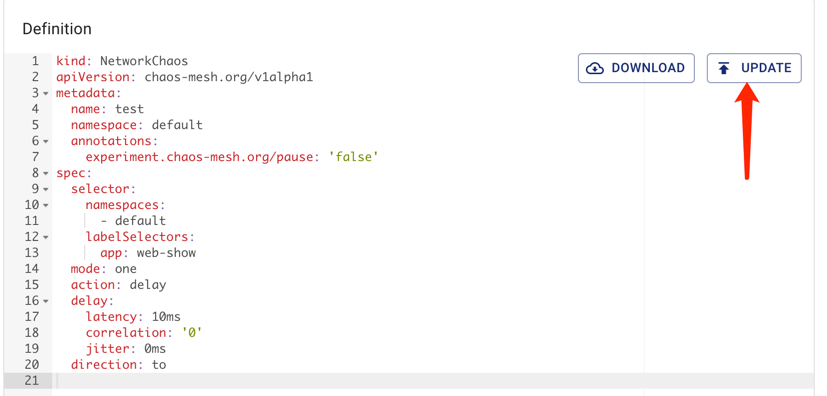

This document describes how to create, run, view, pause, update, and delete Chaos experiments in Chaos Mesh.

## Create Chaos experiments

You can create the following types of Chaos experiments in Chaos Mesh:

- One-time Chaos experiments: The smallest instance of Chaos experiments. Once a one-time experiment is created, Chaos Mesh immediately injects faults into the target test machine according to the experiment configurations. If the `duration` parameter is configured, injected faults will be restored automatically after a period of time specified by `duration`. When the Chaos experiment is paused or deleted, injected faults will be restored immediately.
- Scheduled or cyclic Chaos experiments: Chaos experiments that can be run at a regular interval or cyclically. You need to define the scheduling rules for the experiment when creating this type of Chaos experiment.

### One-time Chaos experiments

To create a one-time Chaos experiment, you can use one of the following methods:

- Use Chaos Dashboard to create a new Chaos experiment, then click **Submit** to run the experiment. For more details, refer to the documentation of each specific Chaos experiment type.
- Use a YAML file to define the Chaos experiment, then create and run the experiment using `kubectl`. If you want to create and run a Chaos experiment in this way, take the following steps:

1. Create a new YAML file to define a Chaos experiment. Add configuration parameters in the file based on the type of Chaos experiment you want to create.

   Take a NetworkChaos experiment as an example. Save the following YAML text as `network-delay.yaml`.

   ```yaml
   apiVersion: chaos-mesh.org/v1alpha1
   kind: NetworkChaos
   metadata:
     name: network-delay
   spec:
     action: delay # the specific chaos action to inject
     mode: one # the mode to run chaos action; supported modes are one/all/fixed/fixed-percent/random-max-percent
     selector: # pods where to inject chaos actions
       namespaces:
         - default
       labelSelectors:
         'app': 'web-show' # the label of the pod for chaos injection
     delay:
       latency: '10ms'
     duration: '12s'
   ```

   The above YAML example defines a network latency fault lasting for `12 seconds`, targeting applications with the `"app": "web-show"` tag under the `default` namespace. For more configuration information about the NetworkChaos experiment, refer to [Simulate network chaos](simulate-network-chaos-on-kubernetes.md).

2. Execute the following command to create and run this Chaos experiment.

   ```sh
   kubectl apply -f network-delay.yaml
   ```

3. To view the running status of the Chaos experiment after it begins, use the following `kubectl describe` command to check the `status` or `event` of this experiment object.

   ```sh
   kubectl describe networkchaos network-delay
   ```

   For detailed steps to check the result of the Chaos experiment, refer to [Inspect Chaos experiments](inspect-chaos-experiments.md).

### Scheduled or cyclic Chaos experiments

Chaos Mesh offers the `Schedule` object to create scheduled Chaos experiments and cyclic Chaos experiments.

To create this type of Chaos experiments, take the following steps:

1. Create a new YAML file to define a Chaos experiment. You need to configure the `Schedule` parameter in the YAML file to define specific schedule rules for the experiment, and then configure other parameters according to the type of Chaos experiments you want to create.

   Take a scheduled NetworkChaos experiment as an example. Save the following YAML text as `schedule-delay-example.yaml`.

   ```yaml
   apiVersion: chaos-mesh.org/v1alpha1
   kind: Schedule
   metadata:
     name: schedule-delay-example
   spec:
     schedule: '5 * * * *'
     historyLimit: 2
     concurrencyPolicy: 'Allow'
     type: 'NetworkChaos'
     networkChaos:
       action: delay
       mode: one
       selector:
         namespaces:
           - default
         labelSelectors:
           'app': 'web-show'
       delay:
         latency: '10ms'
       duration: '12s'
   ```

   The above YAML example defines a network latency fault that can be automatically triggered at the fifth minute of each hour.For detailed introduction of scheduling rules, refer to [Define scheduling rules](define-scheduling-rules.md).

   :::note

   If you do not set the `duration` parameter, the fault behavior keeps taking effect until you pause or delete the Chaos experiment.

   :::

2. Execute the following command to create and run this Chaos experiment.

   ```sh
   kubectl apply -f schedule-delay-example.yaml
   ```

3. To view the running status of the Chaos experiment after it begins, use the following `kubectl describe` command to check the `status` or `event` of this experiment object.

   ```sh
   kubectl describe networkchaos schedule-delay-example
   ```

   For detailed steps to check the result of the Chaos experiment, refer to [Inspect Chaos experiments](inspect-chaos-experiments.md).

## Pause Chaos experiments

### Pause or resume Chaos experiments using commands

For a running Chaos experiment, you can pause the experiment by setting a pause annotation to it using commands.

For example, you can use the following command to pause a Chaos experiment named `network-delay` in the default namespace:

```sh
kubectl annotate networkchaos network-delay experiment.chaos-mesh.org/pause=true
```

After this command is executed, Chaos Mesh restores the injected faults immediately. If you want to resume this Chaos experiment from the pause state to the normal running state, use the following command:

```sh
kubectl annotate networkchaos network-delay experiment.chaos-mesh.org/pause-
```

### Pause or resume Chaos experiments using Chaos Dashboard

If you want to pause or resume a Chaos experiment using Chaos Dashboard, find the Chaos experiment you want on the Dashboard and click the **Pause** button or the **Start** button.


## Update Chaos experiments

If you need to update a Chaos experiment after it is created, you can edit the configuration parameters of the Chaos experiment object.

:::note

- For a one-time Chaos experiment that is already running properly, Chaos Mesh currently supports updating only the duration of the fault behavior, that is, the `duration` parameter of the experiment. You cannot change other configuration parameters of the fault.
- For a scheduled or cyclic experiment, updating the `duration` parameter will take effect after the current fault injection is finished.

:::

### Update Chaos experiments using commands

If you manage Chaos experiments using YAML files, you can use the following commands to update the Chaos experiments:

```sh
vim network-delay.yaml # modify network-delay.yaml to what you want
kubectl apply -f network-delay.yaml
```

You can also use the following `kubectl patch` command to update a specific configuration parameter:

```sh
kubectl patch networchaos network-delay -p '{"spec":{"duration":"30s"}}'
```

After the above command is executed, the duration of the Chaos experiment `network-delay` will be updated to 30s.

For more operations to update experiment objects via the `kubectl` command, see the [kubectl documentation](https://kubernetes.io/docs/reference/kubectl/cheatsheet/).

### Update Chaos experiments using Chaos Dashboard

If you want to update a Chaos experiment with the Dashboard, you can click the corresponding **Update** button of the experiment and update the experiment by editing the corresponding object.



## Delete Chaos experiments

### Delete Chaos experiments using commands

After a Chaos experiment finishes, you can delete the experiment using the following `kubectl delete` command. Once you delete the Chaos experiment, the injected fault will be restored immediately:

```sh
kubectl delete -f network-delay.yaml
# or delete the chaos object directly
kubectl delete networkchaos network-delay
```

If the delete operation is blocked, this means that some fault behaviors of the target object cannot be restored. You can check the Chaos Mesh logs for troubleshooting or directly create a [GitHub issue](https://github.com/pingcap/chaos-mesh/issues) to report this problem to the Chaos Mesh team. Besides, you can forcibly delete the Chaos experiment with the following command:

```sh
kubectl annotate networkchaos web-show-network-delay chaos-mesh.chaos-mesh.org/cleanFinalizer=forced
```

### Delete Chaos experiments using Chaos Dashboard

If you want to delete a Chaos experiment on Chaos Dashboard and archive it to the experiment history, you can click the corresponding **Archive** button of the Chaos experiment.


