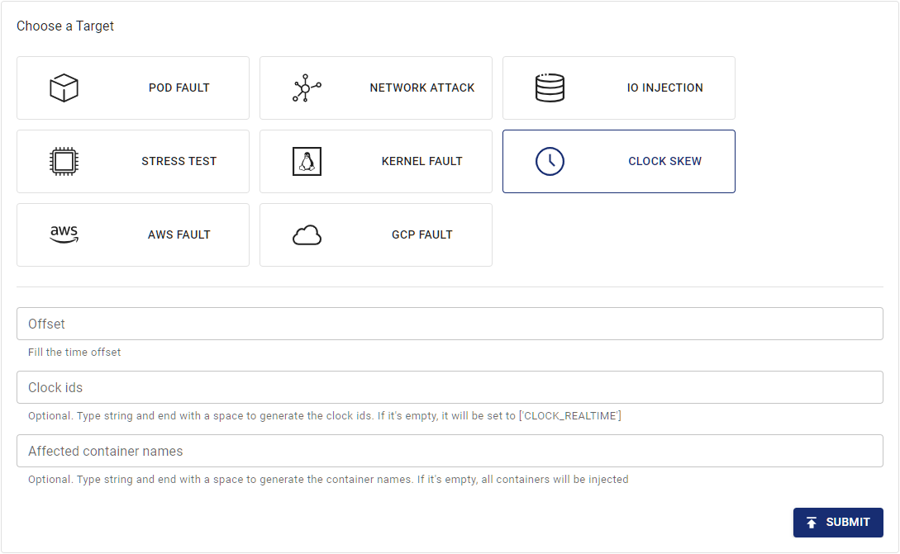

## TimeChaos Introduction

Chaos Mesh provides the TimeChaos experiment type. You can use this experiment type to simulate a time offset scenario. This document describes how to create a TimeChaos experiment and its associated configuration file.

You can create experiments in Chaos Dashboard or using the YAML configuration file.

## Create experiments using Chaos Dashboard

1. Open Chaos Dashboard, and click **NEW EXPERIMENT** on the page to create a new experiment:

   

2. In the **Choose a Target** area, choose **CLOCK SCREW** and fill out the Clock ID and time offset.

   

3. Fill out the experiment information, and specify the experiment scope and the scheduled experiment duration:

   

4. Submit the experiment information.

## Create experiments using the YAML file

1. Write the experiment configuration to the YAML configuration file. In the following example, the `time-shift.yaml` file is used.

   ```yaml
   apiVersion: chaos-mesh.org/v1alpha1
   kind: TimeChaos
   metadata:
     name: time-shift-example
     namespace: chaos-testing
   spec:
     mode: one
     selector:
       labelSelectors:
         'app': 'app1'
     timeOffset: '-10m100ns'
   ```

   This experiment configuration will shift the time of the processes in the specified Pod forward by 10 minutes and 100 nanoseconds.

2. After the configuration file is prepared, use `kubectl` to create an experiment:

   ```bash
   kubectl apply -f time-shift.yaml
   ```

The fields in the YAML configuration file are described in the following table:

| Parameter      | Type     | Note                                                                                                                                                                                                                                                                                                                                                                        | Default value        | Required | Example                                 |
| -------------- | -------- | --------------------------------------------------------------------------------------------------------------------------------------------------------------------------------------------------------------------------------------------------------------------------------------------------------------------------------------------------------------------------- | -------------------- | -------- | --------------------------------------- |
| timeOffset     | string   | Specifies the length of time offset.                                                                                                                                                                                                                                                                                                                                        | None                 | Yes      | `-5m`                                   |
| clockIds       | []string | Specifies the ID of clock that will be offset. See the [<clock>clock_gettime</clock> documentation](https://man7.org/linux/man-pages/man2/clock_gettime.2.html) for details.                                                                                                                                                                                                | `["CLOCK_REALTIME"]` | No       | `["CLOCK_REALTIME", "CLOCK_MONOTONIC"]` |
| mode           | string   | Specifies the mode of the experiment. The mode options include `one` (selecting a random Pod), `all` (selecting all eligible Pods), `fixed` (selecting a specified number of eligible Pods), `fixed-percent` (selecting a specified percentage of Pods from the eligible Pods), and `random-max-percent` (selecting the maximum percentage of Pods from the eligible Pods). | None                 | Yes      | `1`                                     |
| value          | string   | Provides parameters for the `mode` configuration, depending on `mode`.For example, when `mode` is set to `fixed-percent`, `value` specifies the percentage of Pods.                                                                                                                                                                                                         | None                 | No       | 2                                       |
| containerNames | []string | Specifies the name of the container into which the fault is injected.                                                                                                                                                                                                                                                                                                       | None                 | No       | `["nginx"]`                             |
| selector       | struct   | Specifies the target Pod. For details, refer to [Define the experiment scope](./define-chaos-experiment-scope.md).                                                                                                                                                                                                                                                          | None                 | Yes      |                                         |
