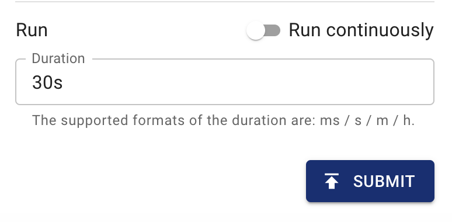

This document describes how to use Chaos Mesh to inject faults into GCP Pod. Chaos Dashboard and YAML files are provided to create GCPChaos experiments.

## GCPChaos introduction

GCPChaos is a fault type in Chaos Mesh. By creating a GCPChaos experiment, you can simulate fault scenarios of the specified GCP instance. Currently, GCPChaos supports the following fault types:

- **Node Stop**: stops the specified GCP instance.
- **Node Reset**: reboots the specified GCP instance.
- **Disk Loss**: uninstalls the storage volume from the specified GCP instance.

## `Secret` file

To easily connect to the GCP cluster, you can create a Kubernetes `Secret` file to store the authentication information in advance.

Below is a sample `secret` file:

```yaml
apiVersion: v1
kind: Secret
metadata:
  name: cloud-key-secret
  namespace: chaos-testing
type: Opaque
stringData:
  service_account: your-gcp-service-account-base64-encode
```

- **name** defines the name of kubernetes secret.
- **namespace** defines the namespace of kubernetes secret.
- **service_account** stores the service account key of your GCP cluster. Remember to complete [Base64](https://zh.wikipedia.org/wiki/Base64) encoding for your GCP service account key. To learn more about service account key, see [Creating and managing service account keys](https://cloud.google.com/iam/docs/creating-managing-service-account-keys).

## Create experiments using Chaos Dashboard

:::note

Before you create an experiment using Chaos Dashboard, make sure the following requirements are met:

1. Chaos Dashboard is installed.
2. Chaos Dashboard can be accessed using **kubectl port-forward** command:

   ```bash
   kubectl port-forward -n chaos-testing svc/chaos-dashboard 2333:2333
   ```

   You can then access the dashboard via [`http://localhost:2333`](http://localhost:2333) in your browser.

:::

1. Open Chaos Dashboard, and click **NEW EXPERIMENT** on the page to create a new experiment:

   

2. In the **Choose a Target** area, choose **GCP fault** and select a specific behavior, such as **STOP NODE**:

   

3. Fill out the experiment information, and specify the experiment scope and the scheduled experiment duration:

   

   

4. Submit the experiment information.

## Create experiments using YAML file

### A `node-stop` configuration example

1. Write the experiment configuration to the `gcpchaos-node-stop.yaml`， as shown below:

   ```yaml
   apiVersion: chaos-mesh.org/v1alpha1
   kind: GCPChaos
   metadata:
     name: node-stop-example
     namespace: chaos-testing
   spec:
     action: node-stop
     secretName: 'cloud-key-secret'
     project: 'your-project-id'
     zone: 'your-zone'
     instance: 'your-instance-name'
     duration: '5m'
   ```

   Based on this configuration example, Chaos Mesh will inject the `node-stop` fault into the specified GCP instance so that the GCP instance will be unavailable in 5 minutes.

   For more information about stopping GCP instances, refer to [Stop GCP instance](https://cloud.google.com/compute/docs/instances/stop-start-instance).

2. After the configuration file is prepared, use `kubectl` to create an experiment:

   ```bash
   kubectl apply -f gcpchaos-node-stop.yaml
   ```

### A `node-reset` configuration example

1. Write the experiment configuration to the `gcpchaos-node-reset.yaml`, as shown below:

   ```yaml
   apiVersion: chaos-mesh.org/v1alpha1
   kind: GCPChaos
   metadata:
     name: node-reset-example
     namespace: chaos-testing
   spec:
     action: node-reset
     secretName: 'cloud-key-secret'
     project: 'your-project-id'
     zone: 'your-zone'
     instance: 'your-instance-name'
     duration: '5m'
   ```

   Based on this configuration example, Chaos Mesh will inject `node-reset` fault into the specified GCP instance so that the GCP instance will be reset.

   For more information about resetting GCP instances, refer to [Resetting a GCP instance](https://cloud.google.com/compute/docs/instances/stop-start-instance#resetting_an_instance).

2. After the configuration file is prepared, use `kubectl` to create an experiment:

   ```bash
   kubectl apply -f gcpchaos-node-reset.yaml
   ```

### A `disk-loss` configuration example

1. Write the experiment configuration to the `gcpchaos-disk-loss.yaml`, as shown below:

   ```yaml
   apiVersion: chaos-mesh.org/v1alpha1
   kind: GCPChaos
   metadata:
     name: disk-loss-example
     namespace: chaos-testing
   spec:
     action: disk-loss
     secretName: 'cloud-key-secret'
     project: 'your-project-id'
     zone: 'your-zone'
     instance: 'your-instance-name'
     deviceNames: ['disk-name']
     duration: '5m'
   ```

   Based on this configuration example, Chaos Mesh will inject a `disk-loss` fault into the specified GCP instance so that the GCP instance is detached from the specified storage volume within 5 minutes.

   For more information about detaching GCP instances, refer to [Detach GCP storage](https://cloud.google.com/compute/docs/reference/rest/v1/instances/detachDisk).

2. After the configuration file is prepared, use `kubectl` to create an experiment:

   ```bash
   kubectl apply -f gcpchaos-disk-loss.yaml
   ```

### Field description

The following table shows the fields in the YAML configuration file.

| Parameter | Type | Descpription | Default value | Required | Example |
| --- | --- | --- | --- | --- | --- |
| action | string | Indicates the specific type of faults. The available fault types include node-stop, node-reset, and disk-loss. | node-stop | Yes | node-stop |
| mode | string | Indicates the mode of the experiment. The mode options include `one` (selecting a Pod at random), `all` (selecting all eligible Pods), `fixed` (selecting a specified number of eligible Pods), `fixed-percent` (selecting a specified percentage of the eligible Pods), and `random-max-percent` (selecting the maximum percentage of the eligible Pods). | None | Yes | `one` |
| value | string | Provides parameters for the `mode` configuration, depending on `mode`. For example, when `mode` is set to `fixed-percent`, `value` specifies the percentage of pods. | None | No | 1 |
| secretName | string | Indicates the name of the Kubernetes secret that stores the GCP authentication information. | None | No | cloud-key-secret |
| project | string | Indicates the name of GCP project. | None | Yes | real-testing-project |
| zone | string | Indicates the region of GCP instance. | None | Yes | us-central1-a |
| instance | string | Indicates the name of GCP instance. | None | Yes | gke-xxx-cluster--default-pool-xxx-yyy |
| deviceNames | []string | This is a required field when the `action` is `disk-loss`. This field specifies the machine disk ID. | None | no | ["your-disk-id"] |
| duration | string | Indicates the duration of the experiment. | None | Yes | 30s |
