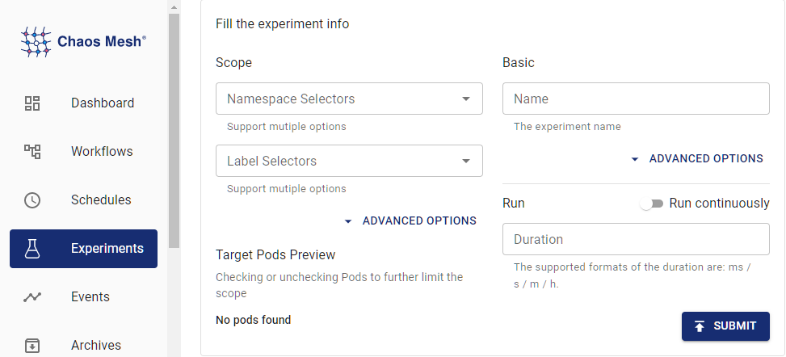

Chaos Mesh simulates the faults of JVM application through [Byteman](https://github.com/chaos-mesh/byteman). The supported fault types are as follows:

- Throw custom exceptions
- Trigger garbage collection
- Increase method latency
- Modify return values of a method
- Trigger faults by setting Byteman configuration files
- Increase JVM pressure

This document describes how to use Chaos Mesh to create the above fault types of JVM experiments.

:::note

Your Linux kernel must be v4.1 or later.

:::

## Create experiments using Chaos Dashboard

1. Open Chaos Dashboard, and click **NEW EXPERIMENT** on the page to create a new experiment.

   

2. In the "**Choose a Target**" area, choose **JVM FAULT**, and select a specific behavior, such as **`RETURN`**. Then, fill out the detailed configurations.

   

   For information about how to fill out the configurations, refer to [Field Description](#field-description).

3. Fill out the experiment information, and specify the experiment scope and the scheduled experiment duration.

   

4. Submit the experiment information.

## Create experiments using YAML files

The following example shows the usage and effects of JVMChaos. The example specifies the return values of a method. The YAML files referred to in the following steps can be found in [examples/jvm](https://github.com/chaos-mesh/chaos-mesh/tree/master/examples/jvm). The default work directory for the following steps is also `examples/jvm`. The default namespace where Chaos Mesh is installed is `chaos-testing`.

### Step 1. Create the target application

[Helloworld](https://github.com/WangXiangUSTC/byteman-example/tree/main/example.helloworld) is a simple Java application. In this section, this application is used as the target application that is to be tested. The target application is defined in `example/jvm/app.yaml` as follows:

```yaml
apiVersion: v1
kind: Pod
metadata:
  name: helloworld
  namespace: helloworld
spec:
  containers:
    - name: helloworld
      # source code: https://github.com/WangXiangUSTC/byteman-example/tree/main/example.helloworld
      # this application will print log like this below:
      # 0. Hello World
      # 1. Hello World
      # ...
      image: xiang13225080/helloworld:v1.0
      imagePullPolicy: IfNotPresent
```

1. Create the namespace for the target application:

   ```shell
   kubectl create namespace helloworld
   ```

2. Build the application Pod:

   ```shell
   kubectl apply -f app.yaml
   ```

3. Execute `kubectl -n helloworld get pods`, and you are expected to find a pod named `helloworld` in the `helloworld` namespace.

   ```shell
   kubectl -n helloworld get pods
   ```

   The result is as follows:

   ```text
   kubectl get pods -n helloworld
   NAME         READY   STATUS    RESTARTS   AGE
   helloworld   1/1     Running   0          2m
   ```

   After the `READY` column turns to `1/1`, you can proceed to the next step.

### Step 2. Observe application behaviors before injecting faults​

You can observe the behavior of `helloworld` application before injecting faults, for example:

```shell
kubectl -n helloworld logs -f helloworld
```

The result is as follows:

```shell
0. Hello World
1. Hello World
2. Hello World
3. Hello World
4. Hello World
5. Hello World
```

You can see that `helloworld` outputs a line of `Hello World` every second, and the number of each line increases in turn.

### Step 3. Inject JVMChaos and check

1. The JVMChaos with a specified return value is as follows:

   ```yaml
   apiVersion: chaos-mesh.org/v1alpha1
   kind: JVMChaos
   metadata:
     name: return
     namespace: helloworld
   spec:
     action: return
     class: Main
     method: getnum
     value: '9999'
     mode: all
     selector:
       namespaces:
         - helloworld
   ```

   JVMChaos changes the return value of the `getnum` method to the number `9999`, which means that the number of each line in the `helloworld` output is set to `9999`.

2. Inject JVMChaos with a specified value:

   ```shell
   kubectl apply -f ./jvm-return-example.yaml
   ```

3. Check the latest log of `helloworld`:

   ```shell
   kubectl -n helloworld logs -f helloworld
   ```

   The log is as follows:

   ```shell
   Rule.execute called for return_0:0
   return execute
   caught ReturnException
   9999. Hello World
   ```

## Field description

| Parameter | Type | Description | Default value | Required | Example |
| --- | --- | --- | --- | --- | --- |
| `action` | string | Indicates the specific fault type. The available fault types include `latency`, `return`, `exception`, `stress`, `gc`, and `ruleData`. | None | Yes | return |
| `mode` | string | Indicates how to select Pod. The supported modes include `one`, `all`, `fixed`, `fixed-percent`, and `random-max-percent`. | None | Yes | `one` |

The meanings of the different `action` values are as follows:

| Value | Meaning |
| --- | --- |
| `latency` | Increase method latency |
| `return` | Modify return values of a method |
| `exception` | Throw custom exceptions |
| `stress` | Increase CPU usage of Java process, or cause memory overflow (support heap overflow and stack overflow) |
| `gc` | Trigger garbage collection |
| `ruleData` | Trigger faults by setting Byteman configuration files |

For different `action` values, there are different configuration items that can be filled in.

### Parameters for `latency`

| Parameter | Type | Description | Required |
| --- | --- | --- | --- |
| `class` | string | The name of the Java class | Yes |
| `method` | string | The name of the method | Yes |
| `latency` | int | The duration of increasing method latency. The unit is milisecond. | Yes |
| `port` | int | The port ID attached to the Java process agent. The faults are injected into the Java process through this ID. | No |

### Parameters for `return`

| Parameter | Type | Description | Required |
| --- | --- | --- | --- | --- |
| `class` | string | The name of the Java class | Yes |
| `method` | string | The name of the method | Yes |
| `value` | string | Specifies the return value of the method | string type, required. Currently, the item can be numeric and string types. If the item (return value) is string, double quotes are required, like "chaos". | Yes |
| `port` | int | The port ID attached to the Java process agent. The faults are injected into the Java process through this ID. | No |

### Parameters for `exception`

| Parameter | Type | Description | Required |
| --- | --- | --- | --- |
| `class` | string | The name of the Java class | Yes |
| `method` | string | The name of the method | Yes |
| `exception` | string | The thrown custom exception, such as 'java.io.IOException("BOOM")'. | Yes |
| `port` | int | The port ID attached to the Java process agent. The faults are injected into the Java process through this ID. | No |

### Parameters for `stress`

| Parameter | Type | Description | Required |
| --- | --- | --- | --- |
| `cpuCount` | int | The number of CPU cores used for increasing CPU stress. You must configure one item between `cpu-count` and `mem-type`. | No |
| `memType` | string | The type of OOM. Currently, both 'stack' and 'heap' OOM types are supported. You must configure one item between `cpu-count` and `mem-type`. | No |
| `port` | int | The port ID attached to the Java process agent. The faults are injected into the Java process through this ID. | No |

### Parameters for `gc`

| Parameter | Type | Description | Required |
| --- | --- | --- | --- |
| `port` | int | The port ID attached to the Java process agent. The faults are injected into the Java process through this ID. | No |

### Parameters for `ruleData`

| Parameter | Type | Description | Required |
| --- | --- | --- | --- |
| `ruleData` | srting | Specifies the Byteman configuration data | Yes |
| `port` | int | The port ID attached to the Java process agent. The faults are injected into the Java process through this ID. | No |

When you write the rule configuration file, take into account the specific Java program and the [byteman-rule-language](https://downloads.jboss.org/byteman/4.0.16/byteman-programmers-guide.html#the-byteman-rule-language). For example:

```txt
RULE modify return value
CLASS Main
METHOD getnum
AT ENTRY
IF true
DO
    return 9999
ENDRULE
```

You need to escape the line breaks in the configuration file to the newline character "\n", and use the escaped text as the value of "rule-data" as follows:

```txt
\nRULE modify return value\nCLASS Main\nMETHOD getnum\nAT ENTRY\nIF true\nDO return 9999\nENDRULE\n"
```
