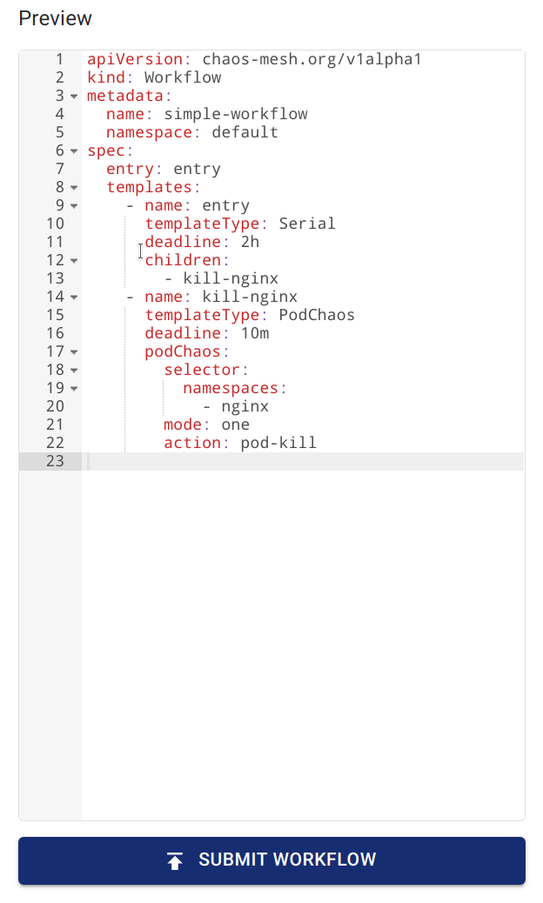

## Introduction to Chaos Mesh Workflow

When you use Chaos Mesh to simulate real system faults, continuous validation is always a need. You might want to build a series of faults on the Chaos Mesh platform, instead of performing individual Chaos injections.

To meet this need, Chaos Mesh provided Chaos Mesh Workflow, a built-in workflow engine. Using this engine, you can run different Chaos experiments in serial or parallel to simulate production-level errors.

Currently, Chaos Mesh Workflow supports the following features:

- Serial Orchestration
- Parallel Orchestration
- Customized tasks
- Conditional branch

Typical user scenarios:

- Use parallel orchestration to inject multiple NetworkChaos faults to simulate complex web environments.
- Use serial orchestration to perform health checks and use the conditional branch to determine whether to perform the remaining steps.

The design of Chaos Mesh Workflow is, to some extent, inspired by Argo Workflows. If you are familiar with Argo Workflows, you can also quickly get started with Chaos Mesh Workflow.

More workflow examples are available in the [Chaos Mesh GitHub repository](https://github.com/chaos-mesh/chaos-mesh/tree/master/examples/workflow).

## Create a workflow using Chaos Dashboard

### Step 1. Open Chaos Dashboard

Click **NEW WORKFLOW**.


### Step 2. Setup basic information of the workflow


### Step 3. Configure the nodes of the workflow

1. Select an option under **Choose task type** according to your needs.

   In this example, the "Single” type is selected as the task type.

   :::note

   Chaos Dashboard automatically creates a serial node named "entry" as the entry point for this workflow.

   :::

   

2. Fill out the experiment information.

   The configuration method is the same as creating a normal chaos experiment. For example, you can set up a "POD KILL" type of "PodChaos" named `kill-nginx`.

   

### Step 4. Submit the workflow

You can check workflow definition through **Preview**, and then click the **SUBMIT WORKFLOW** to create the workflow.



## Create a workflow using a YAML file and `kubectl`

Similar to various types of Chaos objects, workflows also exist in a Kubernetes cluster as a CRD. You can create a Chaos Mesh workflow using `kubectl create -f <workflow.yaml>`. The following command is an example of creating a workflow. Create a workflow using a local YAML file:

```shell
kubectl create -f <workflow.yaml>
```

Create a workflow using a YAML file from the network:

```shell
kubectl create -f https://raw.githubusercontent.com/chaos-mesh/chaos-mesh/master/examples/workflow/serial.yaml
```

A simple workflow YAML file is defined as follows. In this workflow, `StressChaos`, `NetworkChaos`, and `PodChaos` are injected:

```yaml
apiVersion: chaos-mesh.org/v1alpha1
kind: Workflow
metadata:
  name: try-workflow-parallel
spec:
  entry: the-entry
  templates:
    - name: the-entry
      templateType: Parallel
      deadline: 240s
      children:
        - workflow-stress-chaos
        - workflow-network-chaos
        - workflow-pod-chaos-schedule
    - name: workflow-network-chaos
      templateType: NetworkChaos
      deadline: 20s
      networkChaos:
        direction: to
        action: delay
        mode: all
        selector:
          labelSelectors:
            'app': 'hello-kubernetes'
        delay:
          latency: '90ms'
          correlation: '25'
          jitter: '90ms'
    - name: workflow-pod-chaos-schedule
      templateType: Schedule
      deadline: 40s
      schedule:
        schedule: '@every 2s'
        type: 'PodChaos'
        podChaos:
          action: pod-kill
          mode: one
          selector:
            labelSelectors:
              'app': 'hello-kubernetes'
    - name: workflow-stress-chaos
      templateType: StressChaos
      deadline: 20s
      stressChaos:
        mode: one
        selector:
          labelSelectors:
            'app': 'hello-kubernetes'
        stressors:
          cpu:
            workers: 1
            load: 20
            options: ['--cpu 1', '--timeout 600']
```

In the above YAML template, the `templates` fields define the steps of the experiment. The `entry` field defines the entry of the workflow when the workflow is being executed.

Each element in `templates` represents a workflow step. For example:

```yaml
name: the-entry
templateType: Parallel
deadline: 240s
children:
  - workflow-stress-chaos
  - workflow-network-chaos
  - workflow-pod-chaos
```

`templateType: Parallel` means that the node type is parallel. `deadline: 240s` means that all parallel experiments on this node are expected to be performed in 240 seconds; otherwise, the experiments time out. `children` means the other template names to be executed in parallel.

For example:

```yaml
name: workflow-pod-chaos
templateType: PodChaos
deadline: 40s
podChaos:
  action: pod-kill
  mode: one
  selector:
    labelSelectors:
      'app': 'hello-kubernetes'
```

`templateType: PodChaos` means that the node type is PodChaos experiments. `deadline: 40s` means that the current Chaos experiment lasts for 40 seconds. `podChaos` is the definition of the PodChaos experiment.

It is flexible to create a workflow using a YAML file and `kubectl`. You can nest parallel or serial orchestrations to declare complex orchestrations, and even combine the orchestration with conditional branches to achieve a circular effect.

## Field description

### Workflow field description

| Parameter | Type | Description | Default value | Required | Example |
| --- | --- | --- | --- | --- | --- |
| entry | string | Declares the entry of the workflow. Its value is a name of a template. | None | Yes |  |
| templates | []Template | Declares the behavior of each step executable in the workflow. See [Template field description](#template-field-description) for details. | None | Yes |  |

### Template field description

| Parameter | Type | Description | Default value | Required | Example |
| --- | --- | --- | --- | --- | --- |
| name | string | The name of the template, which needs to meet the DNS-1123 requirements. | None | Yes | any-name |
| type | string | Type of template. Value options are Task, Serial, Parallel, Suspend, Schedule, AWSChaos, DNSChaos, GCPChaos, HTTPChaos, IOChaos, JVMChaos, KernelChaos, NetworkChaos, PodChaos, StressChaos, and TimeChaos, StatusCheck. | None | Yes | PodChaos |
| deadline | string | The duration of the template. | None | No | '5m30s' |
| children | []string | Declares the subtasks under this template. You need to configure this field when the type is `Serial` or `Parallel`. | None | No | ["any-chaos-1", "another-serial-2", "any-shcedue"] |
| task | Task | Configures the customized task. You need to configure this field when the type is `Task`. See the [Task field description](#task-field-description) for details. | None | No |  |
| conditionalBranches | []ConditionalBranch | Configures the conditional branch which executes after customized task. You need to configure this field when the type is `Task`. See the [Conditional branch field description](#conditionalbranch-field-description) for details. | None | No |  |
| awsChaos | object | Configures AWSChaos. You need to configure this field when the type is `AWSChaos`. See the [Simulate AWS Faults](simulate-aws-chaos.md) document for details. | None | No |  |
| dnsChaos | object | Configures DNSChaos. You need to configure this field when the type is `DNSChaos`. See the [Simulate DNS Faults](simulate-dns-chaos-on-kubernetes.md) document for details. | None | No |  |
| gcpChaos | object | Configures GCPChaos. You need to configure this field when the type is `GCPChaos`.See the [Simulation GCP Faults](simulate-gcp-chaos.md) document for details. | None | No |  |
| httpChaos | object | Configures HTTPChaos. You need to configure this field when the type is `HTTPChaos`. See the [Simulate HTTP Faults](simulate-http-chaos-on-kubernetes.md) document for details. | None | No |  |
| ioChaos | object | Configure IOChaos. You need to configure this field when the type is `IOChaos`. See the [Simulate File I/O Faults](simulate-io-chaos-on-kubernetes.md) document for details. | None | No |  |
| jvmChaos | object | Configures JVMChaos. You need to configure this field when the type is `JVMChaos`. See the [Simulate JVM Application Faults](simulate-jvm-application-chaos.md) document for details. | None | No |  |
| kernelChaos | object | Configure KernelChaos. You need to configure this field when the type is `KernelChaos`. See the [Simulate Kernel Faults](simulate-kernel-chaos-on-kubernetes.md) document for details. | None | No |  |
| networkChaos | object | Configures NetworkChaos. You need to configure this field when the type is `NetworkChaos`. See the [Simulate Network Faults](simulate-network-chaos-on-kubernetes.md) document for details. | None | No |  |
| podChaos | object | Configures PodChaosd. You need to configure this field when the type is `PodChaosd`. See the [Simulate Pod Faults](simulate-pod-chaos-on-kubernetes.md) document for details. | None | No |  |
| stressChaos | object | Configures StressChaos. You need to configure this field when the type is `StressChaos`. See the [Simulate Heavy Stress on Kubernetes](simulate-heavy-stress-on-kubernetes.md) document for details. | None | No |  |
| timeChaos | object | Configures TimeChaos. You need to configure this field when the type is `TimeChaos`. See the [SImulate Time Faults](simulate-time-chaos-on-kubernetes.md) document for details. | None | No |  |
| schedule | object | Configures Schedule. You need to configure this field when the type is `Schedule`. See the [Define Scheduling Rules](define-scheduling-rules.md) document for details. | None | No |  |
| statusCheck | object | Configures StatusCheck. You need to configure this field when the type is `StatusCheck`. See the [StatusCheck in Workflow](status-check-in-workflow.md) document for details. | None | No |  |
| abortWithStatusCheck | bool | Configures whether abort the Workflow when StatusCheck is failed. You can configure this field when the type is `StatusCheck`. | `false` | No | `true` |

:::note

When creating a Chaos with a duration in the workflow, you need to fill the duration in the outer `deadline` field instead of using the `duration` field in Chaos.

:::

### Task field description

| Parameter | Type | Description | Default value | Required | Example |
| --- | --- | --- | --- | --- | --- |
| container | object | Defines a customized task container. See [Container field description](#container-field-description) for details. | None | No |  |
| volumes | array | If you need to mount a volume in a customized task container, you need to declare the volume in this field. For the detailed definition of a volume, see the [Kubernetes documentation - corev1.Volume](https://kubernetes.io/docs/reference/generated/kubernetes-api/v1.23/#volume-v1-core). | None | No |  |

### ConditionalBranch field description

| Parameter | Type | Description | Default value | Required | Example |
| --- | --- | --- | --- | --- | --- |
| target | string | The name of the template to be executed by the current conditional branch. | None | Yes | another-chaos |
| expression | string | The type is a boolean expression. When a customized task is completed and the expression value is true, the current condition branch is executed. When this value is not set, the conditional branch will be executed directly after the customized task is completed. | None | No | exitCode == 0 |

Currently, two context variables are provided in `expression`:

- `exitCode` means the exit code for a customized task.
- `stdout` indicates the standard output for a customized task.

> More context variables will be added in later releases.

Refer to [this document](https://github.com/antonmedv/expr/blob/master/docs/Language-Definition.md) write `expression` expressions.

### Container field description

The following table only lists the commonly used fields. For the definitions of more fields, see [Kubernetes documentation - core1.Container](https://kubernetes.io/docs/reference/generated/kubernetes-api/v1.23/#container-v1-core).

| Parameter | Type | Description | Default value | Required | Example |
| --- | --- | --- | --- | --- | --- |
| name | string | Container name | None | Yes | task |
| image | string | Image name | None | Yes | busybox:latest |
| command | []string | Container commands | None | No | `["wget", "-q", "http://httpbin.org/status/201"]` |
