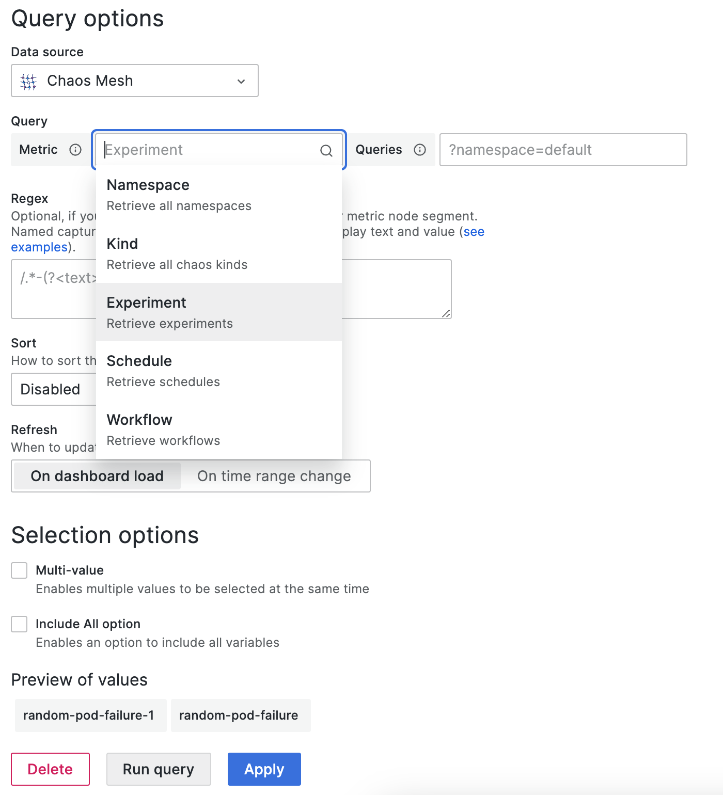

This document describes how to install the Data Source plugin for Grafana and setup the plugin to observe Chaos Mesh events.

:::note

This plugin requires Chaos Mesh **>=2.1**, Grafana >= **10.0**.

We only test the plugin on Grafana 10.0.3, it may support lower versions, but we are not sure. Upgrading to Grafana v10 is because of the [Angular support deprecation](https://github.com/chaos-mesh/datasource/issues/55). If you encounter any problems, please open an issue to let us know.

:::

## Installation

### With dashboard

[https://grafana.com/docs/grafana/latest/administration/plugin-management/#install-a-plugin](https://grafana.com/docs/grafana/latest/administration/plugin-management/#install-a-plugin)

### With cli

```sh
grafana-cli plugins install chaosmeshorg-datasource
```

### Manual installation

Download the plugin zip package with the following command or go to https://github.com/chaos-mesh/datasource/releases to download:

```shell
curl -LO https://github.com/chaos-mesh/datasource/releases/download/v3.0.0/chaosmeshorg-datasource-3.0.0.zip
```

After downloading, unzip:

```shell
unzip chaosmeshorg-datasource-3.0.0.zip -d YOUR_PLUGIN_DIR
```

:::tip

To find the plugin directory, refer to https://grafana.com/docs/grafana/latest/plugins/installation/#install-a-packaged-plugin.

:::

Then update and save the `grafana.ini` file:

```ini
[plugins]
  allow_loading_unsigned_plugins = chaosmeshorg-datasource
```

:::tip

To find the configuration file, refer to https://grafana.com/docs/grafana/latest/administration/configuration/#config-file-locations.

:::

Finally, restart Grafana to load the plugin.

## Setup

Once installed, go to **Administration -> Data sources** and add Chaos Mesh, then go to the configuration page:


Assuming you have Chaos Mesh installed locally, the Chaos Dashboard will export the API on port `2333` by default. So, if you haven't changed anything, you can fill in `http://localhost:2333`.

Then use the `port-forward` command to make the API externally accessible:

```shell
kubectl port-forward -n chaos-mesh svc/chaos-dashboard 2333:2333
```

Finally, click **Save & test** to test the connection. If it shows a successful notification, the setup is complete.

### Authentication

If you deploy Chaos Mesh with [permission authentication](./manage-user-permissions.md), you need to add the `Authorization` header to the configuration. You can follow the steps below to add the header:

1. Click the **Add header** button.
2. Fill in the `Authorization` in the **Header** field.
3. Follow [this section](./manage-user-permissions.md#get-the-token) to get the token.
4. Fill in the `Bearer YOUR_TOKEN` in the **Value** field.

Then don't forget to click **Save & test** to test the connection.

## Query

The data source plugin looks at the Chaos Mesh through the lens of events, and the following options are responsible for filtering the different events:

- **Object ID**

  > Filter by object uuid.

- **Namespace**

  > Filter by different namespace.

- **Name**

  > Filter by object name.

- **Kind**

  > Filter by kind (PodChaos, NetworkChaos, Schedule...). You can also input an arbitrary kind if you implement a new kind in Chaos Mesh.

- **Limit**

  > Limit the number of events.

All of them will be passed as parameters to the `/api/events` API.

## Variables

The data source plugin supports adding query variables by different metrics:



- **Namespace**

  > After selection, all available namespaces will show in the **Preview of values** directly.

- **Kind**

  > Same as **Namespace**. Retrieve all kinds.

- **Experiment/Schedule/Workflow**

  > Same as **Namespace**. Retrieve current all experiments/schedules/workflows.
  >
  > You can also specify the `queries` to further filter the values, for example, `?namespace=default` will only retrieve the experiments/schedules/workflows in the `default` namespace.

## Annotations

You can integrate events into panels via annotations, the following is a sample creation, it will retrieve all PodChaos events:


Please refer to [Query](#query) to fill in the corresponding fields.

## Questions and feedback

If you encounter problems during installation or setup, you are welcome to ask questions to the community at [CNCF Slack](https://cloud-native.slack.com/archives/C0193VAV272), or create an [GitHub issue](https://github.com/chaos-mesh/datasource/issues) to communicate with the Chaos Mesh team.

## What's next

If you want to learn more details about the Data Source plugin, feel free to check out the source code at [chaos-mesh/datasource](https://github.com/chaos-mesh/datasource).
