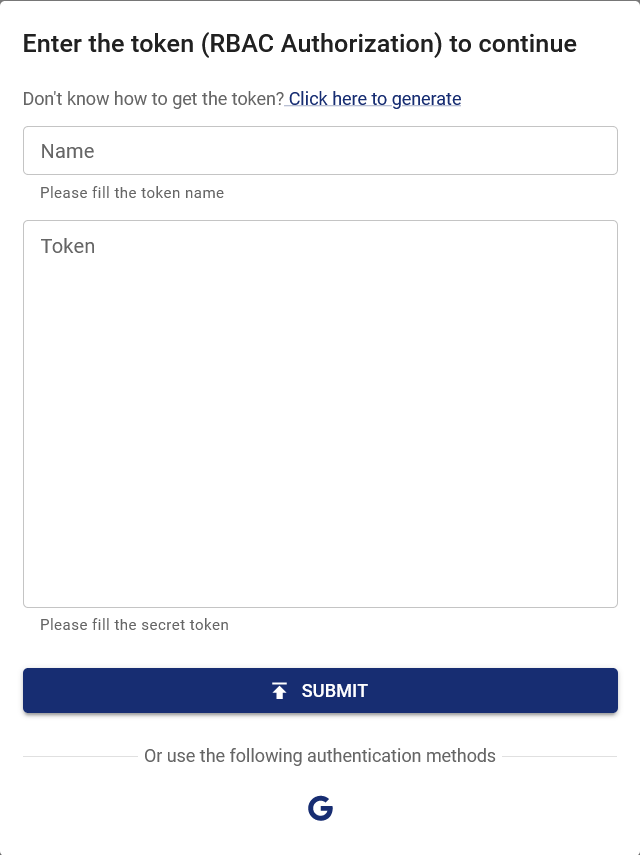

When Chaos Mesh is deployed on the Google Cloud Platform, you can log in to Chaos Dashboard through Google OAuth. This document describes how to enable and configure this function.

## Create OAuth Client

Create GCP OAuth client and get the Client ID and Client Secret according to [Setting up OAuth 2.0](https://support.google.com/cloud/answer/6158849?hl=en).

1. Go to the [Google Cloud Platform Console](https://console.cloud.google.com/).
2. From the projects list, select a project or create a new one.
3. If the APIs & services page was not loaded automatically, open the console left side menu and select "APIs & services" manually.
4. Click "Credentials" on the left.
5. Click "Create Credentials", then select "OAuth client ID".
6. Select "Web Application" as the application type, and enter additional information and the redirect URL of Chaos dashboard, which is `ROOT_URL/api/auth/gcp/callback`. In this part, `ROOT_URL` is the root URL of Chaos dashboard, like `http://localhost:2333`. This URL can be set through the configuration item `dashboard.rootUrl` by `helm`.
7. Click "Create".

After creating the client, remember to save the Client ID and Client Secret for the following steps.

## Configure and Start Chaos Mesh

:::info

Update: Since `v2.7.0`, you can provide a **Secret** to store the Client ID and Client Secret. **We recommend you to use this method**.

This change is to avoid exposing the Client ID and Client Secret to the public. In the previous versions, the Client ID and Client Secret are specified in the values directly, which is not safe in general.

For more information, see https://github.com/chaos-mesh/chaos-mesh/issues/4206.

:::

To enable the function, you need to set the configuration items in helm charts as follows:

```yaml
dashboard:
  rootUrl: http://localhost:2333
  gcpSecurityMode:
    enabled: true
    # Old configuration items for compatibility.
    clientId: ''
    clientSecret: ''
    # References existing Kubernetes secret containing `GCP_CLIENT_ID` and `GCP_CLIENT_SECRET`.
    existingSecret: ''
```

If Chaos Mesh has been installed, you can update the configuration items through `helm upgrade`. If not, you can install Chaos Mesh through `helm install`.

## Login with Google

Open Chaos Dashboard, and click the Google icon under the authentication window.



After logging in to the Google account and being granted permission to OAuth Client, the page automatically redirects to Chaos Dashboard with logged-in status. At this time, you have the same permissions as the google account in this cluster. If you need to add other permissions, you can edit the permission through the RBAC (Role-based access control). For example:

```yaml
kind: ClusterRole
apiVersion: rbac.authorization.k8s.io/v1
metadata:
  name: chaos-mesh-cluster-manager
rules:
  - apiGroups:
      - chaos-mesh.org
    resources: ['*']
    verbs: ['get', 'list', 'watch', 'create', 'delete', 'patch', 'update']
---
kind: ClusterRoleBinding
apiVersion: rbac.authorization.k8s.io/v1
metadata:
  name: cluster-manager-binding
  namespace: chaos-mesh
subjects:
  - kind: User
    name: example@gmail.com
roleRef:
  kind: ClusterRole
  name: chaos-mesh-cluster-manager
  apiGroup: rbac.authorization.k8s.io
```

By setting this configuration, the user `example@gmail.com` is enabled to see or create any chaos experiments.
