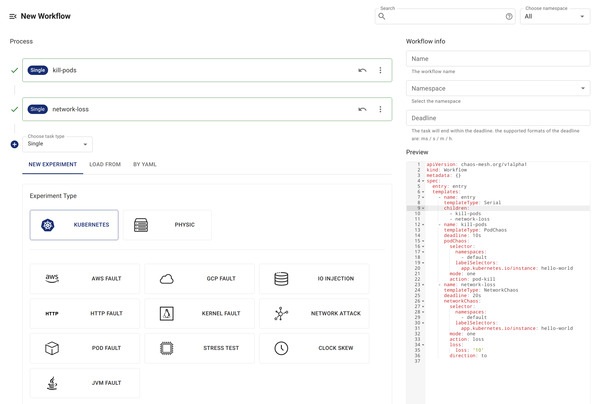
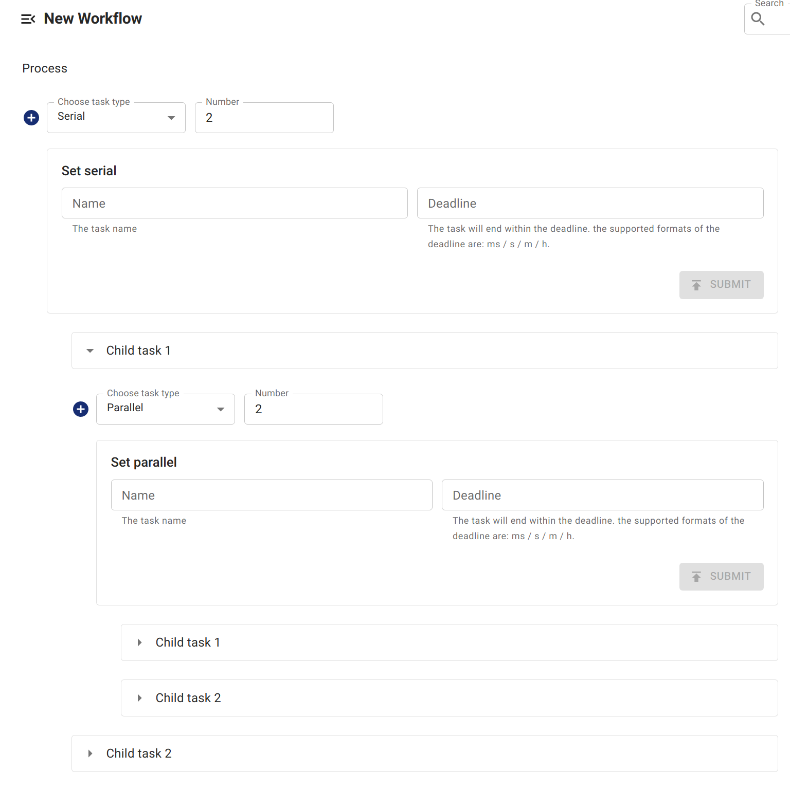

Chaos Mesh Workflow offers two ways of scheduling experiments: serial and parallel. You can configure and schedule multiple experiments as needed.

- If you want to schedule multiple chaos experiments in sequence, use serial nodes.
- If you want to perform multiple chaos experiments simultaneously, use parallel nodes.

Chaos Mesh uses [composite pattern](https://en.wikipedia.org/wiki/Composite_pattern) when designing serial and parallel nodes. It can contain multiple nodes of different types and run the composite nodes in a specific mode. This also means that you can nest the serial and parallel nodes to achieve complicated scheduling.

## Serial experiments

When you create `templates` in Workflow, use `templateType: Serial` to claim a serial node.

Another required field in serial nodes is `children`. Its type is `[]string` and value is the name of other `template`. For example:

```yaml
apiVersion: chaos-mesh.org/v1alpha1
kind: Workflow
metadata:
  name: try-workflow-serial
spec:
  entry: serial-of-3-node
  templates:
    - name: serial-of-3-node
      templateType: Serial
      deadline: 240s
      children:
        - workflow-stress-chaos
        - suspending
        - workflow-network-chaos
    - name: suspending
      templateType: Suspend
      deadline: 10s
    - name: workflow-network-chaos
      templateType: NetworkChaos
      deadline: 20s
      networkChaos:
        direction: to
        action: delay
        mode: all
        selector:
          labelSelectors:
            'app': 'hello-kubernetes'
        delay:
          latency: '90ms'
          correlation: '25'
          jitter: '90ms'
    - name: workflow-stress-chaos
      templateType: StressChaos
      deadline: 20s
      stressChaos:
        mode: one
        selector:
          labelSelectors:
            'app': 'hello-kubernetes'
        stressors:
          cpu:
            workers: 1
            load: 20
            options: ['--cpu 1', '--timeout 600']
```

The above commands claims a serial node named `serial-of-3-node`. This means Chaos Mesh executes sequentially `workflow-stress-chaos`, `suspending`, and `workflow-network-chaos`. After all tasks are completed, serial nodes are marked as completed.

When Chaos Mesh executes the serial node, tasks claimed in `children` are run sequentially to ensure that only one task is running at the same time.

The `deadline` field in serial nodes is optional to limit the maximum duration of the entire serial process. Once this duration is running out, the sub-nodes are stopped and the nodes that are not executed yet will not be executed. If all sub-nodes finish their work before `deadline` time, serial nodes are immediately marked as completed and `deadline` is not affected.

## Parallel experiments

When you create `templates` in Workflow, use `templateType: Parallel` to claim a parallel node.

Another required field in parallel nodes is `children`. Its type is `[]string` and values are the names of other `template`. For example:

```yaml
apiVersion: chaos-mesh.org/v1alpha1
kind: Workflow
metadata:
  name: try-workflow-parallel
spec:
  entry: parallel-of-2-chaos
  templates:
    - name: parallel-of-2-chaos
      templateType: Parallel
      deadline: 240s
      children:
        - workflow-stress-chaos
        - workflow-network-chaos
    - name: workflow-network-chaos
      templateType: NetworkChaos
      deadline: 20s
      networkChaos:
        direction: to
        action: delay
        mode: all
        selector:
          labelSelectors:
            'app': 'hello-kubernetes'
        delay:
          latency: '90ms'
          correlation: '25'
          jitter: '90ms'
    - name: workflow-stress-chaos
      templateType: StressChaos
      deadline: 20s
      stressChaos:
        mode: one
        selector:
          labelSelectors:
            'app': 'hello-kubernetes'
        stressors:
          cpu:
            workers: 1
            load: 20
            options: ['--cpu 1', '--timeout 600']
```

The above commands claimed a parallel node named `parallel-of-2-chaos`. This means Chaos Mesh executes simultaneously `workflow-stress-chaos` and `workflow-network-chaos`. After all tasks are completed, parallel nodes are marked as completed.

When Chaos Mesh executes parallel nodes, all tasks claimed in `children` are executed simultaneously.

Similar to serial nodes, the optional field `deadline` is also available in parallel nodes to limit the maximum execution time of the entire parallel process. If this time is reached, the sub-nodes are stopped. If all sub-nodes finish their work before `deadline` time, parallel nodes are immediately marked as completed and `deadline` is not affected.

## Create a workflow with serial or parallel nodes using Chaos Dashboard

### Create serial nodes

Chaos Dashboard creates a predefined serial node called `entry`. Therefore, when creating a workflow with serial nodes using Chaos Dashboard, the workflow is created under `entry` by default.



### Create parallel nodes

You can create a parallel node `Parallel` and create sub-nodes under `Parallel`.


### Nest serial and parallel nodes

You can create more complex processes by nesting serial and parallel nodes together.


